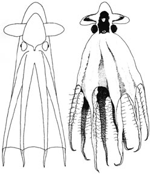
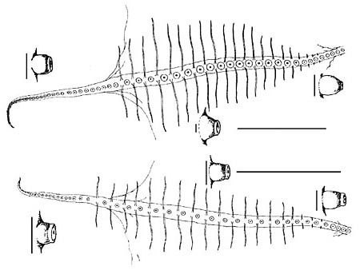
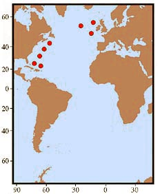

---
aliases:
  - syrtensis
title: Stauroteuthis syrtensis
---

# Stauroteuthis syrtensis [Verrill 1879] 

Containing group: [Stauroteuthidae](../Stauroteuthidae.md)

## Introduction

[Martin Collins, Richard E. Young, and Michael Vecchione]() 

***Stauroteuthis syrtensis*** appears to be relatively common off the
continental slope of the eastern USA although it occurs across the North
Atlantic. It has been observed off the USA from submersibles (e.g.,
Vecchione and Young, 1997, Johnsen, et al., 1999) and is regularly
caught in bottom trawls at the appropriate depths (Vecchione, pers.
obs.). [A video of this species can be found here.](http://www.mnh.si.edu/cephs/cephtaxuf.html)

#### Diagnosis

See \"Comments\" below. 

### Characteristics

1.  Arms
    1.  Males with sexually dimorphic suckers: Suckers 1-8 small, barrel
        shaped; suckers 9 to 22-25 enlarged, conical (see drawings on
        upper right); suckers 9-12 closely packed; suckers 13-18
        largest; maximum sucker diameter 6.5 mm.
    2.  Females with arm suckers uniformly small: Maximum diameter found
        on suckers 1-3, largest sucker diameter 2.2 mm; suckers 1-4
        tightly packed, barrel shaped; suckers 5 to about 24 small and
        well spaced, separated by up to 15 mm (see drawings on lower
        right). Horizontal scale bars 100 mm, vertical scale bars 2 mm.
    3.  Both sexes: suckers distally from number 19-24, become smaller,
        closely packed and more cyclindrical; suckers minute at arm
        tips.

    
    **Figure**. Oral view of arms and side view of suckers of ***S.
    syrtensis***. **Top** - Male arm, R.V. DISCOVERY Sta. 52104, with
    proximal, mid-arm and distal sucker enlarged. **Bottom** - Female
    arm, same octopod as in title drawing (R.V. DISCOVERY Sta. 51014),
    with proximal, mid-arm and distal sucker enlarged. Drawing from
    Collins and Henriques (2000).

#### Comments 

This description is taken from Collins and Henriques (2000). [More details of the description of ***S. syrtensis*** can be found here.](http://www.tolweb.org/accessory/Stauroteuthis_syrtensis_Description_Continued?acc_id=1705)

This species is most easily separated from ***S. gilchristi*** by the
larger sucker size in the latter (***S. gilchristi*** females up to 5 mm
in maximum sucker diameter and males up to 9 mm in maximum sucker
diameter compared to 2.2 mm in females and 6 mm in males of ***S.
syrtensis***), and the more distal position of the largest suckers in
the latter females (suckers 1-3 in ***S. syrtensis*** vs 9-14 in ***S.
gilchristi***. The latter feature suggests the that ***S. gilchristi***
lacks sexual dimorphism in sucker size.

### Nomenclature

***Chunioteuthis ebersbachii*** Grimpe, 1916 is a junior synonym of
***Stauroteuthis syrtensis*** (Voss, 1988; Collins and Henriques, 2000).

### Life History

Maximum length of eggs found in the oviducts were 11 mm and the largest
ovarian eggs were 9.5 mm. The ovary has about 900 oocytes of which 22
were more than 8 mm long. Most oocytes were less than 1 mm in length.
About 40 sheaths, presumably from eggs that had been released, were
found in the ovary.

### Distribution

Distribution records for octopods examined by Collins and Henriques,
2000 indicate that ***S. syrtensis*** is widespread in the North
Atlantic where they are found near bottoms of 500 to 4000 m with maximum
abundance between 1500 and 2500 m.

**Figure**. Geographical distribution of ***S. syrtensis***. Chart
modified from Collins and Henriques (2000).

## Phylogeny 

-   « Ancestral Groups  
    -   [Stauroteuthis](Stauroteuthis)
    -   [Cirrata](../../Cirrata.md)
    -   [Octopod](../../../Octopod.md)
    -  [Octopodiformes](../../../../Octopodiformes.md) 
    -  [Coleoidea](../../../../../Coleoidea.md) 
    -  [Cephalopoda](../../../../../../Cephalopoda.md) 
    -  [Mollusca](../../../../../../../Mollusca.md) 
    -  [Bilateria](../../../../../../../../Bilateria.md) 
    -  [Animals](../../../../../../../../../Animals.md) 
    -  [Eukarya](../../../../../../../../../../Eukarya.md) 
    -   [Tree of Life](../../../../../../../../../../Tree_of_Life.md)

-   ◊ Sibling Groups of  Stauroteuthis
    -   [Stauroteuthis         gilchristi](Stauroteuthis_gilchristi)
    -   Stauroteuthis syrtensis

-   » Sub-Groups 

## Title Illustrations

------------------------------------------------------------------------------------------------------------------- 
 
scientific_name ::  Stauroteuthis syrtensis, Stauroteuthis syrtensis (2)
location ::        Cape Hatteras, U.S.A, SW U.K. (2)
Reference         Vecchione, M. and R. E. Young. 1997 Aspects of the functional morphology of cirrate octopods: locomotion and feeding. Vie Milieu 47(2):101-110., Collins, M. A. and C. Henriques. 2000. A revision of the family Stauroteuthidae (Octopoda: Cirrata) with redescriptions of Stauroteuthis syrtensis and S. gilchristi. J. Mar. Biol. Ass. U.K., 80: 685-697. (2)
Sex ::             f (2)
Size              ca. 90 mm ML, 72 mm ML (2)

## Confidential Links & Embeds: 

### #is_/same_as :: [[/_Standards/bio/bio~Domain/Eukarya/Animal/Bilateria/Mollusca/Cephalopoda/Coleoidea/Octopodiformes/Octopod/Cirrata/Stauroteuthidae/syrtensis|syrtensis]] 

### #is_/same_as :: [[/_public/bio/bio~Domain/Eukarya/Animal/Bilateria/Mollusca/Cephalopoda/Coleoidea/Octopodiformes/Octopod/Cirrata/Stauroteuthidae/syrtensis.public|syrtensis.public]] 

### #is_/same_as :: [[/_internal/bio/bio~Domain/Eukarya/Animal/Bilateria/Mollusca/Cephalopoda/Coleoidea/Octopodiformes/Octopod/Cirrata/Stauroteuthidae/syrtensis.internal|syrtensis.internal]] 

### #is_/same_as :: [[/_protect/bio/bio~Domain/Eukarya/Animal/Bilateria/Mollusca/Cephalopoda/Coleoidea/Octopodiformes/Octopod/Cirrata/Stauroteuthidae/syrtensis.protect|syrtensis.protect]] 

### #is_/same_as :: [[/_private/bio/bio~Domain/Eukarya/Animal/Bilateria/Mollusca/Cephalopoda/Coleoidea/Octopodiformes/Octopod/Cirrata/Stauroteuthidae/syrtensis.private|syrtensis.private]] 

### #is_/same_as :: [[/_personal/bio/bio~Domain/Eukarya/Animal/Bilateria/Mollusca/Cephalopoda/Coleoidea/Octopodiformes/Octopod/Cirrata/Stauroteuthidae/syrtensis.personal|syrtensis.personal]] 

### #is_/same_as :: [[/_secret/bio/bio~Domain/Eukarya/Animal/Bilateria/Mollusca/Cephalopoda/Coleoidea/Octopodiformes/Octopod/Cirrata/Stauroteuthidae/syrtensis.secret|syrtensis.secret]] 

