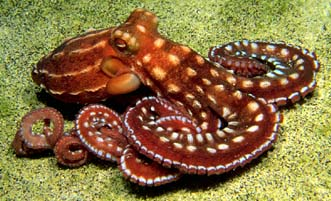

---
title: Incirrata
---

## Phylogeny 

-   « Ancestral Groups  
    -   [Octopod](../Octopod.md)
    -  [Octopodiformes](../../Octopodiformes.md))
    -  [Coleoidea](../../../Coleoidea.md))
    -  [Cephalopoda](../../../../Cephalopoda.md))
    -  [Mollusca](../../../../../Mollusca.md))
    -  [Bilateria](../../../../../../Bilateria.md))
    -  [Animals](../../../../../../../Animals.md))
    -  [Eukarya](../../../../../../../../Eukarya.md))
    -   [Tree of Life](../../../../../../../../Tree_of_Life.md)

-   ◊ Sibling Groups of  Octopoda
    -   [Cirrata](Cirrata.md)
    -   Incirrata

-   » Sub-Groups
    -   [Amphitretidae](Incirrata/Amphitretidae.md)
    -   [Octopodidae](Incirrata/Octopodidae.md)
    -   [Argonautoida](Incirrata/Argonautoida.md)
    -   [Bolitaenidae](Incirrata/Bolitaenidae.md)
    -   [Vitreledonella richardi](Vitreledonella_richardi)

# Incirrata [Grimpe, 1916]

## Common octopods, octopuses or devilfishes 

[Katharina M. Mangold (1922-2003) and Richard E. Young](http://www.tolweb.org/)

The suborder contains four families and one family-group with four
families.

-   *[Amphitretidae](Incirrata/Amphitretidae.md "go to ToL page")*[
    Hoyle, 1886]
-   *[Octopodidae](Incirrata/Octopodidae.md "go to ToL page")*[
    Orbigny, 1839]
-   *[Argonautoida](Incirrata/Argonautoida.md "go to ToL page")*[ Naef,
    1912]
-   *[Bolitaenidae](Incirrata/Bolitaenidae.md "go to ToL page")*[ Chun,
    1911]
-   *[Vitreledonellidae](Vitreledonella_richardi)*[
    Robson, 1932]

Containing group: [Octopod](../Octopod.md)

## Introduction

Incirrate octopods are about 85% of all octopodan species. They are very
small to large in size. The members of the Octopodidae, the family with
the most species and individuals, are benthic. The other seven incirrate
families have pelagic species. The benthic incirrate octopods live from
the intertidal zone to at least 4000 m, and bathypelagic forms may be
found down to 2000 m. The octopodids exhibit sophisticated behavior. The
brain of benthic octopuses, especially that of **Octopus vulgaris**, has
become a model for relating brain structure to function (e.g., J. Z.
Young, 1971). Incirrate octopods are commercially fished throughout the
world.

Fins are absent and the arms bear one or two rows of suckers and lack
cirri. The shape of the body is saccular and rather broad. The arms are
often of about equal length, but sometimes the dorsal or lateral or
ventral arms are distinctly longer than the others.

### Characteristics

1.  Arms
    1.  One member of Arms III hectocotylized.
    2.  Cirri absent.\
        \
2.  Eyes
    1.  Cornea present (greatly reduced in some pelagic species).\
        \
3.  Fins
    1.  Absent.\
        \
4.  Gills
    1.  Branchial canal present
    2.  Asymmetrical in cross-section.\
        \
5.  Female reproductive system
    1.  Paired oviducts present.
    2.  Egg chorion with stalk.\
        \
6.  Internal shell
    1.  Pair of stylets or absent.

### Nomenclature

Naef (1923) placed the argonautoid families within a single family, the
Argonautidae. Robson (1932) placed these families in the Tribe
Argonautida and the remaining families in the Tribes Heteroglossa and
Ctenoglossa based on the structure of the radula. The latter tribe
contained the families Bolitaenidae and Amphitretidae. However the
placement of these families in their own clade has been questioned
(e.g., Thore, 1949; Voight, 1997).

**Idioctopus gracilipes** described by Taki (1962, 1964) and placed in
its own family is probably a synonym of **Amphitretus pelagicus** (see
Hochberg, et al, 1992).

### Discussion of Phylogenetic Relationships

Voight (1997) attempted to unravel the relationships among incirrate
genera using cladistic methods based on morphology. Her family-level
phylogeny is as follows:

        ----- CIRRATA
       / ---- Bolitaenidae
      / / ---- Amphitretidae
    \/ / /   \--- Vitreledonellidae
     \/ /    --- Alloposidae
      \/ \  / --- Argonautidae
       \  \/ /
        \  \/       Ocythoidae
         \  \
          \  \--- Tremoctopodidae
           \--- Octopodidae

\

Thore (1949) considered the Amphitretidae and Vitreledonellidae to be
closely related due to the shared position of the stomach and caecum
relative to the digestive gland. Young *et al*. (1999) caution that the
unusual position of the stomach and caecum serves to reduce the
silhouette in upper mesopelagic waters and that the similarity could be
convergent. In addition, the very different structure of their radulas
has complicated the understanding of their relationships. Nevertheless,
in a first look at relationships via a cladistic analysis based on
morphology, Voight (1997) found these families grouping together, and
placed the Vitreledonellidae in the synonomy of the Amphitretidae. This
study, however, requires confirmation.

Molecular data from the mitochondrial Cytochrome Oxidase I gene and the
nuclear Actin II gene, while without strong bootstrap support, suggest
that our present classification of the Incirrata may be in error
(Carlini, 1998; Carlini and Graves, 1999). Indeed, the possibility
exists that all incirrate families are derived from the Octopodidae.

### Life history

Where known, incirrate octopods have a life span of 6 months to 4 years;
one year is typical. Those living to 4 years are large and/or cold water
species. Most species appear to be terminal spawners, i. e. they lay all
eggs toward the end of their life-span and die shortly after the last of
the brooded embryos hatch. Some species, however, lay several egg
batches and feed between spawning periods. Spawning in the epipelagic
incirrates is in this latter mode but egg batches overlap (i.e. a second
batch is deposited before the first one hatches).

All incirrate octopods, benthic and pelagic, brood their eggs until the
young hatch. Egg strings are mostly fixed to a substrate although some
species carry their eggs on the arms. Specialized brooding habits are
present in pelagic incirrates. In **Argonauta** the dorsal arms secrete
a \"shell\" that functions as a brood chamber and in **Tremoctopus** and
the bolitaenids the arms form brood-chambers. In **Ocythoe**, the eggs
develop in the oviducts and in **Vitreledonella**, apparently, in the
mantle cavity.

### References

Carlini, D. B. 1998. The phylogeny of coleoid cephalopods inferred from
molecular evolutionary analyses of the cytochrome oxidase I, muscle
actin, and cytoplasmic actin genes. Ph.D. diss. Coll. William and Mary,
273 pp.

Carlini, D. B. and J. E. Graves. 1999. Phylogenetic analysis of
cytochrome c oxidase I sequences to determine higher-level relationships
within the coleoid cephalopods. Bull. Mar. Sci., 64: 57-76.

Hochberg, F. G., M. Nixon and R. B. Toll. 1992. Order Octopoda Leach,
1818. In: Sweeney, M. J., C. F. E. Roper, K. M. Mangold, M. R. Clarke
and S. v. Boletzky (eds.) \"Larval\" and juvenile cephalopods: A manual
for their identification. Smithson. Contr. Zool., 513:1-282.

Mangold, K. 1989. Cephalopodes. Traité de Zoologie. Tome V. Masson,
Paris. 804pp.

Naef, A. 1921/23. Cephalopoda. Fauna und Flora des Golfes von Neapel.
Monograph, no. 35.

Robson, G. C. (1932). A monograph of the Recent Cephalopoda. Part II.
The Octopoda (excluding the Octopodinae). Brit. Mus. (Nat. Hist.),
London.

Taki, I. 1962. On species newly added to the fauna of Japanese
Cephalopoda. Zool. Mag., Tokyo, 71: 397-398. \[In Japanese.\]

Taki, I. 1964. On eleven new species of the Cephalopoda from Japan,
including two new genera of Octopodidinae. Jour. Fac. Fish. Animal
Husb., Hiroshima Univ., 5: 277-343.

Thore, S. 1949. Investigations on the \"Dana\" Octopoda. Dana-Report No.
33, 85pp.

Voight, J. R. 1997 \-- Cladistic analysis of the octopods based on
anatomical characters. J. Moll. Stud. 63: 311-325.

Young, J. Z. 1971. The Anatomy of the Nervous System of *Octopus
vulgaris*. Claredon Press, Oxford.

Young, R. E., M. Vecchione and D. Donovan. 1999. The evolution of
coleoid cephalopods and their present biodiversity and ecology. South
African Jour. Mar. Sci. .

## Title Illustrations

)

  ---------------------------------------------------------------------------
  Scientific Name ::     Octopus ornatus
  Location ::           Great Barrier Reef
  Specimen Condition   Live Specimen
  Copyright ::            © 1996 [Mark D. Norman](mailto:mnorman@unimelb.edu.au) 
  ---------------------------------------------------------------------------

## Confidential Links & Embeds: 

### #is_/same_as ::[Incirrata](Incirrata.md)) 

### #is_/same_as :: [Incirrata.public](/_public/bio/bio~Domain/Eukarya/Animal/Bilateria/Mollusca/Cephalopoda/Coleoidea/Octopodiformes/Octopod/Incirrata.public.md) 

### #is_/same_as :: [Incirrata.internal](/_internal/bio/bio~Domain/Eukarya/Animal/Bilateria/Mollusca/Cephalopoda/Coleoidea/Octopodiformes/Octopod/Incirrata.internal.md) 

### #is_/same_as :: [Incirrata.protect](/_protect/bio/bio~Domain/Eukarya/Animal/Bilateria/Mollusca/Cephalopoda/Coleoidea/Octopodiformes/Octopod/Incirrata.protect.md) 

### #is_/same_as :: [Incirrata.private](/_private/bio/bio~Domain/Eukarya/Animal/Bilateria/Mollusca/Cephalopoda/Coleoidea/Octopodiformes/Octopod/Incirrata.private.md) 

### #is_/same_as :: [Incirrata.personal](/_personal/bio/bio~Domain/Eukarya/Animal/Bilateria/Mollusca/Cephalopoda/Coleoidea/Octopodiformes/Octopod/Incirrata.personal.md) 

### #is_/same_as :: [Incirrata.secret](/_secret/bio/bio~Domain/Eukarya/Animal/Bilateria/Mollusca/Cephalopoda/Coleoidea/Octopodiformes/Octopod/Incirrata.secret.md)

