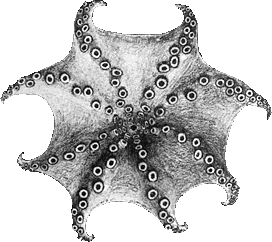
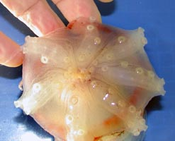
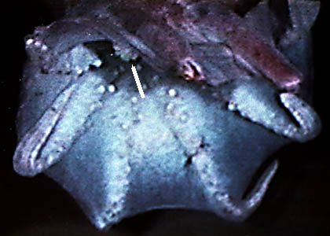

## Phylogeny 

-   « Ancestral Groups  
    -   [Argonautoida](../Argonautoida.md)
    -   [Incirrata](../../Incirrata.md)
    -   [Octopod](../../../Octopod.md)
    -  [Octopodiformes](../../../../Octopodiformes.md))
    -  [Coleoidea](../../../../../Coleoidea.md))
    -  [Cephalopoda](../../../../../../Cephalopoda.md))
    -  [Mollusca](../../../../../../../Mollusca.md))
    -  [Bilateria](../../../../../../../../Bilateria.md))
    -  [Animals](../../../../../../../../../Animals.md))
    -  [Eukarya](../../../../../../../../../../Eukarya.md))
    -   [Tree of Life](../../../../../../../../../../Tree_of_Life.md)

-   ◊ Sibling Groups of  Argonautoida
    -   Haliphron atlanticus
    -   [Tremoctopus](Tremoctopus)
    -   [Argonauta](Argonauta)
    -   [Ocythoe tuberculata](Ocythoe_tuberculata)

-   » Sub-Groups 

## Alloposidae [Verrill 1881] 

# *Haliphron atlanticus* [Steenstrup 1861] 

[Richard E. Young](http://www.tolweb.org/)

Containing group: [Argonautoida](../Argonautoida.md)

## Introduction

Females of ***Haliphron*** (= ***Alloposus**) **atlanticus*** are very
large, reaching 400 mm ML or a total length up to 2m (Nesis, 1982). Body
tissues are gelatinous; the mantle is short and broad and the head wide;
the eyes are large and the short arms have a deep web. The funnel is
embedded in head tissue. Males are much smaller than females but are
relatively large (ca. 300 mm total length) for an argonautoid. The
hectocotylus develops in an inconspicuous sac in front of the right eye
which gives the male the appearance of having only seven arms (see
below). The hectocotylus detaches at mating. Females brood their eggs,
which are attached to the oral side of the arm bases near the mouth
(Young, 1995).

#### Diagnosis

An argonautoid \...

-   of gelatinous consistency with complex funnel locking-apparatus.

### Characteristics

1.  Arms
    1.  Suckers mostly in two series but grade to single series near
        mouth.\
        \

    2.  Hectocotylus with papillate lateral fringes from base to
        spermatophore reservoir; open spermatophore groove.\
        \

    3.  Extensive web between all arms.

        {width="272"}

        **Figure**. Oral view of brachial crown of ***H. atlanticus***
        showing deep web and sucker arrangement, ca. 70 mm ML. Drawing
        from Verrill, 1881.
2.  Body shape
    1.  Short, broad.\
        \
3.  Funnel-locking apparatus
    1.  Lateral folds on the funnel and corresponding grooves on the
        mantle.\
        \
4.  Swim bladder
    1.  Hydrostatic organ (swim bladder) present dorsal to digestive
        system.\
        \
5.  Water pores
    1.  Absent.

#### Comments

Unlike other members of the argonautoid families, ***Haliphron*** has a
remnant of the true shell - a short, thick almost gelatinous stylet
(Voight, 1995). ***H. atlanticus***, like other members of the
argonautoid families except species of ***Argonauta***, has a
hydrostatic organ (Bizikov, 2004).

### Nomenclature

[A list of all nominal genera and species in the Alloposidae can be found here.](http://www.tolweb.org/accessory/Taxa_of_the_Alloposidae?acc_id=2438)
The list includes the current status and type species of all genera, and
the current status, type repository and type locality of all species and
all pertinent references.

### Life History

As in all argonautoids, the male has its hectocotylus coiled in a sac.
In ***Haliphron*** this is located beneath the right eye and due to the
thick gelatinous tissue on the octopod, it is easily overlooked. Indeed
one such animal was described as a new species and genus, ***Heptapus
danae*** (Joubin, 1929), based on the apparent presence of only seven
arms.

{width="247"}

**Figure**. Oral views of two males of ***H. atlanticus*** showing what
appears to be just seven arms. **Left** - Photograph by Ron Gilmer.
**Right** - Photograph by R. Young, R/V G. O. Sars, Mar-Eco cruise,
North Atlantic.

A large, brooding female was observed from a submersible off Hawaii at
270 m. The octopod was drifting just above the bottom and was carrying
eggs that were held within the web and near the mouth (Young, 1995). The
female was badly damaged as can be seen in the photograph by the
truncated dorsal arms and the crease in one of the lower arms.
Presumably the female was near the end of the brooding period and would
not survive long after all young had hatched. The white arrow in the
video frame to the right points to the eggs. The video of this octopod
can be seen at [Cephalopods in Action](http://www.mnh.si.edu/cephs/young92/cephs6.html#hali1).

{width="420"}

**Figure**. Oral view of a female ***H. atlanticus*** ca. 1 m in
diameter, off Hawaii. brooding a small batch of eggs (arrow). Video
frame from the submersible Pisces V, Hawaii Undersea Research Laboratory
(from Young, 1995).

Hatchlings are rarely taken in the near-surface plankton and presumably
reside in deep water (Personal observation).

### Habitat

This species is widely distributed from tropical to high latitudes and
occupies meso- to bathypelagic depths. It is commonly associated with
slopes of land masses. The habitat of this octopod is unusual. It has
been captured in bottom trawls and videotaped swimming within
centimeters of the ocean floor (brooding female) suggesting a
benthopelagic habitat along the slope. However, it has also been taken
from the open ocean thousands of meters from the ocean floor and
hundreds of miles from the nearest slope. ***H. atlanticus*** is a
common food item of blue sharks off New England, USA, and sperm whales
near the Azores Isl. (M. Vecchione, pers. comm.).

### References

Bizikov, V. A. 2004. The shell in Vampyropoda (Cephalopoda): Morphology,
functional role and evolution. Ruthenica. Supplement 3: 1-88.

Naef, A. 1921/23. Cephalopoda. Fauna und Flora des Golfes von Neapel.
Monograph, no. 35.

Nesis, K. N. 1982. Abridged dey to the cephalopod mollusks of the
world\'s ocean. 385+ii pp. Light and Food Industry Publishing House,
Moscow. (In Russian.). Translated into English by B. S. Levitov, ed. by
L. A. Burgess (1987), Cephalopods of the world. T. F. H. Publications,
Neptune City, NJ, 351pp.

Sasaki, M. 1929. A monograph of the dibranchiate cephalopods of the
Japanese and adjacent waters. Journal of the College of Agriculture,
Hokkaido Imperial University, 20(Supplementary number):1-357.

Verrill, A.E. 1881. The cephalopods of the north-eastern coast of
America. Part II. The smaller cephalopods, including the \"squids\" and
the octopi, with other allied forms. Trans. Connecticut Acad. Sciences,
5: 259-446.

Young, R. E. 1995. Aspects of the natural history of pelagic cephalopods
of the Hawaiian mesopelagic-boundary region. Pacific Science, 49:
143-155.

## Title Illustrations

)

  -------------------------------------------------------------------------------
  Scientific Name ::  Haliphron atlanticus
  Comments          Photographed aboard the R/V G. O. Sars, Mar-Eco cruise, central North Atlantic.
  Sex ::             Male
  View              Lateral
  Size              54 mm ML
  Copyright ::         © 2004 [Richard E. Young](http://www.soest.hawaii.edu/%7Eryoung/rey.html) 
  -------------------------------------------------------------------------------
)

  ---------------------------------------------------------------------------
  Scientific Name ::  Haliphron atlanticus
  Reference         from Verrill, A.E. 1881. The cephalopods of the north-eastern coast of America. Part II. The smaller cephalopods, including the \"squids\" and the octopi, with other allied forms. Trans. Connecticut Acad. Sciences 5:259-446.
  View              ventral
  Size              70 mm ML
  ---------------------------------------------------------------------------

## Confidential Links & Embeds: 

### #is_/same_as :: [Alloposidae](/_Standards/bio/bio~Domain/Eukarya/Animal/Bilateria/Mollusca/Cephalopoda/Coleoidea/Octopodiformes/Octopod/Incirrata/Argonautoida/Alloposidae.md) 

### #is_/same_as :: [Alloposidae.public](/_public/bio/bio~Domain/Eukarya/Animal/Bilateria/Mollusca/Cephalopoda/Coleoidea/Octopodiformes/Octopod/Incirrata/Argonautoida/Alloposidae.public.md) 

### #is_/same_as :: [Alloposidae.internal](/_internal/bio/bio~Domain/Eukarya/Animal/Bilateria/Mollusca/Cephalopoda/Coleoidea/Octopodiformes/Octopod/Incirrata/Argonautoida/Alloposidae.internal.md) 

### #is_/same_as :: [Alloposidae.protect](/_protect/bio/bio~Domain/Eukarya/Animal/Bilateria/Mollusca/Cephalopoda/Coleoidea/Octopodiformes/Octopod/Incirrata/Argonautoida/Alloposidae.protect.md) 

### #is_/same_as :: [Alloposidae.private](/_private/bio/bio~Domain/Eukarya/Animal/Bilateria/Mollusca/Cephalopoda/Coleoidea/Octopodiformes/Octopod/Incirrata/Argonautoida/Alloposidae.private.md) 

### #is_/same_as :: [Alloposidae.personal](/_personal/bio/bio~Domain/Eukarya/Animal/Bilateria/Mollusca/Cephalopoda/Coleoidea/Octopodiformes/Octopod/Incirrata/Argonautoida/Alloposidae.personal.md) 

### #is_/same_as :: [Alloposidae.secret](/_secret/bio/bio~Domain/Eukarya/Animal/Bilateria/Mollusca/Cephalopoda/Coleoidea/Octopodiformes/Octopod/Incirrata/Argonautoida/Alloposidae.secret.md)

