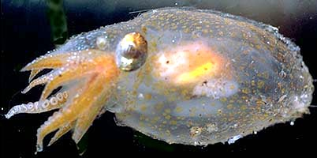
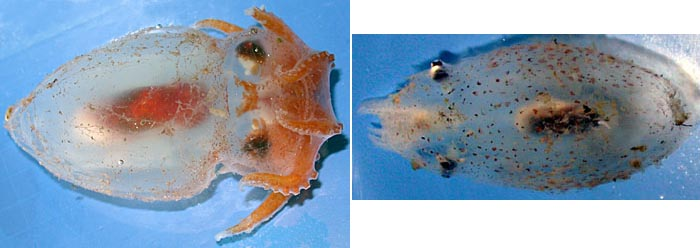
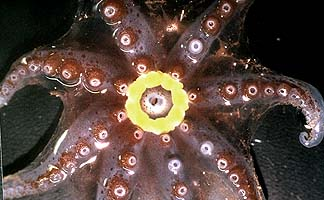
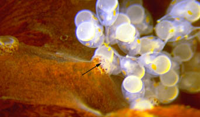
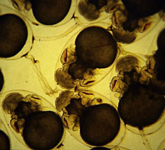
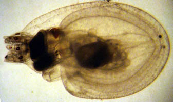

---
aliases:
  - Bolitaenidae
title: Bolitaenidae
---

# [[Bolitaenidae]] 

 

Two, probably monotypic, genera are present in the Bolitaenidae.

## #has_/text_of_/abstract 

> The Bolitaeninae are a subfamily, in the family Amphitretidae, of small, common 
> pelagic octopuses found in all tropical and temperate oceans of the world. 
> 
> The taxonomy of this taxon is not entirely certain. 
> 
> Recent research suggests just two genera exist, Bolitaena and Japetella, 
> both of which are thought to be monotypic by some authorities 
> and under this view, the family would represent two very similar species: 
> 
> Bolitaena pygmaea and Japetella diaphana. 
> However, currently a second species of Bolitaena, B. massyae is also recognised.
>
> [Wikipedia](https://en.wikipedia.org/wiki/Bolitaeninae) 

## Introduction

[Richard E. Young]() 

These are common meso- to bathypelagic octopods of rather small size
(ca. 85 mm ML in the largest species) that are broadly distributed
mostly in tropical to temperate latitudes of all oceans. They have
gelatinous bodies, numerous chromatophores and possess short arms with a
single series of suckers. The mantle aperture is wide. The hectocotylus
has a swollen ligula in ***Bolitaena*** but is unknown in
***Japetella**.*

### Characteristics

1.  Arms
    1.  Short; length less than ML.
    2.  Suckers in a single series.
    3.  Third right arm in ***Bolitaena*** hectocotylized
        *(**Japetella*** apparently lacks hectocotylization although
        some sexual dimorphism of arms III occurs).
2.  Eyes
    1.  Eyes laterally compressed.\
        \
3.  Viscera
    1.  Long axis of digestive gland parallels body axis.
    2.  Stomach posterior to digestive gland.\
        \
4.  Radula
    1.  Lateral teeth multicuspid (=ctenoglossan).
5.  Photophores
    1.  Mature females with a circular light organ surrounding the
        mouth.

#### Comments

For immature octopods, the two genera can be difficult to separate. The
most obvious features are the size of the eyes (larger in
***Japetella***) and the distance between the eyes (larger in
***Bolitaena***). When comparing adjacent octopods (see below), these
differences are distinct. However, with isolated specimens, the
differences are not always obvious.

\

**Figure**. **Left** - Dorsal view of ***Japetella diaphana***, 83 mm
ML, nearly mature female. **Right** - Dorsal view of ***Bolitaena
pygmaea***, 38 mm ML, immature female. Differences above in arm sizes
and pigmentation is accuated by the size disparity. In addition, if the
***J. diaphana*** were smaller, the separation of its eyes would be
less.\

 

### Nomenclature

***Bolitaena microcotyla*** Steenstrup in Hoyle, 1886, has many
similarities to ***Eledonella pygmaea***. Thore (1949), in his review of
the family, distinguishes ***B.microcotyla*** primarily by its having
(1) large eggs, (2) suckers apart within the web and closely set beyond
the web and (3) reddish-purple color. The eggs of ***B. microcotyla***
are 2.5 mm in length (Thore, 1949). The eggs of \"***E. pygmaea***\"
(incorrectly identified by Young, 1972, as ***Bolitaena microcotyla***),
however, are nearly the same length (2.0 mm, Young, 1972). The second
and third distinguishing characters result from rather marked
morphological changes that bolitaenids exhibit at sexual maturity. At
maturity females lose the irridescence on their eyes and digestive
glands, become heavily pigmented (the degree of pigmentation is greater
in ***Bolitaena***), and the arms increase in length relative to the
mantle length. The longer arms produce the distinctive sucker
arrangement on the arms (Note the pigmentation and sucker spacing in the
photograph of the brooding female below). Unfortunately, adequate
material has not been available to quantitatively document these
changes. Nevertheless, the mature female appears very different from the
subadult and has resulted in labeling different life-history stages as
different genera.

The genus ***Bolitaena*** was described nearly 30 years before a species
name, ***B. microcotyla***, was appended in 1886, in a brief
description. Description of a new genus without a type species is no
longer legal under the rules of zoological nomenclature but was valid at
the time. ***Eledonella pygmaea*** was described by Verrill in 1884. The
proper name, therefore, is ***Bolitaena pygmaea*** (Verrill, 1884).

Careful comparisons of specimens in good condition (or, more likely
genetic analyses) may eventually reveal that more than one species of
***Bolitaena*** exists. Our present knowledge, however, requires
synonymizing the genera and leaves little reason for maintaining
separate species.

Thore (1949) described **Dorsopsis taningi** as a new genus and species
of bolitaenid that had hemispherical, dorsally directed eyes. This
specimen, however, was a damanged **Japetella** (Hochberg, *et al.*,
1992).

[A list of all nominal genera and species in the Bolitaenidae can be found here.](http://www.tolweb.org/accessory/Bolitaenidae_Taxa?acc_id=2421)
The list includes the current status and type species of all genera, and
the current status, type repository and type locality of all species and
all pertinent references.

### Life history

A large light organ develops around the mouth in females at maturity.
Presumably it functions in attracting a male in dark waters at a depth
of 1000m or more (Robison and Young, 1981). This is the only luminescent
organ known in incirrate octopods.

**Figure*****. *** Oral view of mature female ***Japetella
diaphana***showing yellow photophore around mouth, off Hawaii.
Photograph by M. Vecchione.

Bolitaenids brood their embryos until hatching. During brooding, the
eggs are held by suckers near the mouth where they are well covered by
the arms and web.

**Figure**. Arms of ***Bolitaena pygmaea*** holding onto a brood of
embryos. Arrow in photograph points to a sucker holding one of the eggs.
Photograph by R. Young.

The chorion of each egg has a long stalk that attaches to the chorion of
an adjacent egg. Some eggs will have several stalks attached to them. 
As a result the egg cluster is a matrix of eggs attached to one another
in a rather haphazard way.

**Figure**. Developing embryos of ***Bolitaena pygmaea*** (?).  The egg
in the upper left corner of the photograph has two stalks attached to
the chorion opposite the large yolk sac. Photograpyh by R. Young.

Off Hawaii female bolitaenids apparently release their young at a depth
near 800m. The young, free-swimming octopods are found at depths around
150 - 250 m. As they grow they descend, at first abruptly then more
gradually, to depths of 800 -1400 m. Gravid females are found at the
lower end of the range where mating presumably occurs (Young, 1978).
More details of this pattern are presented under each genus.

Figure. Ventrolateral view of a hatchling of ***Japetella diaphana***.
This hatchling may have hatched slightly prematurely due to the trauma
of capture). Note that only a few chromatophores are present and that
the arms are very short. Photograph by R. Young.

## Phylogeny 

-   « Ancestral Groups  
    -   [Incirrata](../Incirrata.md)
    -   [Octopod](../../Octopod.md)
    -  [Octopodiformes](../../../Octopodiformes.md) 
    -  [Coleoidea](../../../../Coleoidea.md) 
    -  [Cephalopoda](../../../../../Cephalopoda.md) 
    -  [Mollusca](../../../../../../Mollusca.md) 
    -  [Bilateria](../../../../../../../Bilateria.md) 
    -  [Animals](../../../../../../../../Animals.md) 
    -  [Eukarya](../../../../../../../../../Eukarya.md) 
    -   [Tree of Life](../../../../../../../../../Tree_of_Life.md)

-   ◊ Sibling Groups of  Incirrata
    -   [Amphitretidae](Amphitretidae.md)
    -   [Octopodidae](Octopodidae.md)
    -   [Argonautoida](Argonautoida.md)
    -   Bolitaenidae
    -   [Vitreledonella richardi](Vitreledonella_richardi)

-   » Sub-Groups
    -   [Bolitaena pygmaea](Bolitaenidae/Bolitaena_pygmaea.md)
    -   [Japetella diaphana](Bolitaenidae/Japetella_diaphana.md)

## Title Illustrations

--------- 
 
scientific_name ::  Japetella diaphana
location ::        off Hawaii
copyright ::         © 1995 R. E.Young

## Confidential Links & Embeds: 

### #is_/same_as :: [[/_Standards/bio/bio~Domain/Eukarya/Animal/Bilateria/Mollusca/Cephalopoda/Coleoidea/Octopodiformes/Octopod/Incirrata/Bolitaenidae|Bolitaenidae]] 

### #is_/same_as :: [[/_public/bio/bio~Domain/Eukarya/Animal/Bilateria/Mollusca/Cephalopoda/Coleoidea/Octopodiformes/Octopod/Incirrata/Bolitaenidae.public|Bolitaenidae.public]] 

### #is_/same_as :: [[/_internal/bio/bio~Domain/Eukarya/Animal/Bilateria/Mollusca/Cephalopoda/Coleoidea/Octopodiformes/Octopod/Incirrata/Bolitaenidae.internal|Bolitaenidae.internal]] 

### #is_/same_as :: [[/_protect/bio/bio~Domain/Eukarya/Animal/Bilateria/Mollusca/Cephalopoda/Coleoidea/Octopodiformes/Octopod/Incirrata/Bolitaenidae.protect|Bolitaenidae.protect]] 

### #is_/same_as :: [[/_private/bio/bio~Domain/Eukarya/Animal/Bilateria/Mollusca/Cephalopoda/Coleoidea/Octopodiformes/Octopod/Incirrata/Bolitaenidae.private|Bolitaenidae.private]] 

### #is_/same_as :: [[/_personal/bio/bio~Domain/Eukarya/Animal/Bilateria/Mollusca/Cephalopoda/Coleoidea/Octopodiformes/Octopod/Incirrata/Bolitaenidae.personal|Bolitaenidae.personal]] 

### #is_/same_as :: [[/_secret/bio/bio~Domain/Eukarya/Animal/Bilateria/Mollusca/Cephalopoda/Coleoidea/Octopodiformes/Octopod/Incirrata/Bolitaenidae.secret|Bolitaenidae.secret]] 

