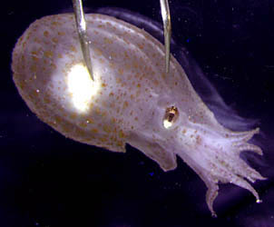
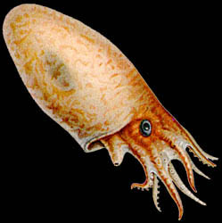
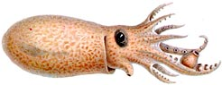
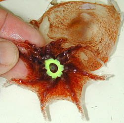
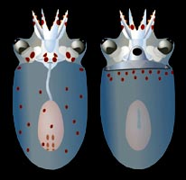
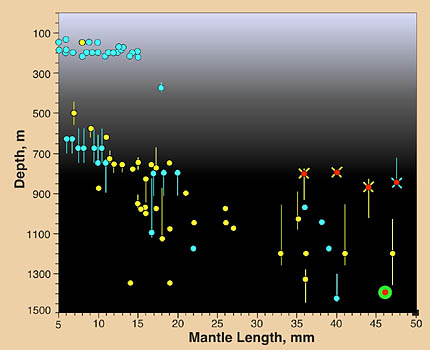

---
aliases:
  - Bolitaena_pygmaea
  - Bolitaena pygmaea
title: Bolitaena pygmaea
---

## Phylogeny 

-   « Ancestral Groups  
    -   [Bolitaenidae](../Bolitaenidae.md)
    -   [Incirrata](../../Incirrata.md)
    -   [Octopod](../../../Octopod.md)
    -  [Octopodiformes](../../../../Octopodiformes.md) 
    -  [Coleoidea](../../../../../Coleoidea.md) 
    -  [Cephalopoda](../../../../../../Cephalopoda.md) 
    -  [Mollusca](../../../../../../../Mollusca.md) 
    -  [Bilateria](../../../../../../../../Bilateria.md) 
    -  [Animals](../../../../../../../../../Animals.md) 
    -  [Eukarya](../../../../../../../../../../Eukarya.md) 
    -   [Tree of Life](../../../../../../../../../../Tree_of_Life.md)

-   ◊ Sibling Groups of  Bolitaenidae
    -   Bolitaena pygmaea
    -   [Japetella diaphana](Japetella_diaphana.md)

-   » Sub-Groups 

# [[Bolitaena_pygmaea]] 

## *Bolitaena* [Steenstrup 1859] 

A single species is recognized in this genus.

## Introduction

[Richard E. Young](http://www.tolweb.org/) 

***Bolitaena pygmaea*** is a small, lower mesopelagic to bathypelagic
octopus. It is very similar in appearance to ***Japetella*** as small
subadults but is distinguished primarily by the smaller eyes that are
set on longer optic stalks.

#### Diagnosis

A bolitaenid \...

-   with a ligula on the hectocotylus.
-   with small eyes on long optic stalks.

### Characteristics

1.  Arms
    1.  Left arm III hectocotylized in males with an elongate ligula.
        Third right arm sexually dimorphic with 1-3 greatly enlarged
        suckers in males.

        {height="95" width="246"}
        **Figure**. View of right side of a male ***B. pygmaea***
        showing enlarged sucker. Drawing from Chun, 1910.

2.  Eyes
    1.  Well removed from brain on long optic stalks.

#### Comments

The distinctive hectocotylus makes identification of nearly mature males
easy. Unfortunately these males are rarely seen. As a result, separation
of this species from ***Japetella diaphana*** depends largely on the
differences in eye size and length of the optic stalks.\

### Life history

Near sexual maturity, iridescence of the digestive gland and eyes is
lost; pigmentation greatly increases in females, and arms become
relatively longer. In addition, the posterior salivary glands of males
become greatly enlarged (Voight, 1995). Females develop a yellow
ring-shaped light organ around the mouth. Gravid females and nearly
mature males (mature males are unknown) are found at the lower end of
the vertical distribution range near 1200-1400 m. Brooding females,
however, are found near 800 m off Hawaii.

{height="250" width="251"}

**Figure**. Oral view of the brachial crown of ***B. pygmaea*** showing
photophore, mature female, Northwest Atlantic. Photograph by M.
Vecchione.

Hatchlings have a ML of about 2 mm and eggs are about the same length
(Young, 1972). The early paralarvae of ***Bolitaena pygmaea*** have an
abundance of chromatophores that easily separates them from ***Japetella
diaphana*** if specimens are intact which they usually are not. The
optic lobe of the brain is distinctly separated from the brain by a
short optic stalk even in the paralarva. In ***Japetella diaphana***
paralarvae no such separation is apparent.

{height="200" width="206"}

**Figure**. Dorsal and ventral views of a paralarva of ***B. pygmaea***,
3.9 mm ML. Drawing modified from Hochberg, *et al*. (1992).

The life history appears to be very similar to that of ***Japetella
diaphana***. Present data suggest the following scenario:

Females, brooding clusters of interconnected eggs, float at a depth of
around 800 m where downwelling sunlight is too low to reveal their
presence. This is about as close as they can get to the surface in
Hawaiian waters under this visibility constraint. Females do not feed
while brooding and apparently die after the young hatch (Young, 1972).
At a temperature of 4-5°C, brooding is expected to take at least several
months. Hatchlings either swim upward to about 200 m depth where food
presumably is more plentiful or are carried there by the female at the
time of hatching. Young ***Bolitaena*** descend into mesopelagic depths
as they grow, but the size at which they descend is variable (ca. 5-15
mm ML). At maturity the octopus descends to depths of about 1400 m where
males probably first attract females then females attract males.
Secretions from the enlarged posterior salivary glands of males could
secrete pheromones to attract females (for an alternate view of the
function of the enlarged salivary glands, see Voight, 1995). Presumably,
as the female draws close and considers conditions safe, she will signal
the male with the oral light organ and mating will occur.

### Distribution

#### Vertical distribution

In waters off Hawaii, Young (1978) found the distribution pattern shown
on the right. Small octopods (ca. 5-15 mm ML) were found near 150-200 m
depth or mostly below 600 m. One gravid female was captured at 1400 m.
Two nearly mature males were taken at 1200 and 1425 m. Four brooding
females were taken between 800 and 900 m.\

\

**Figure**. Vertical distribution of ***B. pygmaea*** off Hawaii. Bars -
Fishing range of opening/closing trawl; absence of bar indicates capture
is from an open trawl. Circles- Modal depth of the trawl. Open yellow
circles- Day captures. Filled blue circles- Night captures. Red dots
with yellow cross-bars- Brooding females, day captures. Red dots with
blue cross-bars- Brooding females, night capture. Red dot with green
ring- Gravid female. Chart redrawn from Young,
1978.

#### Geographical distribution

This is a tropical-subtropical species found worldwide (Thore, 1949;
Nesis, 1982).

## Title Illustrations

------------------------------------------------------------------------------- 
 
scientific_name ::  Bolitaena pygmaea
location ::        off Hawaii
copyright ::         © 1999 [Richard E. Young](http://www.soest.hawaii.edu/%7Eryoung/rey.html) 

------------ 
 
scientific_name ::  Bolitaena pygmaea
Reference         modified from Chun, 1910

## Confidential Links & Embeds: 

### #is_/same_as :: [[/_Standards/bio/bio~Domain/Eukarya/Animal/Bilateria/Mollusca/Cephalopoda/Coleoidea/Octopodiformes/Octopod/Incirrata/Bolitaenidae/Bolitaena_pygmaea|Bolitaena_pygmaea]] 

### #is_/same_as :: [[/_public/bio/bio~Domain/Eukarya/Animal/Bilateria/Mollusca/Cephalopoda/Coleoidea/Octopodiformes/Octopod/Incirrata/Bolitaenidae/Bolitaena_pygmaea.public|Bolitaena_pygmaea.public]] 

### #is_/same_as :: [[/_internal/bio/bio~Domain/Eukarya/Animal/Bilateria/Mollusca/Cephalopoda/Coleoidea/Octopodiformes/Octopod/Incirrata/Bolitaenidae/Bolitaena_pygmaea.internal|Bolitaena_pygmaea.internal]] 

### #is_/same_as :: [[/_protect/bio/bio~Domain/Eukarya/Animal/Bilateria/Mollusca/Cephalopoda/Coleoidea/Octopodiformes/Octopod/Incirrata/Bolitaenidae/Bolitaena_pygmaea.protect|Bolitaena_pygmaea.protect]] 

### #is_/same_as :: [[/_private/bio/bio~Domain/Eukarya/Animal/Bilateria/Mollusca/Cephalopoda/Coleoidea/Octopodiformes/Octopod/Incirrata/Bolitaenidae/Bolitaena_pygmaea.private|Bolitaena_pygmaea.private]] 

### #is_/same_as :: [[/_personal/bio/bio~Domain/Eukarya/Animal/Bilateria/Mollusca/Cephalopoda/Coleoidea/Octopodiformes/Octopod/Incirrata/Bolitaenidae/Bolitaena_pygmaea.personal|Bolitaena_pygmaea.personal]] 

### #is_/same_as :: [[/_secret/bio/bio~Domain/Eukarya/Animal/Bilateria/Mollusca/Cephalopoda/Coleoidea/Octopodiformes/Octopod/Incirrata/Bolitaenidae/Bolitaena_pygmaea.secret|Bolitaena_pygmaea.secret]] 

