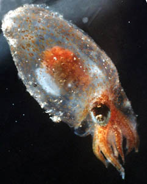
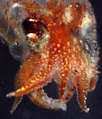
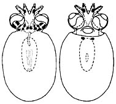
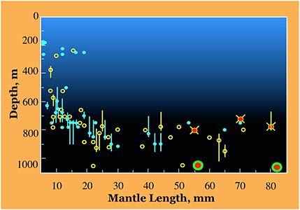

---
aliases:
  - Japetella_diaphana
  - Japetella diaphana
title: Japetella diaphana
---

# [[Japetella diaphana]] 

 

A single species is recognized in ***Japetella***.

Containing group: [Bolitaenidae](../Bolitaenidae.md)

## Introduction

[Richard E. Young](http://www.tolweb.org/) 

***Japetella diaphana*** reaches about twice the length of ***Bolitaena
pygmaea*** and has larger eyes. The third arms the the male have
slightly enlarged suckers but no trace of a ligula has been found. No
fully mature male, however, has ever been captured.

### Characteristics

1.  Arms
    1.  Arms III exhibit sexual dimorphism with suckers slightly
        enlarged on the distal 2/3rds of the arms. Near sexual maturity
        suckers on right arm III become abruptly enlarged (5th sucker ca
        2x height of sucker 4 - see photograph on right);
        Hectocotylization (i.e., modification of the arm tip) unknown.
2.  Eyes
    1.  Adjacent to brain in young animals but slightly removed in older
        animals (optic stalks short).

#### Comments

The nearly mature male that was examined had 4 enlarged suckers on arm
III but the remainder of the arm was badly damaged during capture so
details are unknown. Suckers on the left arm III were normal but other
arms were damaged.

***Japetella diaphana*** has iridophores in the skin, overlying the
dorsal arms and head that lie in a plane transverse, rather than
parallel, to the body axis. The function of these unusually positioned
iridophores is unknown.

**Figure**. Dorsal view of the head and arms of ***J. diaphana***. The
light is hitting the head at the correct angle to show the strong
reflection (gold spots) of the iridophores. Photograph by R. Young.\
### Life history

Near sexual maturity, irridescence of the digestive gland and eyes are
lost (Young, 1972) and pigmentation increases but not as greatly as in
***Bolitaena pygmaea***. The increase in salivary gland size found in
male ***Bolitaena pygmaea*** has not been documented in this species. We
have seen a nearly mature male, however, that had a salivary gland over
twice the size of a female of the same size. In addition the male
salivary gland, in the fresh octopus, was a pearly, opaque white unlike
the normal translucent appearance of the gland of subadults. Females
develop a ring-shaped light organ around the mouth. Gravid females are
found at the lower end of the vertical distribution range near 1000 m
(nothing is known of the vertical distribution of near-mature and mature
males) and brooding females near 800 m off Hawaii.

**Figure**. Dorsal and ventral views of small paralarva of ***J.
diaphana***, 3.8 mm ML. Drawing from Hochberg, et al., 1992.

Young are found between about 200 and 300 m or at much greater depths.
Hatchlings have a ML of about 3 mm and eggs are about the same size
(pers. obs.). The young paralarvae at the right have a different
chromatophore pattern than that of ***Bolitaena pygmaea*** young.
Unfortunately, the chromatophores are often lost during capture. Indeed,
the smaller ***Japetella*** hatchling on the family page shows two
posterior mantle chromatophores that apparently were lost from the
paralarva illustrated here.

The life history appears to be very similar to that of ***Bolitaena
pygmaea***. Present data suggest the following senario:

Spawned females float at a depth of around 800m and brood clusters of
interconnected eggs between their arms. At this depth downwelling
sunlight is too low to reveal their presence; this is about as close as
they can get to the surface under this visibility constraint. Females
probably do not feed while brooding and die after the young hatch. At a
temperature of 4-5°C, brooding is expected to take at least several
months. Hatchlings either swim to the upper 200-300 m where food
presumably is more plentiful or are carried there by the female at the
time of hatching. Young ***Japetella*** descend into mesopelagic depths
as they grow but the size at which they descend is variable (ca. 7-20mm
ML). At maturity the female, and presumably the male, descends to depths
of just over 1000 m where males perhaps first attract females then
vice-versa. Secretions from the posterior salivary gland of males could
act as a pheromone to attract females. Presumably as the female draws
close and when she considers conditions safe, she will signal the male
with the oral light organ and mating will occur.

### Distribution

#### Vertical distribution

In Hawaiian waters, Young (1978) found the distribution pattern shown on
the right. Small octopods (ca. 5-20 mm ML) were found near 170-270 m
depth or mostly between 500 and 800 m. At a ML of over 20 mm, most were
captured at depths of 700-950 m. Two gravid females were captured at
about 1050 m. No mature males were taken. Three brooding females were
taken between 725 and 800 m.

**Figure**. Vertical distribution chart of ***J. diaphana***, Hawaiian
waters. **Bars** - Fishing range of opening/closing trawl; absence of
bar indicates capture is from an open trawl. **Circles** - Modal depth
of the trawl. **Open yellow circles** - day captures. **Filled blue
circles** - night captures. **Red dots with yellow cross-bars** -
Brooding female, day capture. **Red dots with blue cross-bars** -
Brooding female, night capture. **Red dot with green ring** - Gravid
female. Chart modified from Young, 1978.

The distribution seen here is similar to that found by Lu and Clarke
(1975) for ***J. diaphana*** in the tropical Eastern North Atlantic
except that these authors record several daytime captures of large
octopods at shallow depths. Two of these captures were extreme: One was
in the upper 100 m (60 mm ML) and the other in the 100-200 m range (70
mm ML). Neither octopus was mature. At present, we have no explanation
for this peculiar aspect of their vertical distribution.

#### Geographical distribution

***Japetella diaphana*** is found throughout the tropical and
subtropical regions of the world\'s oceans but extends into boreal
waters in the North Pacific (Thiele, 1949, Nesis, 1982).

## Phylogeny 

-   « Ancestral Groups  
    -   [Bolitaenidae](../Bolitaenidae.md)
    -   [Incirrata](../../Incirrata.md)
    -   [Octopod](../../../Octopod.md)
    -  [Octopodiformes](../../../../Octopodiformes.md) 
    -  [Coleoidea](../../../../../Coleoidea.md) 
    -  [Cephalopoda](../../../../../../Cephalopoda.md) 
    -  [Mollusca](../../../../../../../Mollusca.md) 
    -  [Bilateria](../../../../../../../../Bilateria.md) 
    -  [Animals](../../../../../../../../../Animals.md) 
    -  [Eukarya](../../../../../../../../../../Eukarya.md) 
    -   [Tree of Life](../../../../../../../../../../Tree_of_Life.md)

-   ◊ Sibling Groups of  Bolitaenidae
    -   [Bolitaena pygmaea](Bolitaena_pygmaea.md)
    -   Japetella diaphana

-   » Sub-Groups 

## Title Illustrations

**Japetella diaphana** off Hawaii (photograph copyright © 1996, R.
Young).

#### Other illustrations

-   Dorsal and ventral views of small paralarva, 3.8 mm ML, from
Hochberg, et al., 1992.
-   Vertical distribution chart redrawn from Young, 1978.

-------------------------------------------------------------------------------

Scientific Name ::  Japetella diaphana
Location ::        off Hawaii
Copyright ::         © 1996 [Richard E. Young](http://www.soest.hawaii.edu/%7Eryoung/rey.html) 

## Confidential Links & Embeds: 

### #is_/same_as :: [Japetella_diaphana](/_Standards/bio/bio~Domain/Eukarya/Animal/Bilateria/Mollusca/Cephalopoda/Coleoidea/Octopodiformes/Octopod/Incirrata/Bolitaenidae/Japetella_diaphana.md) 

### #is_/same_as :: [Japetella_diaphana.public](/_public/bio/bio~Domain/Eukarya/Animal/Bilateria/Mollusca/Cephalopoda/Coleoidea/Octopodiformes/Octopod/Incirrata/Bolitaenidae/Japetella_diaphana.public.md) 

### #is_/same_as :: [Japetella_diaphana.internal](/_internal/bio/bio~Domain/Eukarya/Animal/Bilateria/Mollusca/Cephalopoda/Coleoidea/Octopodiformes/Octopod/Incirrata/Bolitaenidae/Japetella_diaphana.internal.md) 

### #is_/same_as :: [Japetella_diaphana.protect](/_protect/bio/bio~Domain/Eukarya/Animal/Bilateria/Mollusca/Cephalopoda/Coleoidea/Octopodiformes/Octopod/Incirrata/Bolitaenidae/Japetella_diaphana.protect.md) 

### #is_/same_as :: [Japetella_diaphana.private](/_private/bio/bio~Domain/Eukarya/Animal/Bilateria/Mollusca/Cephalopoda/Coleoidea/Octopodiformes/Octopod/Incirrata/Bolitaenidae/Japetella_diaphana.private.md) 

### #is_/same_as :: [Japetella_diaphana.personal](/_personal/bio/bio~Domain/Eukarya/Animal/Bilateria/Mollusca/Cephalopoda/Coleoidea/Octopodiformes/Octopod/Incirrata/Bolitaenidae/Japetella_diaphana.personal.md) 

### #is_/same_as :: [Japetella_diaphana.secret](/_secret/bio/bio~Domain/Eukarya/Animal/Bilateria/Mollusca/Cephalopoda/Coleoidea/Octopodiformes/Octopod/Incirrata/Bolitaenidae/Japetella_diaphana.secret.md)

