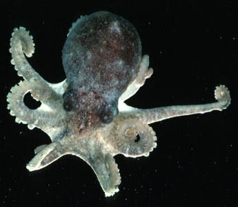
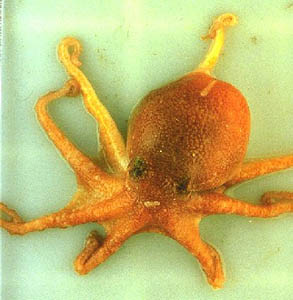
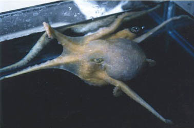
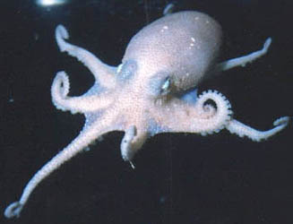
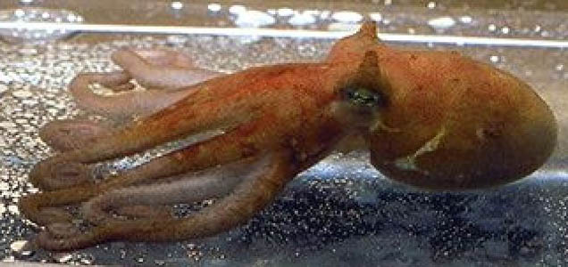

---
aliases:
  - Pareledone
title: Pareledone
---

# [[Pareledone]] 

         

The following five species are presently recognized as valid. There are
at least seven other undescribed species.

-   *Pareledone turqueti*
-   *Pareledone harrissoni*
-   *Pareledone charcoti*
-   *Pareledone framensis*
-   *Pareledone prydzensis*

Containing group: [Octopodidae](../Octopodidae.md)

## Introduction

[Louise Allcock]() 

**Pareledone** is the most abundant and diverse cephalopod genus in
Antarctica. It is restricted to the continental shelf and slope margins
(in depths of less than 1000 m) of Antarctica and the surrounding
islands of the Southern Ocean. Members of the genus tend to be small;
total length reaches 95 mm (mantle length 30 mm) in the smallest
species, and 350 mm (mantle length 100 mm) in the largest. The first
specimens of this genus were caught in 1905, but because of the
inaccessibility of their habitat there is still only limited information
available on their behaviour and life history. They have no commercial
value.

### Characteristics

1.  Hectocotylus clearly differentiated into ligula and calamus.
2.  Ligula groove long, well marked and shallow without transverse
    ridges.
3.  Funnel organ VV-shaped.
4.  Cartilaginous stylets absent.
5.  Ink sac present.
6.  Anal flaps present.
7.  Gills well developed, with 6-11 lamellae per demibranch.
8.  Web well developed.
9.  Crop well developed.
10. Spermatophores long and slender.
11. Beak medium sized, rostral tip of lower beak rounded.

### Discussion of Phylogenetic Relationships

The status of this genus has been questioned as rather than being a
group of species that share a unique evolutionary history, it is a group
that simply shares primitive character states (Voight, 1993).  Certain
characteristics, however, such as the absence of cartilaginous stylets,
are almost certainly derived.  Furthermore, recent biochemical genetic
analyses confirm that the species are closely related (Allcock, 1997).

### Life History

Life history data on the **Pareledone** is limited.  Although live
specimens have been successfully transported from Antarctica and kept in
captivity, there are no reported cases of successful breeding.  Studies
into the maturation of the gonads by Kuehl (1988) suggest that the
spawning season extends over a considerable period of time. The eggs of
**Pareledone** are large (reaching 20 mm in length), hence they are
likely to be incubated for a considerable time. The incubation period
probably extends over the winter months.  The large size of the eggs
also means that the hatchlings are probably benthic in habitat.  The
lack of a planktonic larval stage restricts gene flow between isolated
populations (Allcock et al., 1997) and may have consequences for
speciation.

### Distribution

-   **Pareledone harrissoni** (type locality: 65°06\'S, 96°13\'E), **P.
    framensis** (type locality: 67°29\'S, 68°50\'E) and **Pareledone
    prydzensis** (type locality: 66°48\'S, 72°33\'E) are restricted in
    their distribution to Eastern Antarctica.
-   **Pareledone turqueti** (type locality: 65°05\'S 63°55\'W) is
    restricted in its distribution to Western Antarctica.
-   **Pareledone charcoti** (type locality: 65°05\'S 63°55\'W) is the
    only circum-Antarctic species.

## Phylogeny 

-   « Ancestral Groups  
    -   [Octopodidae](../Octopodidae.md)
    -   [Incirrata](../../Incirrata.md)
    -   [Octopod](../../../Octopod.md)
    -  [Octopodiformes](../../../../Octopodiformes.md))
    -  [Coleoidea](../../../../../Coleoidea.md))
    -  [Cephalopoda](../../../../../../Cephalopoda.md))
    -  [Mollusca](../../../../../../../Mollusca.md))
    -  [Bilateria](../../../../../../../../Bilateria.md))
    -  [Animals](../../../../../../../../../Animals.md))
    -  [Eukarya](../../../../../../../../../../Eukarya.md))
    -   [Tree of Life](../../../../../../../../../../Tree_of_Life.md)

-   ◊ Sibling Groups of  Octopodidae
    -   [Ameloctopus litoralis](Ameloctopus_litoralis)
    -   Pareledone

-   » Sub-Groups 

## Title Illustrations

------------------)
Scientific Name ::  Pareledone
Copyright ::         © 1998 J. Gilbert / British Antarctic Survey

--------------------------------------------------------------------------)
Scientific Name ::  Pareledone framensis
Location ::        Eastern Antarctica
View              dorsal
Copyright ::         © 1998 [Chung Cheng Lu](mailto:cclu@dragon.nchu.edu.tw) 

------------------------------------------------------------------------)
Scientific Name ::  Pareledone turqueti
Location ::        Antarctic Peninsula
Copyright ::         © 1998 [Louise Allcock](mailto:l.allcock@qub.ac.uk) 

------------------------------------------------------------------------

Scientific Name ::  Pareledone charcoti
Location ::        Antarctic Peninsula
Copyright ::         © 1998 [Louise Allcock](mailto:l.allcock@qub.ac.uk) 

--------------------------------------------------------------------------

Scientific Name ::  Pareledone framensis
Location ::        Eastern Antarctica
View              lateral
Copyright ::         © 1998 [Chung Cheng Lu](mailto:cclu@dragon.nchu.edu.tw) 

## Confidential Links & Embeds: 

### #is_/same_as :: [Pareledone](/_Standards/bio/bio~Domain/Eukarya/Animal/Bilateria/Mollusca/Cephalopoda/Coleoidea/Octopodiformes/Octopod/Incirrata/Octopodidae/Pareledone.md) 

### #is_/same_as :: [Pareledone.public](/_public/bio/bio~Domain/Eukarya/Animal/Bilateria/Mollusca/Cephalopoda/Coleoidea/Octopodiformes/Octopod/Incirrata/Octopodidae/Pareledone.public.md) 

### #is_/same_as :: [Pareledone.internal](/_internal/bio/bio~Domain/Eukarya/Animal/Bilateria/Mollusca/Cephalopoda/Coleoidea/Octopodiformes/Octopod/Incirrata/Octopodidae/Pareledone.internal.md) 

### #is_/same_as :: [Pareledone.protect](/_protect/bio/bio~Domain/Eukarya/Animal/Bilateria/Mollusca/Cephalopoda/Coleoidea/Octopodiformes/Octopod/Incirrata/Octopodidae/Pareledone.protect.md) 

### #is_/same_as :: [Pareledone.private](/_private/bio/bio~Domain/Eukarya/Animal/Bilateria/Mollusca/Cephalopoda/Coleoidea/Octopodiformes/Octopod/Incirrata/Octopodidae/Pareledone.private.md) 

### #is_/same_as :: [Pareledone.personal](/_personal/bio/bio~Domain/Eukarya/Animal/Bilateria/Mollusca/Cephalopoda/Coleoidea/Octopodiformes/Octopod/Incirrata/Octopodidae/Pareledone.personal.md) 

### #is_/same_as :: [Pareledone.secret](/_secret/bio/bio~Domain/Eukarya/Animal/Bilateria/Mollusca/Cephalopoda/Coleoidea/Octopodiformes/Octopod/Incirrata/Octopodidae/Pareledone.secret.md)

