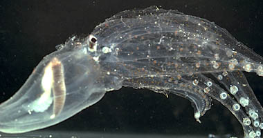
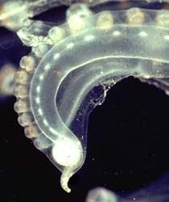
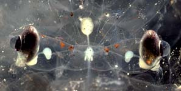
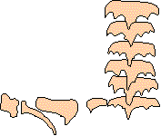
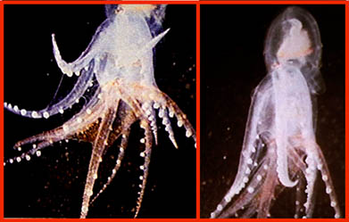
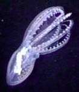
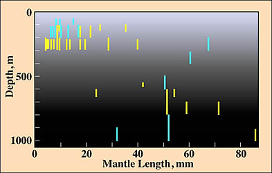

---
aliases:
- Vitreledonella
- Vitreledonella richardi
- Vitreledonellidae
- أخطبوط زجاجي
- اختاپوس شیشهای
- اخطبوط زجاجى
- 玻璃章魚屬
title: Vitreledonella richardi
has_id_wikidata: Q3166977
dv_has_:
  name_:
    an: Vitreledonella
    ar: أخطبوط زجاجي
    arz: اخطبوط زجاجى
    ast: Vitreledonella
    bg: Vitreledonella
    ca: Vitreledonella
    ceb: Vitreledonella
    de: Vitreledonella
    en: Vitreledonella
    eo: Vitreledonella
    es: Vitreledonella
    eu: Vitreledonella
    ext: Vitreledonella
    fa: اختاپوس شیشهای
    fi: Vitreledonella
    fr: Vitreledonella
    ga: Vitreledonella
    gl: Vitreledonella
    ia: Vitreledonella
    ie: Vitreledonella
    io: Vitreledonella
    it: Vitreledonella
    la: Vitreledonella
    mul: Vitreledonella
    nl: Vitreledonella richardi
    oc: Vitreledonella
    pl: Vitreledonella
    pt: Vitreledonella
    pt_br: Vitreledonella
    ro: Vitreledonella
    ru: Vitreledonella
    sq: Vitreledonella
    sv: Vitreledonella
    tr: Vitreledonellidae
    uk: Vitreledonella
    vi: Vitreledonella
    vo: Vitreledonella
    war: Vitreledonella
    zh: 玻璃章魚屬
---
# [[Vitreledonellidae]] 

The Vitreledonellidae contains one species.

## #has_/text_of_/abstract 

> Vitreledonella is a genus of mesopelagic octopods from the family Amphitretidae 
> which contains two species, one of which is the glass octopus.
>
> These octopods have the sucker on their arms arranged in a single series 
> with the suckers widely separated from each other. 
> The third left arm is hectocotylised with a spherical vesicle at the distal end 
> and in males the other arms have suckers which are enlarged beyond the web. 
> 
> The eye has strong lateral compression with a near rectangular shape in lateral view and with the width equal to the diameter of the lens. There is a ventral, blunt rostrum-like extension on the eye which contains iridescent tissue above the eye. The opening to the mantle is broad, the radula is multicuspid and linear in form with the first and second lateral tooth each being unicuspid, which means that this species has a heteroglossan radula. The long and slender digestive gland is spindle-shaped and the stomach is positioned dorsally to the digestive gland.
>
> Amphitretus and Bolitaena are two other transparent, gelatinous pelagic incirrate octopods. Both of these genera differ from Vitreledonella in that the right third arm is hectocotylized and the radula is ctenodont (with comb-like individual teeth).
>
> [Wikipedia](https://en.wikipedia.org/wiki/Vitreledonella) 

## Introduction

[Richard E. Young, Katharina M. Mangold (1922-2003), and Michael Vecchione]()  

Little information exists on the biology or ecology of this pelagic
octopod. It has a cosmopolitan distribution in tropical and subtropical
waters where it lives at meso- to bathypelagic depths. The body is
gelatinous, transparent and almost colourless. The peculiar long, narrow
shape and position of the digestive gland is seen in the title
photograph. The stomach and caecum, unlike most other octopods, is
reportedly located anterior to the digestive gland. The photo, however,
indicates that it actually lies on the dorsal surface of the
transversely oriented digestive gland. The title photograph also shows
the hectocotylized third left arm. On the other arms the suckers are
enlarged outside the web (see title photograph).

**Figure**. Side view of the tip of hectocotylus of ***V. richardi***,
Hawaiian waters. The hectocotylus has an unusual oval vesicle with a
slender papilla at its tip. Photograph by R. Young

One of the most distinctive features of ***V. richardi*** is the nearly
rectangular shape of each eye as is seen from the side. The elgonate
shape of the eye is inhanced by a ventral appendage (rostrum) that helps
to camouflage the eye.

**Figure**. Dorsal view of the head of ***V. richardi*** showing the
long optic stalks. Photograph by R. Young
### Characteristics

**Figure**. The radula of ***V. richardi***. Modified from Thore (1949).

1.  Arms
    1.  Suckers in single series.
    2.  Left arm III hectocotylized; spherical vesicle present near
        tip.\
        \
2.  Eye
    1.  Shape nearly retangular: rostrum present.\
        \
3.  Mantle
    1.  Opening broad.\
        \
4.  Viscera
    1.  Radula with multicuspid rhachidian (with a-seriation) and
        unicuspid first and second lateral teeth (drawing on right).
    2.  Digestive gland long and slender.
    3.  Stomach dorsal to digestive gland.

### Nomenclature

[A list of all nominal genera and species in the Vitreledonellidae can be found here.](http://www.tolweb.org/accessory/Vitreledonellidae_Taxa?acc_id=2425)
The list includes the current status and type species of all genera, and
the current status, type repository and type locality of all species and
all pertinent references.

### Life History

Mating in pelagic octopods poses some problems. Male argonautoids have
solved this simply by detaching a hectocotylized arm and giving it to
the female. One submersible observation on ***Vitreledonella*** suggests
that they mate a bit differently:

{width="391"}

**Figure**. These pictures are from a video sequence taken from a
submersible at about 900 m depth off Hawaii. A **Vitreledonella**
drifted into view but clearly has too many arms. A closer look indicates
that one octopus is within the web of another; presumably they are
mating. Unfortunately, the hectocotylus cannot be identified.
Photographs from Young, et al., 1999.

The females apparently brood their eggs within the mantle cavity until
hatching (Joubin, 1937).

### Behavior

***V. richardi*** maintains the digestive gland in a vertical
orientation as it swims. The slender shape of this opaque organ and its
vertical orientation will result in the otherwise transparent octopod
casting a minimal shadow. Concealment is important when the octopod is
at the upper end of its habitat where the downwelling light is dim but
strongly directional. An AVI format video clip of this animal showing
the vertical orientation of the digestive gland is available at
[Cephalopods in Action](http://www.mnh.si.edu/cephs/yvd98/yvd98.html#vitrel).

### Distribution

The best vertical distribution data is from the eastern North Atlantic.
Until about 40 mm ML, most captures have been in the upper 300 m. The
larger octopods have a very broad vertical distribution with most
captures occuring in the upper mesopelagic zone but with some at lower
mesopelagic depths during both the day and night. At night two captures
were made in the lower regions of the epipelagic zone (Clarke and Lu,
1975 and Lu and Clarke, 1975).

{width="393"}

**Figure**. Vertical distribution of ***V. richardi***. All captures
were made with opening/closing trawls. Bars represent a capture and the
bar length indicates the depth range of the trawl while open. Yellow
bars indicate a daytime capture and blue bars a nighttime capture. Graph
modified and redrawn from Clarke and Lu, 1975 and Lu and Clarke, 1975.

The geographical distribution of ***V. richardi*** is throughout the
tropical and subtropical regions of the world\'s oceans (Nesis, 1982).

## Phylogeny 

-   « Ancestral Groups  
    -   [Incirrata](../Incirrata.md)
    -   [Octopod](../../Octopod.md)
    -  [Octopodiformes](../../../Octopodiformes.md) 
    -  [Coleoidea](../../../../Coleoidea.md) 
    -  [Cephalopoda](../../../../../Cephalopoda.md) 
    -  [Mollusca](../../../../../../Mollusca.md) 
    -  [Bilateria](../../../../../../../Bilateria.md) 
    -  [Animals](../../../../../../../../Animals.md) 
    -  [Eukarya](../../../../../../../../../Eukarya.md) 
    -   [Tree of Life](../../../../../../../../../Tree_of_Life.md)

-   ◊ Sibling Groups of  Incirrata
    -   [Amphitretidae](Amphitretidae.md)
    -   [Octopodidae](Octopodidae.md)
    -   [Argonautoida](Argonautoida.md)
    -   [Bolitaenidae](Bolitaenidae.md)
    -   Vitreledonella richardi

-   » Sub-Groups 

## Title Illustrations

------------------------------------------------------------------------------- 
 
scientific_name ::  Vitreledonellidae
location ::        off Hawaii
Sex ::             Male
copyright ::         © 1996 [Richard E. Young](http://www.soest.hawaii.edu/%7Eryoung/rey.html) 

## Confidential Links & Embeds: 

### #is_/same_as :: [[/_Standards/bio/bio~Domain/Eukarya/Animal/Bilateria/Mollusca/Cephalopoda/Coleoidea/Octopodiformes/Octopod/Incirrata/Vitreledonellidae|Vitreledonellidae]] 

### #is_/same_as :: [[/_public/bio/bio~Domain/Eukarya/Animal/Bilateria/Mollusca/Cephalopoda/Coleoidea/Octopodiformes/Octopod/Incirrata/Vitreledonellidae.public|Vitreledonellidae.public]] 

### #is_/same_as :: [[/_internal/bio/bio~Domain/Eukarya/Animal/Bilateria/Mollusca/Cephalopoda/Coleoidea/Octopodiformes/Octopod/Incirrata/Vitreledonellidae.internal|Vitreledonellidae.internal]] 

### #is_/same_as :: [[/_protect/bio/bio~Domain/Eukarya/Animal/Bilateria/Mollusca/Cephalopoda/Coleoidea/Octopodiformes/Octopod/Incirrata/Vitreledonellidae.protect|Vitreledonellidae.protect]] 

### #is_/same_as :: [[/_private/bio/bio~Domain/Eukarya/Animal/Bilateria/Mollusca/Cephalopoda/Coleoidea/Octopodiformes/Octopod/Incirrata/Vitreledonellidae.private|Vitreledonellidae.private]] 

### #is_/same_as :: [[/_personal/bio/bio~Domain/Eukarya/Animal/Bilateria/Mollusca/Cephalopoda/Coleoidea/Octopodiformes/Octopod/Incirrata/Vitreledonellidae.personal|Vitreledonellidae.personal]] 

### #is_/same_as :: [[/_secret/bio/bio~Domain/Eukarya/Animal/Bilateria/Mollusca/Cephalopoda/Coleoidea/Octopodiformes/Octopod/Incirrata/Vitreledonellidae.secret|Vitreledonellidae.secret]] 

