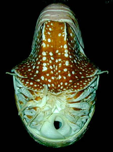
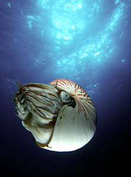
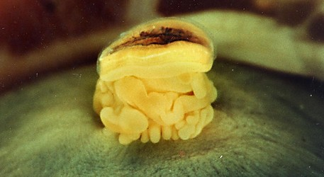

---
aliases:
  - Nautiloidea
title: Nautilidae
---

## [[Nautiloidea]] 

# Nautilidae [Blainville 1825]

Pearly nautiluses 
) 

Only these few living species represent this once abundant subclass.

## #has_/text_of_/abstract 

> Nautiloids are a group of cephalopods (Mollusca) which originated in the Late Cambrian and are represented today by the living Nautilus and Allonautilus. Fossil nautiloids are diverse and species rich, with over 2,500 recorded species. They flourished during the early Paleozoic era, when they constituted the main predatory animals. Early in their evolution, nautiloids developed an extraordinary diversity of shell shapes, including coiled morphologies and giant straight-shelled forms (orthocones). No orthoconic and only a handful of coiled species, the nautiluses, survive to the present day.
>
> In a broad sense, "nautiloid" refers to a major cephalopod subclass or collection of subclasses (**Nautiloidea** sensu lato). Nautiloids are typically considered one of three main groups of cephalopods, along with the extinct ammonoids (ammonites) and living coleoids (such as squid, octopus, and kin). While ammonoids and coleoids are monophyletic clades with exclusive ancestor-descendant relationships, this is not the case for nautiloids. Instead, nautiloids are a paraphyletic grade of various early-diverging cephalopod lineages, including the ancestors of ammonoids and coleoids. Some authors prefer a narrower definition of Nautiloidea (Nautiloidea sensu stricto), as a singular subclass including only those cephalopods which are closer to living nautiluses than they are to either ammonoids or coleoids.
>
> [Wikipedia](https://en.wikipedia.org/wiki/Nautiloid) 

## Introduction

[Richard E. Young]() 

The pearly nautilus is unusual among living cephalopods in having a
large calcareous external shell divided into chambers (phragmocone) that
are pierced by a siphuncle. The animal lives in the largest and most
recently formed chamber. The shell acts as a protective and buoyancy
device. The nautilus can withdraw into the shell and seal the entrance
with a large tough hood. Buoyancy is controlled by pumping fluid in and
out of the chambers using an osmotic mechanism. The osmotic pump must
operate against hydrostatic pressure and a depth limit for this
mechanism seems to be around 300 m (Saunders and Ward, 1987). It can
only exceed this depth for short periods of time. At a depth of
approximately 800 m the shell implodes.

Pearly nautiluses are very muscular but slow swimers. They swim by jet
propulsion provided by contraction of the large funnel and the \"piston
action\" resulting from withdrawal of the head into the living chamber.
They are restricted to the Indo-Pacific from 30° N lat. to 30° S lat.
and 90° to 185° W long. (Saunders, 1987). Their numerous tentacles with
adhesive ridges that are used to grab prey are quite different from the
8 or 10 sucker-bearing arms of coleoid cephalopods. The pearly
nautiluses are partially, at least, scavengers that can hold an
occasional windfall of up to 20% of the body weight in their large crop.
Some species undergo vertical migrations, moving along steeply sloping
bottoms from around 300 m during the day to 100 m at night. One of their
predators is their distant relative, the octopus, which is able to bore
a hole through the shell and inject a poison.

### Characteristics

1.  External chambered shell.
2.  Eyes form images via a pin-hole opening.
3.  Funnel formed by overlapping flaps.

### Nomenclature

[A list of all nominal genera and species in the living Nautilidae can be found here](http://www.tolweb.org/accessory/Nautilidae_Taxa?acc_id=2324). The
list includes the current status and type species of all genera, and the
current status, type repository and type locality of all species and all
pertinent references.

### Life History
 

**Figure**. Embryo of ***Nautilus*** sp. removed from the egg case.
Photograph by J. Arnold.\

## Phylogeny 

-   « Ancestral Groups  
    -  [Cephalopoda](../Cephalopoda.md) 
    -  [Mollusca](../../Mollusca.md) 
    -  [Bilateria](../../../Bilateria.md) 
    -  [Animals](../../../../Animals.md) 
    -  [Eukarya](../../../../../Eukarya.md) 
    -   [Tree of Life](../../../../../Tree_of_Life.md)

-   ◊ Sibling Groups of  Cephalopoda
    -   Nautilidae
    -  [Coleoidea](Coleoidea.md) 

-   » Sub-Groups 
	-   *Nautilus belauensis*
	-   *Nautilus macromphalus*
	-   *Nautilus pompilius*
	-   *Nautilus repertus ?*
	-   *Nautilus stenomphalus*
	-   *Allonautilus scrobiculatus*

## Title Illustrations

------------------------------------------------------------------------- 
 
Scientific Name ::     Nautilus
Location ::           Photographed at the U.S. National Zoo in Washington, D.C.
Specimen Condition   Live Specimen
View                 frontal
Copyright ::            © 1996 [Michael Vecchione](mailto:vecchiom@si.edu) 

--------------------------------------------------------------------------- 
 
Scientific Name ::     Nautilus pompilius
Location ::           Osprey Reef, Coral Sea
Specimen Condition   Live Specimen
Copyright ::            © 1996 [Mark D. Norman](mailto:mnorman@unimelb.edu.au) 

## Confidential Links & Embeds: 

### #is_/same_as :: [[/_Standards/bio/bio~Domain/Eukarya/Animal/Bilateria/Mollusca/Cephalopoda/Nautiloidea|Nautiloidea]] 

### #is_/same_as :: [[/_public/bio/bio~Domain/Eukarya/Animal/Bilateria/Mollusca/Cephalopoda/Nautiloidea.public|Nautiloidea.public]] 

### #is_/same_as :: [[/_internal/bio/bio~Domain/Eukarya/Animal/Bilateria/Mollusca/Cephalopoda/Nautiloidea.internal|Nautiloidea.internal]] 

### #is_/same_as :: [[/_protect/bio/bio~Domain/Eukarya/Animal/Bilateria/Mollusca/Cephalopoda/Nautiloidea.protect|Nautiloidea.protect]] 

### #is_/same_as :: [[/_private/bio/bio~Domain/Eukarya/Animal/Bilateria/Mollusca/Cephalopoda/Nautiloidea.private|Nautiloidea.private]] 

### #is_/same_as :: [[/_personal/bio/bio~Domain/Eukarya/Animal/Bilateria/Mollusca/Cephalopoda/Nautiloidea.personal|Nautiloidea.personal]] 

### #is_/same_as :: [[/_secret/bio/bio~Domain/Eukarya/Animal/Bilateria/Mollusca/Cephalopoda/Nautiloidea.secret|Nautiloidea.secret]] 

