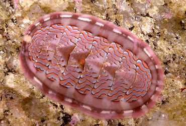

---
aliases:
- bokoživčniki
- Bruņgliemeži
- Chiton
- Chitonai
- Chitons
- chitony
- Chitóny
- chroustnatky
- ciotón
- cserepeshéjúak
- Hitoni
- keverslakken
- Kewerslak
- Kitonlar
- Kraabsneken
- Käferschnecken
- leddsnegler
- leddsniglar
- Ledsnäckor
- Mnogoljušturaši
- nivelkotilot
- Nökkvar
- Ord. Chitonida
- Poliplacofore
- Poliplacòfor
- Poliplacóforo
- Polyplacophora
- Táłtłʼááh chʼoshtʼą́hí bikááʼtsʼinígíí
- Zirehli molyusklar
- Πολυπλακοφόρα
- Панцерни мекотели
- панцирні
- панцирные моллюски
- панцырныя малюскі
- Сауытты жұмсақденелілер
- Хитони
- խիտոններ
- רב-לוחיתאים
- عديدة الأصداف
- عديدة الاصداف
- گهواره دریایی
- ಉಭಯ ನರಹುರಿ ಪ್ರಾಣಿಗಳು
- തേരട്ടക്കക്ക
- ชั้นพอลิพลาโคฟอรา
- ჯავშნიანები
- 多板綱
- 多板纲
- 다판류
title: Polyplacophora
has_id_wikidata: Q188906
dv_has_:
  name_:
    af: Kewerslak
    an: Polyplacophora
    ar: عديدة الأصداف
    arz: عديدة الاصداف
    ast: Ord. Chitonida
    az: Zirehli molyusklar
    be: панцырныя малюскі
    be_tarask: панцырныя малюскі
    bg: Панцерни мекотели
    bs: Mnogoljušturaši
    ca: Poliplacòfor
    ceb: Polyplacophora
    cs: chroustnatky
    de: Käferschnecken
    el: Πολυπλακοφόρα
    en: Polyplacophora
    eo: Polyplacophora
    es: Polyplacophora
    eu: Polyplacophora
    ext: Polyplacophora
    fa: گهواره دریایی
    fi: nivelkotilot
    fr: Polyplacophora
    frr: Kraabsneken
    ga: ciotón
    gl: Poliplacóforo
    he: רב-לוחיתאים
    hr: Hitoni
    hu: cserepeshéjúak
    hy: խիտոններ
    ia: Polyplacophora
    id: Polyplacophora
    ie: Polyplacophora
    io: Polyplacophora
    is: Nökkvar
    it: Polyplacophora
    ja: 多板綱
    jv: Polyplacophora
    ka: ჯავშნიანები
    kk: Сауытты жұмсақденелілер
    kn: ಉಭಯ ನರಹುರಿ ಪ್ರಾಣಿಗಳು
    ko: 다판류
    la: Polyplacophora
    lt: Chitonai
    lv: Bruņgliemeži
    mk: Хитони
    ml: തേരട്ടക്കക്ക
    mul: Polyplacophora
    nb: leddsnegler
    nl: keverslakken
    nn: leddsniglar
    nv: Táłtłʼááh chʼoshtʼą́hí bikááʼtsʼinígíí
    oc: Polyplacophora
    pl: chitony
    pt: Polyplacophora
    pt_br: Polyplacophora
    ro: Poliplacofore
    ru: панцирные моллюски
    sk: Chitóny
    sl: bokoživčniki
    sq: Polyplacophora
    sr: Хитони
    sr_ec: Хитони
    sr_el: Hitoni
    sv: Ledsnäckor
    th: ชั้นพอลิพลาโคฟอรา
    tr: Kitonlar
    uk: панцирні
    vi: Polyplacophora
    vo: Polyplacophora
    war: Polyplacophora
    zh: 多板纲
    zh_cn: 多板纲
    zh_hans: 多板纲
    zh_hant: 多板綱
    zh_hk: 多板綱
    zh_sg: 多板纲
    zh_tw: 多板綱
---
## Phylogeny 
-   « Ancestral Groups  
    -  [Mollusca](../Mollusca.md) 
    -  [Bilateria](../../Bilateria.md) 
    -  [Animals](../../../Animals.md) 
    -  [Eukarya](../../../../Eukarya.md) 
    -   [Tree of Life](../../../../Tree_of_Life.md)

-   ◊ Sibling Groups of  Mollusca
    -   Polyplacophora
    -  [Bivalvia](Bivalvia.md) 
    -  [Gastropoda](Gastropoda.md) 
    -  [Cephalopoda](Cephalopoda.md) 

-   » Sub-Groups 
	-   *Lepidopleurina*
	-   *Ischnochitonina*
	-   *Acanthochitonina*
	-   *Choriplacina*

# [[Chitons]] 

Chitons 

 

## #has_/text_of_/abstract 

> Chitons are marine molluscs of varying size in the class **Polyplacophora** ( POL-ee-plə-KOF-ər-ə), formerly known as Amphineura. About 940 extant and 430 fossil species are recognized.
>
> They are also sometimes known as sea cradles or coat-of-mail shells or suck-rocks, or more formally as loricates, polyplacophorans, and occasionally as polyplacophores.
>
> Chitons have a shell composed of eight separate shell plates or valves. These plates overlap slightly at the front and back edges, and yet articulate well with one another. Because of this, the shell provides protection at the same time as permitting the chiton to flex upward when needed for locomotion over uneven surfaces, and even allows the animal to curl up into a ball when dislodged from rocks. The shell plates are encircled by a skirt known as a girdle.
>
> [Wikipedia](https://en.wikipedia.org/wiki/Chiton) 

## Title Illustrations

------------------------------------------------------------------------------

scientific_name ::     Tonicella lokii
location ::           North America
Creator              Photograph by E. Eugenia Patten
specimen_condition ::  Live Specimen
Source Collection    [CalPhotos](http://calphotos.berkeley.edu/)
copyright ::            © 1999 [California Academy of Sciences](http://www.calacademy.org/) 

## Confidential Links & Embeds: 

### #is_/same_as :: [[/_Standards/bio/bio~Domain/Eukarya/Animal/Bilateria/Mollusca/Chitons|Chitons]] 

### #is_/same_as :: [[/_public/bio/bio~Domain/Eukarya/Animal/Bilateria/Mollusca/Chitons.public|Chitons.public]] 

### #is_/same_as :: [[/_internal/bio/bio~Domain/Eukarya/Animal/Bilateria/Mollusca/Chitons.internal|Chitons.internal]] 

### #is_/same_as :: [[/_protect/bio/bio~Domain/Eukarya/Animal/Bilateria/Mollusca/Chitons.protect|Chitons.protect]] 

### #is_/same_as :: [[/_private/bio/bio~Domain/Eukarya/Animal/Bilateria/Mollusca/Chitons.private|Chitons.private]] 

### #is_/same_as :: [[/_personal/bio/bio~Domain/Eukarya/Animal/Bilateria/Mollusca/Chitons.personal|Chitons.personal]] 

### #is_/same_as :: [[/_secret/bio/bio~Domain/Eukarya/Animal/Bilateria/Mollusca/Chitons.secret|Chitons.secret]] 

