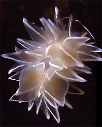
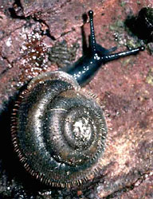
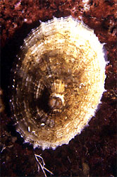

---
aliases:
- Bekicot
- brzuchonogi
- Chʼosh chʼééh digháhii
- csigák
- Edenöit
- Gasteropodo
- gasteròpodes
- Gasterópodos
- gastrapód
- Gastropod
- Gastropoda
- Gastropodoj
- Gastropodos
- Gastrópodes
- gastrópodos
- Gliemeži
- Gondang
- Hilahila
- Ibeldisen
- Karından bacaklılar
- kotilot
- Kërmilli
- Lớp Chân bụng
- Pilvakojai
- plži
- polži
- Puževi
- Qorinoyoqli mollyuskalar
- Schnecken
- Schneckn
- siput
- Slak
- slakken
- Slek
- slekke
- Slekkn
- snegl
- snegler
- Sneken
- sniglar
- snäckor
- Snægel
- soldachi
- sòldachi
- Teod
- Ulitníky
- Wiksachaki
- Zikpê
- İlbizlər
- Γαστερόποδα
- Бажанаттукку
- Бауыраяқты ұлулар
- бруханогія малюскі
- брюхоногие
- Гæлдæркъахонтæ
- коремоноги
- корсагаяклылар
- Курсак буттуулар
- Лёльӧ
- Полжави
- пужеви
- пыдокöтъёс
- черевоногі
- чэраваногія
- Эмгэн хумс
- փորոտանիներ
- חלזונות
- פוילע רוילע
- ایلبیزلر
- بطنيات القدم
- شکمپایان
- گاسترۆپۆد
- उदरपाद
- উদরপদী
- குடற்காலி
- ಗ್ಯಾಸ್ಟ್ರೋಪಡಾ
- ชั้นแกสโทรโพดา
- მუცელფეხიანები
- ქვარაკუჩხამეფი
- 腹足綱
- 腹足纲
- 蠃
- 복족강
title: Gastropoda
has_id_wikidata: Q4867740
dv_has_:
  name_:
    af: Slak
    an: Gastropoda
    ang: Snægel
    ar: بطنيات القدم
    ast: Gastropoda
    az: İlbizlər
    azb: ایلبیزلر
    ban: Gastropoda
    bar: Schneckn
    be: бруханогія малюскі
    be-tarask: чэраваногія
    bg: коремоноги
    bjn: Gondang
    bn: উদরপদী
    br: Gastropoda
    bs: Puževi
    ca: gasteròpodes
    ceb: Hilahila
    ckb: گاسترۆپۆد
    co: Gastropoda
    cs: plži
    cy: Gastropod
    da: snegl
    de: Schnecken
    de-at: Gastropoda
    de-ch: Schnecken
    el: Γαστερόποδα
    en: Gastropoda
    en-ca: Gastropoda
    en-gb: Gastropoda
    eo: Gastropodoj
    es: gastrópodos
    et: Teod
    eu: Gastropoda
    ext: Gastropoda
    fa: شکمپایان
    fi: kotilot
    fo: Sniglar
    fr: Gastropoda
    frp: Gastropoda
    frr: Sneken
    fur: Gastropoda
    ga: gastrapód
    gd: Gastropoda
    gl: Gasterópodos
    gor: Gastropoda
    gsw: Gastropoda
    he: חלזונות
    hi: उदरपाद
    hr: puževi
    hu: csigák
    hy: փորոտանիներ
    ia: Gastropodos
    id: siput
    ie: Gastropoda
    io: Gasteropodo
    is: Sniglar
    it: Gastropoda
    ja: 腹足綱
    jv: Bekicot
    ka: მუცელფეხიანები
    kab: Ibeldisen
    kg: Gastropoda
    kk: Бауыраяқты ұлулар
    kn: ಗ್ಯಾಸ್ಟ್ರೋಪಡಾ
    ko: 복족강
    ku: Zikpê
    kv: Лёльӧ
    ky: Курсак буттуулар
    la: Gastropoda
    lb: Gastropoda
    lbe: Бажанаттукку
    lfn: Gastropoda
    li: Slek
    lij: Gastropoda
    lmo: Gastropoda
    lt: Pilvakojai
    lv: Gliemeži
    lzh: 蠃
    mg: Gastropoda
    min: Gastropoda
    mk: Полжави
    mn: Эмгэн хумс
    ms: Gastropoda
    mul: Gastropoda
    nap: Gastropoda
    nb: snegler
    nds: Gastropoda
    nds-nl: slekke
    nl: slakken
    nn: sniglar
    nrm: Gastropoda
    nv: Chʼosh chʼééh digháhii
    nys: Gastropoda
    oc: Gastropoda
    olo: Edenöit
    os: Гæлдæркъахонтæ
    pap: sòldachi
    pap-aw: soldachi
    pcd: Gastropoda
    pl: brzuchonogi
    pms: Gastropoda
    pt: Gastrópodes
    pt-br: Gastrópodes
    qu: Wiksachaki
    rm: Gastropoda
    ro: Gastropoda
    ru: брюхоногие
    sc: Gastropoda
    scn: Gastropoda
    sco: Gastropoda
    sh: Puževi
    sk: Ulitníky
    sl: polži
    sq: Kërmilli
    sr: пужеви
    sr-ec: пужеви
    sv: snäckor
    sw: Gastropoda
    ta: குடற்காலி
    th: ชั้นแกสโทรโพดา
    tl: Gastropoda
    tr: Karından bacaklılar
    tt: корсагаяклылар
    udm: пыдокöтъёс
    uk: черевоногі
    uz: Qorinoyoqli mollyuskalar
    vec: Gastropoda
    vi: Lớp Chân bụng
    vls: Slekkn
    vo: Gastropoda
    wa: Gastropoda
    war: Gastropoda
    wo: Gastropoda
    wuu: 腹足纲
    xmf: ქვარაკუჩხამეფი
    yi: פוילע רוילע
    yue: 腹足綱
    zh: 腹足纲
    zh-cn: 腹足纲
    zh-hans: 腹足纲
    zh-tw: 腹足綱
    zu: Gastropoda
---
## Phylogeny 

-   « Ancestral Groups  
    -  [Mollusca](../Mollusca.md) 
    -  [Bilateria](../../Bilateria.md) 
    -  [Animals](../../../Animals.md) 
    -  [Eukarya](../../../../Eukarya.md) 
    -   [Tree of Life](../../../../Tree_of_Life.md)

-   ◊ Sibling Groups of  Mollusca
    -   [Chitons](Chitons.md)
    -  [Bivalvia](Bivalvia.md) 
    -   Gastropoda
    -  [Cephalopoda](Cephalopoda.md) 

-   » Sub-Groups
    -  [Caenogastropoda](Gastropoda/Caenogastropoda.md) 

# [[Gastropoda]] 

 
 
 

## #has_/text_of_/abstract 

> Gastropods (), commonly known as slugs and snails, belong to a large taxonomic class of invertebrates within the phylum Mollusca called **Gastropoda** ().
>
> This class comprises snails and slugs from saltwater, freshwater, and from the land. There are many thousands of species of sea snails and slugs, as well as freshwater snails, freshwater limpets, land snails and slugs.
>
> The class Gastropoda is a diverse and highly successful class of mollusks within the phylum Mollusca. It contains a vast total of named species, second only to the insects in overall number. The fossil history of this class goes back to the Late Cambrian. As of 2017, 721 families of gastropods are known, of which 245 are extinct and appear only in the fossil record, while 476 are currently extant with or without a fossil record.
>
> Gastropoda (previously known as univalves and sometimes spelled "Gasteropoda") are a major part of the phylum Mollusca, and are the most highly diversified class in the phylum, with 65,000 to 80,000 living snail and slug species. The anatomy, behavior, feeding, and reproductive adaptations of gastropods vary significantly from one clade or group to another, so stating many generalities for all gastropods is difficult.
>
> The class Gastropoda has an extraordinary diversification of habitats. Representatives live in gardens, woodland, deserts, and on mountains; in small ditches, great rivers, and lakes; in estuaries, mudflats, the rocky intertidal, the sandy subtidal, the abyssal depths of the oceans, including the hydrothermal vents, and numerous other ecological niches, including parasitic ones.
>
> Although the name "snail" can be, and often is, applied to all the members of this class, commonly this word means only those species with an external shell big enough that the soft parts can withdraw completely into it. Slugs are gastropods that have no shell or a very small, internal shell; semislugs are gastropods that have a shell that they can partially retreat into but not entirely.
>
> The marine shelled species of gastropods include species such as abalone, conches, periwinkles, whelks, and numerous other sea snails that produce seashells that are coiled in the adult stage—though in some, the coiling may not be very visible, for example in cowries. In a number of families of species, such as all the various limpets, the shell is coiled only in the larval stage, and is a simple conical structure after that.
>
> [Wikipedia](https://en.wikipedia.org/wiki/Gastropoda) 

## Title Illustrations

-------------------------------------------------------------------------- 
 
scientific_name ::  Nudibranchia
Comments          Silver cloud nudibranch
Creator           P. Crawford & D. Giberson, UPEI
copyright ::         © [BIODIDAC](http://biodidac.bio.uottawa.ca/index.htm) 

--------------------------------------------------------------------------- 
) 
scientific_name ::     Pulmonata
Comments             A pulmonate snail
Creator              Cornuet
specimen_condition ::  Live Specimen
copyright ::            © [BIODIDAC](http://biodidac.bio.uottawa.ca/index.htm) 

--------------------------------------------------------------------------

scientific_name ::  Gastropoda
Comments          a limpet
Creator           P. Crawford, UPEI
copyright ::         © [BIODIDAC](http://biodidac.bio.uottawa.ca/index.htm) 

## Confidential Links & Embeds: 

### #is_/same_as :: [[/_Standards/bio/bio~Domain/Eukarya/Animal/Bilateria/Mollusca/Gastropoda|Gastropoda]] 

### #is_/same_as :: [[/_public/bio/bio~Domain/Eukarya/Animal/Bilateria/Mollusca/Gastropoda.public|Gastropoda.public]] 

### #is_/same_as :: [[/_internal/bio/bio~Domain/Eukarya/Animal/Bilateria/Mollusca/Gastropoda.internal|Gastropoda.internal]] 

### #is_/same_as :: [[/_protect/bio/bio~Domain/Eukarya/Animal/Bilateria/Mollusca/Gastropoda.protect|Gastropoda.protect]] 

### #is_/same_as :: [[/_private/bio/bio~Domain/Eukarya/Animal/Bilateria/Mollusca/Gastropoda.private|Gastropoda.private]] 

### #is_/same_as :: [[/_personal/bio/bio~Domain/Eukarya/Animal/Bilateria/Mollusca/Gastropoda.personal|Gastropoda.personal]] 

### #is_/same_as :: [[/_secret/bio/bio~Domain/Eukarya/Animal/Bilateria/Mollusca/Gastropoda.secret|Gastropoda.secret]] 

