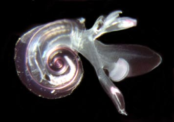
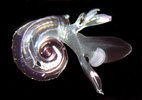

---
aliases:
  - Atlantidae
title: Atlantidae
---

# [[Atlantidae]] 

## #has_/text_of_/abstract 

> **Atlantidae** is a family of sea snails, holoplanktonic gastropod molluscs in the clade Littorinimorpha.
>
> According to taxonomy of the Gastropoda by Bouchet & Rocroi (2005) the family Atlantidae has no subfamilies.
>
> [Wikipedia](https://en.wikipedia.org/wiki/Atlantidae) 

## Introduction

[Roger R. Seapy]() 

Atlantids are the most species-rich family of heteropods, containing
over 60% of all species. They are small (\< 1 cm), and their bodies can
be retracted entirely into their shells and closed off by a chitinous
operculum on the opercular lobe of the foot. The head has a pair of
large tentacles anterior to the eyes. A large muscular sucker, located
on the posteroventral margin of the swimming fin, is used to hold prey
fast while feeding. Atlantids are found primarily between the surface
and 200 m in tropical to subtropical waters. Many species undergo
vertical migration from daytime depths into shallower waters at night.

#### Diagnosis

A heteropod with:

-   Body retractable into shell.

### Characteristics

1.  Shell
    1.  Body fully retractable into shell.
    2.  Adult shell with dextral (right-hand) coiling and laterally
        flattened.
    3.  Shell aperture closed with operculum.
2.  Foot
    1.  Sucker large relative to fin size.
    2.  Opercular lobe and operculum present.
3.  Head
    1.  Tentacles large and may extend beyond contracted proboscis.
    2.  Each eye elevated above head surface.
4.  Radula
    1.  Rachidian tooth (central tooth in each tooth row) with one
        (***Atlanta*** and ***Protatlanta***) or three (***Oxygyrus***)
        short cusps.

#### Comments

Most species are in the genus ***Atlanta***; ***Protatlanta*** and
***Oxygyrus*** are monotypic. Due to the variability in species-level
characters in ***Atlanta***, generic differences are few and difficult
to use. The genera can be distinguished by the following characters:

-----------------------
Genus               Shell and keel compositon                Spiral portion of operculum
***Atlanta***       Calcareous shell and keel                Present
***Protatlanta***   Calcareous shell and conchiolin\* keel   Present
***Oxygyrus***      Conchiolin shell and keel                Absent
-----------------------

\* Conchiolin, especially in fresh specimens, can be recognized by its
extreme transparency.

## Phylogeny 

-   « Ancestral Groups  
    -   [Carinarioidea](Carinarioidea)
    -  [Caenogastropoda](../../Caenogastropoda.md) 
    -  [Gastropoda](../../../Gastropoda.md) 
    -  [Mollusca](../../../../Mollusca.md) 
    -  [Bilateria](../../../../../Bilateria.md) 
    -  [Animals](../../../../../../Animals.md) 
    -  [Eukarya](../../../../../../../Eukarya.md) 
    -   [Tree of Life](../../../../../../../Tree_of_Life.md)

-   ◊ Sibling Groups of  Carinarioidea
    -   Atlantidae
    -  [Pterotracheidae](Pterotracheidae.md) 

-   » Sub-Groups
    -  [Atlanta](Atlantidae/Atlanta.md) 
	-   [Atlanta](Atlantidae/Atlanta.md "go to ToL page"))* [Lesueur,1817]
	-   *Oxygyrus keraudreni*
	-   *Protatlanta souleyeti*

## Title Illustrations

------------------------------------------------------------------------ 
)
Scientific Name ::  Atlanta peroni
Location ::        Hawaiian waters
Copyright ::         © 2005 [Roger R. Seapy](mailto:rseapy@fullerton.edu) 

## Confidential Links & Embeds: 

### #is_/same_as :: [[/_Standards/bio/bio~Domain/Eukarya/Animal/Bilateria/Mollusca/Gastropoda/Caenogastropoda/Pterotracheoidea/Atlantidae|Atlantidae]] 

### #is_/same_as :: [[/_public/bio/bio~Domain/Eukarya/Animal/Bilateria/Mollusca/Gastropoda/Caenogastropoda/Pterotracheoidea/Atlantidae.public|Atlantidae.public]] 

### #is_/same_as :: [[/_internal/bio/bio~Domain/Eukarya/Animal/Bilateria/Mollusca/Gastropoda/Caenogastropoda/Pterotracheoidea/Atlantidae.internal|Atlantidae.internal]] 

### #is_/same_as :: [[/_protect/bio/bio~Domain/Eukarya/Animal/Bilateria/Mollusca/Gastropoda/Caenogastropoda/Pterotracheoidea/Atlantidae.protect|Atlantidae.protect]] 

### #is_/same_as :: [[/_private/bio/bio~Domain/Eukarya/Animal/Bilateria/Mollusca/Gastropoda/Caenogastropoda/Pterotracheoidea/Atlantidae.private|Atlantidae.private]] 

### #is_/same_as :: [[/_personal/bio/bio~Domain/Eukarya/Animal/Bilateria/Mollusca/Gastropoda/Caenogastropoda/Pterotracheoidea/Atlantidae.personal|Atlantidae.personal]] 

### #is_/same_as :: [[/_secret/bio/bio~Domain/Eukarya/Animal/Bilateria/Mollusca/Gastropoda/Caenogastropoda/Pterotracheoidea/Atlantidae.secret|Atlantidae.secret]] 

