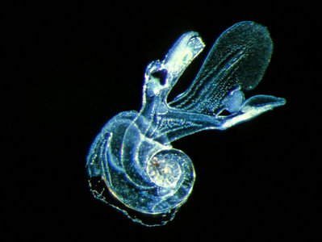
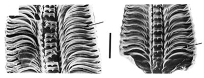
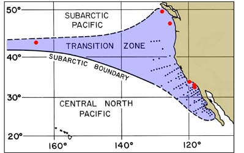

---
aliases:
  - californiensis
title: Atlanta californiensis
---

## Phylogeny 

-   « Ancestral Groups  
    -  [Atlanta](../Atlanta.md))
    -  [Atlantidae](../../Atlantidae.md))
    -   [Carinarioidea](Carinarioidea)
    -  [Caenogastropoda](../../../../Caenogastropoda.md))
    -  [Gastropoda](../../../../../Gastropoda.md))
    -  [Mollusca](../../../../../../Mollusca.md))
    -  [Bilateria](../../../../../../../Bilateria.md))
    -  [Animals](../../../../../../../../Animals.md))
    -  [Eukarya](../../../../../../../../../Eukarya.md))
    -   [Tree of Life](../../../../../../../../../Tree_of_Life.md)

-   ◊ Sibling Groups of  Atlanta
    -   Atlanta californiensis

-   » Sub-Groups 

# *Atlanta californiensis* [Seapy and Richter 1993] 

[Roger R. Seapy](http://www.tolweb.org/)
)

Containing group: [Atlanta](../Atlanta.md))*

## Introduction

***Atlanta californiensis*** Seapy and Richter, 1993 is one of the four
most recently described species in the heteropod snail genus
***Atlanta***; two of the others, ***A. fragilis*** and ***A.
frontieri***, were described by Richter in the same year, and the third,
***A. selvagensis***, was described in 2006. ***Atlanta
californiensis*** has a restrictive geographical distribution, limited
to the Transition Zone faunal province of the North Pacific Ocean (which
includes the California Current off the west coast of North America and
extends westward in a narrow band to eastern Asia). Its shell is most
similar in external appearance to those of ***A. gaudichaudi*** and
***A. peroni***, but morphological features of its body and spire
interior ally it most closely with ***A. inflata*** and the ***A.
inflata*** species group.

------------------------

#### Diagnosis

An ***Atlanta*** with:

-   Restricted geographically to Transition Zone faunal province of
    North Pacific Ocean.
-   Shell flattened, up to 3.5 mm diameter, with a brown keel base;
    small, low and globular spire with 3-1/4 whorls.

### Characteristics

1.  Shell
    1.  Shell moderately small (to 3.5 mm, with 4-2/3 whorls).
    2.  Shell flattened and transparent, except keel base that is
        orange- to red-brown.
    3.  Keel penetrates between last and penultimate whorls in shells
        larger than about 2 mm diameter.
    4.  Shell spire low and globular in shape, with 3-1/4 whorls, a
        smooth surface, and sutures ranging from clear to light violet
        to purple.
    5.  Spire coloration variable, either uniformly clear to light
        yellow, brown or violet, or mottled light to dark yellow-brown
        to brown.
    6.  Umbilicus wide, but narrows rapidly with penultimate whorl.
    7.  Internal walls of shell spire partially decalcified and replaced
        with thin, chitinous membrane.
2.  Eye
    1.  Eye type a (see ***Atlanta*** page), with a clear, spherical
        lens and a black pigmented base that is interrupted dorsally by
        a triangular-shaped, transparent window.
3.  Operculum
    1.  Operculum monogyre (type c); thin, transparent and oval in
        shape.
    2.  Spiral gyre portion lacks spines.
4.  Radula
    1.  Radula large relative to size of the animal.

    2.  Radula elongate and narrowly triangular, with distinct sexual
        dimorphism (male radula broader, with a wider growth angle and
        greater number of tooth rows than in females).

       ){hspace="20" vspace="25"}

        **Figure** Radulae of ***Atlanta californiensis***, southern
        California waters. **Left two** **photographs** - low
        magnification views of male (with 99 tooth rows) and immature
        female (with 56 tooth rows), respectively; scale = 0.1 mm.
        **Right two photographs** - high magnification views of sections
        of male and female radulae, respectively. Arrows indicate row 60
        on each radula, scale = .05 mm. Photographs copyright © 2005 G.
        Richter.

#### Comments

The above information is from Seapy and Richter (1993).

Morphological features of the body (with type a eye and type c
operculum) and shell interior (i.e., with partial decalcification of the
inner walls of the shell spire and replacement by a thin, flexible
chitinous membrane) ally ***Atlanta californiensis*** most closely with
***A. inflata***. The external shell morphologies of the two species,
however, are quite different. The shell of ***A. californiensis*** is
laterally flattened, with a spire consisting of 3-1/4 whorls and having
a smooth surface (similar to the shells of ***A. gaudichaudi*** and
***A. peroni***), while that of ***A. inflata*** is laterally
\"inflated\" (about 40% of the shell diameter) and has a spire of 4-1/2
whorls, usually bearing evenly-spaced, raised spiral ridges. Also, the
radulae of the two species differ; they are broader and consist of fewer
tooth rows in ***A. californiensis*** than in ***A. inflata***.

### Distribution

#### Vertical distribution 

Opening-closing BONGO plankton net samples collected in San Pedro Basin,
southern California by R. Seapy (unpubl.) indicate that the daytime
vertical range of ***Atlanta californiensis*** extends from the surface
to about 150 m (the epipelagic zone in this nearshore basin). Nighttime
samples have not been collected, so it is not known if this species
undergoes nocturnal vertical migration. Such a migration probably does
occur, however, since a number of other species of atlantids whose
ranges extend through the epipelagic zone in Hawaiian waters were shown
to be vertical migrators (Seapy, 1990).\

#### Seasonal distribution

Replicated, monthly oblique samples in San Pedro Basin by Cummings and
Seapy (2003) showed that ***A. californiensis*** occurred in low
abundances (less than 25 individuals per 1,000 m^3^) throughout the year
except in the summer (to 88 per 1,000 m^3^). The seasonal maxima are
correlated with the period of the year when California Current flow is
strongest and shoreward transport of animals from offshore waters would
be predicted.

#### Geographic distribution

Among the Heteropoda, two species (***Atlanta californiensis*** and
***Carinaria japonica***) are members of the Transition Zone faunal
province of the North Pacific Ocean (Seapy and Richter, 1993; Seapy,
1974, respectively). This faunal province extends in a narrowing band
from the western coast of North America (between British Columbia and
southern Baja California) to the coast of Japan. It is bounded to the
north by the Subarctic Pacific faunal province and to the south (at the
Subarctic Boundary) by the Central North Pacific faunal province.
){height="250" width="399"}

**Figure**. Location of the Transition Zone faunal province and (shaded
blue) and records (red dots) of ***Atlanta californiensis***. The
province is separated from the Central North Pacific province by the
Subarctic Boundary and its southeasterly extension to Baja California;
it merges more broadly with the Subarctic Pacific province to the north.
The black dots are station records for ***Atlanta*** sp. of McGowan
(1967), many of which, particularly those north of about 34° latitude,
are probably ***A. californiensis***. Modified from Seapy and Richter
(1993).

### References

Cummings, F. A. and R. R. Seapy. 2003. Seasonal abundances of
euthecosomatous pteropods and heteropods from waters overlying the San
Pedro Basin, California. *Veliger* **46**: 305-313.

McGowan, J. A. 1967. Distributional atlas of pelagic molluscs in the
California Current region. *Calif. Coop. Ocean. Fish. Invest.*, Atlas 6,
218 pp.

Seapy, R. R. 1974. Distribution and abundance of the epipelagic mollusk
***Carinaria japonica*** in waters off Southern California. *Mar. Biol.*
**24**: 243-250.

Seapy, R. R. 1990. Patterns of vertical distribution in epipelagic
heteropod molluscs off Hawaii. *Mar. Ecol. Progr. Ser.* **60**: 235-246.

Seapy, R. R. and G. Richter. 1993. ***Atlanta californiensis***, a new
species of atlantid heteropod (Mollusca: Gastropoda) from the California
Current. *Veliger* **36**: 389-398.

## Title Illustrations



  --------------------
  Scientific Name ::     Atlanta californiensis
  Location ::           Monterey Bay, California
  Specimen Condition   Live Specimen
  Sex ::                Female
  Life Cycle Stage ::     adult
  View                 right side
  Size                 maximal shell diameter about 1.3 mm
  Copyright ::            © 1998 [David Wrobel](mailto:wrobel2@verizon.et)
  --------------------

## Confidential Links & Embeds: 

### #is_/same_as :: [californiensis](/_Standards/bio/bio~Domain/Eukarya/Animal/Bilateria/Mollusca/Gastropoda/Caenogastropoda/Pterotracheoidea/Atlantidae/Atlanta/californiensis.md) 

### #is_/same_as :: [californiensis.public](/_public/bio/bio~Domain/Eukarya/Animal/Bilateria/Mollusca/Gastropoda/Caenogastropoda/Pterotracheoidea/Atlantidae/Atlanta/californiensis.public.md) 

### #is_/same_as :: [californiensis.internal](/_internal/bio/bio~Domain/Eukarya/Animal/Bilateria/Mollusca/Gastropoda/Caenogastropoda/Pterotracheoidea/Atlantidae/Atlanta/californiensis.internal.md) 

### #is_/same_as :: [californiensis.protect](/_protect/bio/bio~Domain/Eukarya/Animal/Bilateria/Mollusca/Gastropoda/Caenogastropoda/Pterotracheoidea/Atlantidae/Atlanta/californiensis.protect.md) 

### #is_/same_as :: [californiensis.private](/_private/bio/bio~Domain/Eukarya/Animal/Bilateria/Mollusca/Gastropoda/Caenogastropoda/Pterotracheoidea/Atlantidae/Atlanta/californiensis.private.md) 

### #is_/same_as :: [californiensis.personal](/_personal/bio/bio~Domain/Eukarya/Animal/Bilateria/Mollusca/Gastropoda/Caenogastropoda/Pterotracheoidea/Atlantidae/Atlanta/californiensis.personal.md) 

### #is_/same_as :: [californiensis.secret](/_secret/bio/bio~Domain/Eukarya/Animal/Bilateria/Mollusca/Gastropoda/Caenogastropoda/Pterotracheoidea/Atlantidae/Atlanta/californiensis.secret.md)

