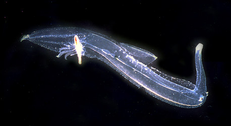
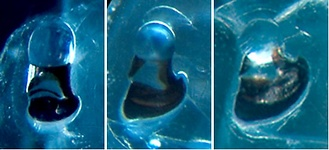

---
aliases:
- hyytelökölijalkaiset
- Pterotracheidae
- 翼管螺科
title: Pterotracheidae
has_id_wikidata: Q121811
dv_has_:
  name_:
    an: Pterotracheidae
    ast: Pterotracheidae
    bg: Pterotracheidae
    ca: Pterotracheidae
    ceb: Pterotracheidae
    de: Pterotracheidae
    en: Pterotracheidae
    eo: Pterotracheidae
    es: Pterotracheidae
    eu: Pterotracheidae
    ext: Pterotracheidae
    fi: hyytelökölijalkaiset
    fr: Pterotracheidae
    ga: Pterotracheidae
    gl: Pterotracheidae
    ia: Pterotracheidae
    ie: Pterotracheidae
    io: Pterotracheidae
    it: Pterotracheidae
    la: Pterotracheidae
    mul: Pterotracheidae
    nl: Pterotracheidae
    oc: Pterotracheidae
    pl: Pterotracheidae
    pt: Pterotracheidae
    pt_br: Pterotracheidae
    ro: Pterotracheidae
    ru: Pterotracheidae
    sq: Pterotracheidae
    sv: Pterotracheidae
    tr: Pterotracheidae
    uk: Pterotracheidae
    vi: Pterotracheidae
    vo: Pterotracheidae
    war: Pterotracheidae
    zh: 翼管螺科
    zh_cn: 翼管螺科
    zh_tw: 翼管螺科
---

# [[Pterotracheidae]] 
) 

## #has_/text_of_/abstract 

> **Pterotracheidae** is a family of medium-sized to large floating sea snails, pelagic gastropod molluscs. They are in the superfamily Pterotracheoidea along with two other similar pelagic families, the Atlantidae and the Carinariidae.
>
> These pelagic snails are not at all closely related to the pelagic heterobranch opistobranchs such as the sea angels and sea butterflies. They are in the clade Littorinimorpha, and as such they are related to such families as the tritons (Ranellidae) and the tun shells (Tonnidae), in the clade Caenogastropoda.
>
> According to taxonomy of the Gastropoda by Bouchet & Rocroi (2005) the family Pterotracheidae has no subfamilies.
>
> [Wikipedia](https://en.wikipedia.org/wiki/Pterotracheidae) 

## Introduction

[Roger R. Seapy]()

All pterotracheids lack a shell as adults, although they possess one as
larvae (the shell is shed at metamorphosis). Their bodies are elongate
and basically cylindrical, consisting of a proboscis, trunk and tail.
The maximal recorded body length is 33 cm. The head lacks tentacles
anterior to the eyes, except in male *Firoloida*. The viscera are
compacted into a fusiform visceral nucleus. The swimming fin is large,
located about midway between the anterior and posterior ends of the
trunk, and bears a sucker only in males (presumably used in mating).
Pterotracheids are mostly epipelagic (dwelling in the upper several
hundred meters of the water column), although the vertical ranges of two
species of *Pterotrachea* extend into the mesopelagic. Nocturnal
vertical migration is seen in *Pterotrachea.*

The Pterotracheidae are widely regarded as the most highly derived of
the heteropod families. Features supporting this contention include: (1)
enlargement, elongation and narrowing (to a  basically cylindrical
shape) of the body in the anterior-posterior axis, resulting in a
streamlined body with enhanced swimming abilities, (2) shedding of the
larval shell at metamorphosis, with the result that buoyancy problems
are reduced since a calcareous shell (present in the adults of the other
two families) is lacking, (3) compaction of the viscera into a pyriform
visceral nucleus, which is largely enveloped by the gelatinous body at
the posterior end of the trunk.

#### Diagnosis

Heteropod molluscs with:

-   Body elongated and basically cylindrical, divided into proboscis,
    trunk and tail\
-   Viscera compacted into a pyriform visceral nucleus
-   Shell lacking in adults; larval shell shed at metamorphosis\

### Characteristics

Shell

1.  Present in larvae
2.  Cast off at metamorphosis

Body morphology

1.  Elongate, basically cylindrical; streamlined for rapid swimming
2.  Proboscis, trunk and tail body regions

   ){height="150" width="329"}
    **Figure.** Dorsal views of ***Pterotrachea*** eyes. **Left**: ***P.
    coronata*** adult. **Middle**: ***P. hippocampus** j*uvenile.
    **Right**: ***P. hippocampus*** adult.

3.  Tentacles absent, except in *Firoloida* males

Radula

1.  24-30 tooth rows
2.  Rachidian (central) tooth polycuspid with prominent central cusp

#### Comments

Two genera are included in the Pterotracheidae, one of which,
*Firoloida*, is monotypic. The genera can be distinguished by the
following characters:

  --------- --------------------
  Genus            Tail                  Posterior egg string or filamentous extension   Tentacles
  *Pterotrachea*   prominent             absent                                          absent in both sexes
  *Firoloida*      very short, ventral   present                                         present in males
  --------- --------------------

## Phylogeny 

-   « Ancestral Groups  
    -   [Carinarioidea](Carinarioidea)
    -  [Caenogastropoda](../../Caenogastropoda.md) 
    -  [Gastropoda](../../../Gastropoda.md) 
    -  [Mollusca](../../../../Mollusca.md) 
    -  [Bilateria](../../../../../Bilateria.md) 
    -  [Animals](../../../../../../Animals.md) 
    -  [Eukarya](../../../../../../../Eukarya.md) 
    -   [Tree of Life](../../../../../../../Tree_of_Life.md)

-   ◊ Sibling Groups of  Carinarioidea
    -  [Atlantidae](Atlantidae.md) 
    -   Pterotracheidae

-   » Sub-Groups
    -   [Firoloida desmaresti](Firoloida_desmaresti)

## Title Illustrations

------------------------------------------------------------------------

scientific_name ::     Pterotrachea coronata
location ::           Hawaiian Islands
specimen_condition ::  Live Specimen
View                 left side
copyright ::            © [Roger R. Seapy](mailto:rseapy@fullerton.edu) 

## Confidential Links & Embeds: 

### #is_/same_as :: [[/_Standards/bio/bio~Domain/Eukarya/Animal/Bilateria/Mollusca/Gastropoda/Caenogastropoda/Pterotracheoidea/Pterotracheidae|Pterotracheidae]] 

### #is_/same_as :: [[/_public/bio/bio~Domain/Eukarya/Animal/Bilateria/Mollusca/Gastropoda/Caenogastropoda/Pterotracheoidea/Pterotracheidae.public|Pterotracheidae.public]] 

### #is_/same_as :: [[/_internal/bio/bio~Domain/Eukarya/Animal/Bilateria/Mollusca/Gastropoda/Caenogastropoda/Pterotracheoidea/Pterotracheidae.internal|Pterotracheidae.internal]] 

### #is_/same_as :: [[/_protect/bio/bio~Domain/Eukarya/Animal/Bilateria/Mollusca/Gastropoda/Caenogastropoda/Pterotracheoidea/Pterotracheidae.protect|Pterotracheidae.protect]] 

### #is_/same_as :: [[/_private/bio/bio~Domain/Eukarya/Animal/Bilateria/Mollusca/Gastropoda/Caenogastropoda/Pterotracheoidea/Pterotracheidae.private|Pterotracheidae.private]] 

### #is_/same_as :: [[/_personal/bio/bio~Domain/Eukarya/Animal/Bilateria/Mollusca/Gastropoda/Caenogastropoda/Pterotracheoidea/Pterotracheidae.personal|Pterotracheidae.personal]] 

### #is_/same_as :: [[/_secret/bio/bio~Domain/Eukarya/Animal/Bilateria/Mollusca/Gastropoda/Caenogastropoda/Pterotracheoidea/Pterotracheidae.secret|Pterotracheidae.secret]] 

