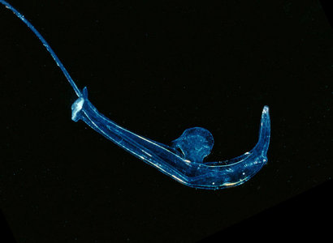
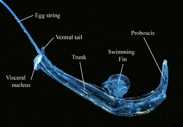
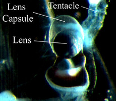

---
aliases:
  - Firoloida
title: Firoloida desmaresti
has_id_wikidata: Q18510899
---
## Phylogeny 

-   « Ancestral Groups  
    -  [Pterotracheidae](../Pterotracheidae.md) 
    -   [Carinarioidea](Carinarioidea)
    -  [Caenogastropoda](../../../Caenogastropoda.md) 
    -  [Gastropoda](../../../../Gastropoda.md) 
    -  [Mollusca](../../../../../Mollusca.md) 
    -  [Bilateria](../../../../../../Bilateria.md) 
    -  [Animals](../../../../../../../Animals.md) 
    -  [Eukarya](../../../../../../../../Eukarya.md) 
    -   [Tree of Life](../../../../../../../../Tree_of_Life.md)

-   ◊ Sibling Groups of  Pterotracheidae
    -   Firoloida desmaresti

-   » Sub-Groups 

## [[Firoloida]]

# *Firoloida desmaresti* [Lesueur 1817] 

 

## #has_/text_of_/abstract 

> **Firoloida** is a monotypic genus of pelagic marine gastropod mollusc in the family Pterotracheidae, with the only species in the genus being Firoloida desmarestia. This shell-less mollusc is found in tropical and sub-tropical waters in the epipelagic zone of the world's oceans.
>
> [Wikipedia](https://en.wikipedia.org/wiki/Firoloida) 

## Introduction

[Roger R. Seapy]() 

*Firoloida desmaresti* is a monotypic species with a cosmopolitan
distribution. It is the smallest (maximal body length of 40 mm) and most
transparent species in the family Pterotracheidae. The visceral nucleus
is terminal on the trunk, followed by a short ventral tail and either a
permanent egg string (in females) or a tail filament (in males).
Prominent tentacles and a fin sucker are present in males, but are
absent in females.

#### Brief Diagnosis

A pterotracheid with:

-   elongated, cylindrical body divided into a proboscis, trunk and a
    very short tail
-   tentacles, fin sucker and tail filament only in males
-   permanent egg string in females

### Characteristics

1.  Body morphology
    1.  Body elongate, cylindrical
    2.  Proboscis short relative to the long trunk
    3.  Visceral nucleus terminal on trunk\
    4.  Tail ventral and short

   )
    **Figure**. Location of body regions and structures in ***Firoloida
    desmaresti***. © [Roger R. Seapy](mailto:rseapy@fullerton.edu)

2.  Sexually dimorphic characters
    1.  Permanent egg string extends posteriorly from base of visceral
        nucleus in females
    2.  Tail filament posterior to visceral nucleus in males\
    3.  Sucker small and located on anterior margin of swimming fin in
        males\
    4.  Tentacles prominent, located anterior to eyes in males
3.  Eye morphology
    1.  Lens capsule oblong, with lens basal and distal portion slightly
        opaque

   ){width="229"}
    **Figure.** Dorsal view of right eye in *male* ***Firoloida
    desmaresti***.© [Roger R. Seapy](mailto:rseapy@fullerton.edu)

4.  Radula
    1.  Central tooth bears two long, sickle-shaped and pointed
        posterior processes on its basal plate\

## Title Illustrations

-------------- 
 
scientific_name ::     Firoloida desmaresti
location ::           off Monterey Bay, California
specimen_condition ::  Live Specimen
Sex ::                Female
Life Cycle Stage ::     adult
View                 left side
copyright ::            © 1998 David Wrobel

## Confidential Links & Embeds: 

### #is_/same_as :: [[/_Standards/bio/bio~Domain/Eukarya/Animal/Bilateria/Mollusca/Gastropoda/Caenogastropoda/Pterotracheoidea/Pterotracheidae/Firoloida|Firoloida]] 

### #is_/same_as :: [[/_public/bio/bio~Domain/Eukarya/Animal/Bilateria/Mollusca/Gastropoda/Caenogastropoda/Pterotracheoidea/Pterotracheidae/Firoloida.public|Firoloida.public]] 

### #is_/same_as :: [[/_internal/bio/bio~Domain/Eukarya/Animal/Bilateria/Mollusca/Gastropoda/Caenogastropoda/Pterotracheoidea/Pterotracheidae/Firoloida.internal|Firoloida.internal]] 

### #is_/same_as :: [[/_protect/bio/bio~Domain/Eukarya/Animal/Bilateria/Mollusca/Gastropoda/Caenogastropoda/Pterotracheoidea/Pterotracheidae/Firoloida.protect|Firoloida.protect]] 

### #is_/same_as :: [[/_private/bio/bio~Domain/Eukarya/Animal/Bilateria/Mollusca/Gastropoda/Caenogastropoda/Pterotracheoidea/Pterotracheidae/Firoloida.private|Firoloida.private]] 

### #is_/same_as :: [[/_personal/bio/bio~Domain/Eukarya/Animal/Bilateria/Mollusca/Gastropoda/Caenogastropoda/Pterotracheoidea/Pterotracheidae/Firoloida.personal|Firoloida.personal]] 

### #is_/same_as :: [[/_secret/bio/bio~Domain/Eukarya/Animal/Bilateria/Mollusca/Gastropoda/Caenogastropoda/Pterotracheoidea/Pterotracheidae/Firoloida.secret|Firoloida.secret]] 

