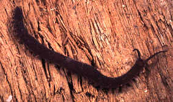

---
aliases:
- Birlamchi traxeyalilar
- Crvonošci
- drápkovci
- fluweelwormen
- fløyelsdyr
- Giun nhung
- karmos féreglábúak
- klomaskar
- krempljičarji
- käsnäjalkaiset
- Kéłánii bikágí yilzhólígíí
- Kütük ayaklılar
- küüsikloomad
- Mananap nga kuyamas
- Mdudu-ute
- Onicoforo
- Onicòfor
- Onicóforos
- Onihofori
- Onikoforo
- Onikoforoj
- Onixoforlar
- Onychophora
- pazurnice
- pazúrikavce
- Sametwirmer
- Stummelfüsser
- Stummelfüßer
- Алгачкы кекиректүүлөр
- аніхафоры
- баршунасти црви
- Кадифени црви
- Онихофоралар
- онихофори
- онихофоры
- первиннотрахейні
- Օնիխոֆորներ
- נושאי ציפורניים
- حاملات المخالب
- کرمهای مخملی
- ओनिकोफोरा
- ஆனிக்கோபொரா
- ఒనికోఫోరా
- ಒನಿಕೊಫೊರ
- ഒനിക്കോഫൊറ
- หนอนกำมะหยี่
- 有爪动物门
- 有爪動物
- 유조동물
title: Onychophora
has_id_wikidata: Q5191
dv_has_:
  name_:
    an: Onychophora
    ar: حاملات المخالب
    arz: حاملات المخالب
    ast: Onychophora
    az: Onixoforlar
    be: аніхафоры
    bg: онихофори
    bs: Onychophora
    ca: Onicòfor
    ceb: Mananap nga kuyamas
    cs: drápkovci
    de: Stummelfüßer
    de_ch: Stummelfüsser
    en: Onychophora
    en_ca: Onychophora
    en_gb: Onychophora
    eo: Onikoforoj
    es: Onychophora
    et: küüsikloomad
    eu: Onikoforo
    ext: Onychophora
    fa: کرمهای مخملی
    fi: käsnäjalkaiset
    fr: Onychophora
    frr: Sametwirmer
    ga: Onychophora
    gl: Onicóforos
    he: נושאי ציפורניים
    hi: ओनिकोफोरा
    hr: Crvonošci
    hu: karmos féreglábúak
    hy: Օնիխոֆորներ
    ia: Onychophora
    id: Onychophora
    ie: Onychophora
    io: Onychophora
    it: Onychophora
    ja: 有爪動物
    kk: Онихофоралар
    kn: ಒನಿಕೊಫೊರ
    ko: 유조동물
    ky: Алгачкы кекиректүүлөр
    la: Onychophora
    lfn: Onicoforo
    lv: Onihofori
    mk: Кадифени црви
    ml: ഒനിക്കോഫൊറ
    mul: Onychophora
    nb: fløyelsdyr
    nl: fluweelwormen
    nv: Kéłánii bikágí yilzhólígíí
    oc: Onychophora
    pl: pazurnice
    pt: Onychophora
    pt_br: Onychophora
    ro: Onychophora
    ru: онихофоры
    sco: Onychophora
    sk: pazúrikavce
    sl: krempljičarji
    sq: Onychophora
    sr: баршунасти црви
    sv: klomaskar
    sw: Mdudu-ute
    ta: ஆனிக்கோபொரா
    te: ఒనికోఫోరా
    th: หนอนกำมะหยี่
    tl: Onychophora
    tr: Kütük ayaklılar
    uk: первиннотрахейні
    uz: Birlamchi traxeyalilar
    vec: Onychophora
    vi: Giun nhung
    vo: Onychophora
    war: Onychophora
    wuu: 有爪动物门
    zh: 有爪动物门
---
# [[Onychophora]]

Velvet Worms 

 

## #has_/text_of_/abstract 

> **Onychophora**  (from Ancient Greek: ονυχής, onyches, "claws"; and φέρειν, pherein, "to carry"), commonly known as velvet worms (for their velvety texture and somewhat wormlike appearance) or more ambiguously as peripatus  (after the first described genus, Peripatus), is a phylum of elongate, soft-bodied, many-legged animals. In appearance they have variously been compared to worms with legs, caterpillars, and slugs. They prey upon other invertebrates, which they catch by ejecting an adhesive slime. Approximately 200 species of velvet worms have been described, although the true number is likely to be much greater.
>
> The two extant families of velvet worms are Peripatidae and Peripatopsidae. They show a peculiar distribution, with the peripatids being predominantly equatorial and tropical, while the peripatopsids are all found south of the equator. It is the only phylum within Animalia that is wholly endemic to terrestrial environments, at least among extant members. Velvet worms are generally considered close relatives of the Arthropoda and Tardigrada, with which they form the proposed taxon Panarthropoda. This makes them of palaeontological interest, as they can help reconstruct the ancestral arthropod. Only two fossil species are confidently assigned as onychophorans: Antennipatus from the Late Carboniferous, and Cretoperipatus from the Late Cretaceous, the latter belonging to Peripatidae. In modern zoology, they are known for their mating behaviours and the bearing of live young in some species.
>
> [Wikipedia](https://en.wikipedia.org/wiki/Onychophora) 

## Phylogeny 

-   « Ancestral Groups  
    -  [Bilateria](../Bilateria.md) 
    -  [Animals](../../Animals.md) 
    -  [Eukarya](../../../Eukarya.md) 
    -   [Tree of Life](../../../Tree_of_Life.md)

-   ◊ Sibling Groups of  Bilateria
    -   [Deuterostomia](Deutero.md)
    -  [Arthropoda](Arthropoda.md) 
    -   Onychophora
    -   [Tardigrade](Tardigrade.md)
    -  [Nematoda](Nematoda.md) 
    -  [Nematomorpha](Nematomorpha.md) 
    -  [Kinorhyncha](Kinorhyncha.md) 
    -  [Loricifera](Loricifera.md) 
    -  [Priapulida](Priapulida.md) 
    -   [Arrow_Worm](Arrow_Worm.md)
    -  [Gastrotricha](Gastrotricha.md) 
    -  [Rotifera](Rotifera.md) 
    -  [Gnathostomulida](Gnathostomulida.md) 
    -   [Limnognathia maerski](Limnognathia_maerski)
    -  [Cycliophora](Cycliophora.md) 
    -  [Mesozoa](Mesozoa.md) 
    -  [Platyhelminthes](Platyhelminthes.md) 
    -  [Annelida](Annelida.md) 
    -  [Bryozoa](Bryozoa.md) 
    -  [Sipuncula](Sipuncula.md) 
    -  [Mollusca](Mollusca.md) 
    -  [Nemertea](Nemertea.md) 
    -  [Entoprocta](Entoprocta.md) 
    -  [Phoronida](Phoronida.md) 
    -  [Brachiopoda](Brachiopoda.md) 

-   » Sub-Groups 
	-   *Peripatidae*
	-   *Peripatopsidae*

## Confidential Links & Embeds: 

### #is_/same_as :: [[/_Standards/bio/bio~Domain/Eukarya/Animal/Bilateria/Onychophora|Onychophora]] 

### #is_/same_as :: [[/_public/bio/bio~Domain/Eukarya/Animal/Bilateria/Onychophora.public|Onychophora.public]] 

### #is_/same_as :: [[/_internal/bio/bio~Domain/Eukarya/Animal/Bilateria/Onychophora.internal|Onychophora.internal]] 

### #is_/same_as :: [[/_protect/bio/bio~Domain/Eukarya/Animal/Bilateria/Onychophora.protect|Onychophora.protect]] 

### #is_/same_as :: [[/_private/bio/bio~Domain/Eukarya/Animal/Bilateria/Onychophora.private|Onychophora.private]] 

### #is_/same_as :: [[/_personal/bio/bio~Domain/Eukarya/Animal/Bilateria/Onychophora.personal|Onychophora.personal]] 

### #is_/same_as :: [[/_secret/bio/bio~Domain/Eukarya/Animal/Bilateria/Onychophora.secret|Onychophora.secret]] 

