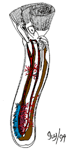

---
aliases:
- Atnalı ağızlılar
- chapadlovky
- Chytadlovité
- Daa-mguufarasi
- foronidis
- Foronido
- Foronidoj
- Foronídeos
- Foronīdi
- hesteskomakkar
- hesteskoormer
- Hoefijzerwormen
- Hoofiezerwörm
- Hufeisenwürmer
- hästskomaskar
- Kryzelnice
- Phoronid
- Phoronida
- Potkovnjaci
- Pärgussid
- Skuiliswirmer
- Trubkalılar
- tupsumadot
- Táyiʼ chʼosh bideeʼ názbąsí
- Ulod nga sapatos sa kabayo
- Φορωνίδια
- Потковичасти црви
- фараніды
- фороніди
- форониди
- форониды
- Ֆորոնիդներ
- פורונידה
- تروبکالیلار
- ديدان حدوية
- ديدان حدويه
- کرمهای نعل اسبی
- ფორონიდები
- 帚虫动物门
- 箒虫動物
- 추형동물
title: Phoronida
has_id_wikidata: Q162907
dv_has_:
  name_:
    an: Phoronida
    ar: ديدان حدوية
    arz: ديدان حدويه
    ast: Phoronida
    az: Trubkalılar
    azb: تروبکالیلار
    be: фараніды
    bg: форониди
    bs: Phoronida
    ca: foronidis
    ceb: Ulod nga sapatos sa kabayo
    cs: chapadlovky
    de: Hufeisenwürmer
    el: Φορωνίδια
    en: Phoronida
    en-ca: Phoronid
    en-gb: Phoronid
    eo: Foronidoj
    es: Phoronida
    et: Pärgussid
    eu: Foronido
    ext: Phoronida
    fa: کرمهای نعل اسبی
    fi: tupsumadot
    fr: Phoronida
    frr: Skuiliswirmer
    ga: Phoronida
    gl: Foronídeos
    he: פורונידה
    hr: Potkovnjaci
    hy: Ֆորոնիդներ
    ia: Phoronida
    id: Phoronida
    ie: Phoronida
    io: Phoronida
    it: Phoronida
    ja: 箒虫動物
    ka: ფორონიდები
    ko: 추형동물
    la: Phoronida
    lfn: Foronido
    li: Hoofiezerwörm
    lv: Foronīdi
    mul: Phoronida
    nb: hesteskoormer
    nl: Hoefijzerwormen
    nn: hesteskomakkar
    nv: Táyiʼ chʼosh bideeʼ názbąsí
    oc: Phoronida
    pl: Kryzelnice
    pt: Phoronida
    pt-br: Phoronida
    ro: Phoronida
    ru: форониды
    sk: Chytadlovité
    sq: Phoronida
    sr: Потковичасти црви
    sv: hästskomaskar
    sw: Daa-mguufarasi
    th: Phoronid
    tl: Phoronida
    tr: Atnalı ağızlılar
    uk: фороніди
    vi: Phoronida
    vo: Phoronida
    war: Phoronida
    wuu: 帚虫动物门
    zh: 帚虫动物门
---
# [[Phoronida]]

## Horseshoe worms 

 

## #has_/text_of_/abstract 

> Phoronids (taxonomic name **Phoronida**, sometimes called horseshoe worms) 
> are a small phylum of marine animals that filter-feed with a lophophore (a "crown" of tentacles), 
> and build upright tubes of chitin to support and protect their soft bodies. 
> 
> They live in most of the oceans and seas, including the Arctic Ocean 
> but excluding the Antarctic Ocean, and between the intertidal zone and about 400 meters down. 
> 
> Most adult phoronids are 2 cm long and about 1.5 mm wide, although the largest are 50 cm long.
>
> The name of the group comes from its type genus: Phoronis.
>
> [Wikipedia](https://en.wikipedia.org/wiki/Phoronid) 

## Title Illustrations

Diagram showing the internal anatomy of a phoronid.\
Drawing by Ivy Livingstone. Copyright © 1994
[BIODIDAC](http://biodidac.bio.uottawa.ca/index.htm).

--------------------------------------------------------------------------

copyright ::   © 1994 [BIODIDAC](http://biodidac.bio.uottawa.ca/index.htm) 

## Phylogeny 

-   « Ancestral Groups  
    -  [Bilateria](../Bilateria.md) 
    -  [Animals](../../Animals.md) 
    -  [Eukarya](../../../Eukarya.md) 
    -   [Tree of Life](../../../Tree_of_Life.md)

-   ◊ Sibling Groups of  Bilateria
    -   [Deuterostomia](Deutero.md)
    -  [Arthropoda](Arthropoda.md) 
    -  [Onychophora](Onychophora.md) 
    -   [Tardigrade](Tardigrade.md)
    -  [Nematoda](Nematoda.md) 
    -  [Nematomorpha](Nematomorpha.md) 
    -  [Kinorhyncha](Kinorhyncha.md) 
    -  [Loricifera](Loricifera.md) 
    -  [Priapulida](Priapulida.md) 
    -   [Arrow_Worm](Arrow_Worm.md)
    -  [Gastrotricha](Gastrotricha.md) 
    -  [Rotifera](Rotifera.md) 
    -  [Gnathostomulida](Gnathostomulida.md) 
    -   [Limnognathia maerski](Limnognathia_maerski)
    -  [Cycliophora](Cycliophora.md) 
    -  [Mesozoa](Mesozoa.md) 
    -  [Platyhelminthes](Platyhelminthes.md) 
    -  [Annelida](Annelida.md) 
    -  [Bryozoa](Bryozoa.md) 
    -  [Sipuncula](Sipuncula.md) 
    -  [Mollusca](Mollusca.md) 
    -  [Nemertea](Nemertea.md) 
    -  [Entoprocta](Entoprocta.md) 
    -   Phoronida
    -  [Brachiopoda](Brachiopoda.md) 

-   » Sub-Groups 
	-   *Phoronis ovalis*
	-   *Phoronis hippocrepia*
	-   *Phoronis ijimai*
	-   *Phoronis australis*
	-   *Phoronis muelleri*
	-   *Phoronis psammophila*
	-   *Phoronis pallida*
	-   *Phoronis svetlanae*
	-   *Phoronis vancouverensis*
	-   *Phoronis architecta*
	-   *Phoronopsis albomaculata*
	-   *Phoronopsis harmeri*
	-   *Phoronopsis californica*
	-   *Phoronopsis viridis*
	-   *Phoronopsis malakhovi*

## Confidential Links & Embeds: 

### #is_/same_as :: [[/_Standards/bio/bio~Domain/Eukarya/Animal/Bilateria/Phoronida|Phoronida]] 

### #is_/same_as :: [[/_public/bio/bio~Domain/Eukarya/Animal/Bilateria/Phoronida.public|Phoronida.public]] 

### #is_/same_as :: [[/_internal/bio/bio~Domain/Eukarya/Animal/Bilateria/Phoronida.internal|Phoronida.internal]] 

### #is_/same_as :: [[/_protect/bio/bio~Domain/Eukarya/Animal/Bilateria/Phoronida.protect|Phoronida.protect]] 

### #is_/same_as :: [[/_private/bio/bio~Domain/Eukarya/Animal/Bilateria/Phoronida.private|Phoronida.private]] 

### #is_/same_as :: [[/_personal/bio/bio~Domain/Eukarya/Animal/Bilateria/Phoronida.personal|Phoronida.personal]] 

### #is_/same_as :: [[/_secret/bio/bio~Domain/Eukarya/Animal/Bilateria/Phoronida.secret|Phoronida.secret]] 

