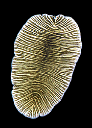

---
aliases:
- Cacing pipih
- Chʼoshtʼą́hí
- Fladorme
- flatmakkar
- flatormer
- giun dẹp
- kurmên pan
- laakamadot
- Lameussid
- laposférgek
- leithphéisteanna
- Llyngyren ledog
- Mnyoo-bapa
- Pahnkirmho
- Pampa kuru
- Plakantārpi
- Platelminto
- Platelmintos
- platihelmint
- Platihelminto
- Platihelmintos
- plattmaskar
- Plattwierm
- Plattwörmer
- Plattwürmer
- Platvermoj
- Platwirmer
- platwormen
- Platwörm
- Platyhelminthes
- Pljosnati crvi
- Plokščiosios kirmėlės
- Ploskavce
- ploski črvi
- Plošnjaci
- ploštěnci
- płazińce
- Raammoo Battee
- Ulod nga patag
- Yassı solucanlar
- Yastı qurdlar
- Πλατυέλμινθες
- Жалпак курттар
- Жалпақ құрттар
- пљоснати црви
- Паҳнкирмҳо
- плоскі черви
- плоскія чэрві
- Плоски червеи
- плоские черви
- Сплескани црви
- Яҫы селәүсендәр
- տափակ որդեր
- תולעים שטוחות
- ديدان مسطحة
- ديدان مسطحه
- پدھرے جنور
- چپٽا ڪيڙا
- کرمهای پهن
- یاستی قۇردلار
- पट्टकृमि
- চেপেটা কৃমি
- চ্যাপ্টাকৃমি
- தட்டைப் புழு
- ప్లాటీహెల్మింథిస్
- ಚಪ್ಪಟೆ ಹುಳುಗಳು
- പ്ലാറ്റിഹെൽമിന്തസ്
- หนอนตัวแบน
- ბრტყელი ჭიები
- ጥፍጥፍ ትል
- 扁形动物门
- 扁形動物
- 扁形動物門
- 편형동물문
title: Platyhelminthes
has_id_wikidata: Q124900
dv_has_:
  name_:
    af: Platyhelminthes
    am: ጥፍጥፍ ትል
    an: Platyhelminthes
    ar: ديدان مسطحة
    arz: ديدان مسطحه
    as: চেপেটা কৃমি
    ast: Platyhelminthes
    az: Yastı qurdlar
    azb: یاستی قۇردلار
    ba: Яҫы селәүсендәр
    bar: Platyhelminthes
    be: плоскія чэрві
    bg: Плоски червеи
    bn: চ্যাপ্টাকৃমি
    br: Platyhelminthes
    bs: Pljosnati crvi
    ca: platihelmint
    ceb: Ulod nga patag
    co: Platyhelminthes
    cs: ploštěnci
    cy: Llyngyren ledog
    da: Fladorme
    de: Plattwürmer
    de-at: Platyhelminthes
    de_ch: Platyhelminthes
    el: Πλατυέλμινθες
    en: Platyhelminthes
    en_ca: Platyhelminthes
    en_gb: Platyhelminthes
    eo: Platvermoj
    es: Platyhelminthes
    et: Lameussid
    eu: Platelminto
    ext: Platyhelminthes
    fa: کرمهای پهن
    fi: laakamadot
    fr: Platyhelminthes
    frp: Platyhelminthes
    frr: Platwirmer
    fur: Platyhelminthes
    ga: leithphéisteanna
    gd: Platyhelminthes
    gl: Platihelmintos
    gsw: Platyhelminthes
    he: תולעים שטוחות
    hi: पट्टकृमि
    hr: Plošnjaci
    hu: laposférgek
    hy: տափակ որդեր
    ia: Platyhelminthes
    id: Platyhelminthes
    ie: Platyhelminthes
    io: Platyhelminthes
    is: Platyhelminthes
    it: Platyhelminthes
    ja: 扁形動物
    jv: Platyhelminthes
    ka: ბრტყელი ჭიები
    kg: Platyhelminthes
    kk: Жалпақ құрттар
    kn: ಚಪ್ಪಟೆ ಹುಳುಗಳು
    ko: 편형동물문
    ku_latn: kurmên pan
    ky: Жалпак курттар
    la: Platyhelminthes
    lb: Plattwierm
    lfn: Platihelminto
    li: Platwörm
    lij: Platyhelminthes
    lt: Plokščiosios kirmėlės
    lv: Plakantārpi
    mg: Platyhelminthes
    min: Platyhelminthes
    mk: Сплескани црви
    ml: പ്ലാറ്റിഹെൽമിന്തസ്
    ms: Cacing pipih
    mul: Platyhelminthes
    nap: Platyhelminthes
    nb: flatormer
    nds: Plattwörmer
    nds_nl: Platyhelminthes
    nl: platwormen
    nn: flatmakkar
    nrm: Platyhelminthes
    nv: Chʼoshtʼą́hí
    nys: Platyhelminthes
    oc: Platyhelminthes
    om: Raammoo Battee
    pcd: Platyhelminthes
    pl: płazińce
    pms: Platyhelminthes
    pnb: پدھرے جنور
    pt: Platelmintos
    pt_br: Platyhelminthes
    qu: Pampa kuru
    rm: Platyhelminthes
    ro: Platyhelminthes
    ru: плоские черви
    sc: Platyhelminthes
    scn: Platyhelminthes
    sco: Platyhelminthes
    sd: چپٽا ڪيڙا
    sh: Pljosnati crvi
    sk: Ploskavce
    sl: ploski črvi
    sq: Platyhelminthes
    sr: пљоснати црви
    sr_ec: Пљоснати црви
    sr_el: Pljosnati crvi
    su: Platyhelminthes
    sv: plattmaskar
    sw: Mnyoo-bapa
    ta: தட்டைப் புழு
    te: ప్లాటీహెల్మింథిస్
    tg: Паҳнкирмҳо
    tg_latn: Pahnkirmho
    th: หนอนตัวแบน
    tl: Platyhelminthes
    tr: Yassı solucanlar
    uk: плоскі черви
    vec: Platyhelminthes
    vi: giun dẹp
    vls: Platyhelminthes
    vo: Platyhelminthes
    wa: Platyhelminthes
    war: Platyhelminthes
    wo: Platyhelminthes
    wuu: 扁形动物门
    yue: 扁形動物門
    zh: 扁形动物门
    zh_cn: 扁形动物门
    zh_hans: 扁形动物门
    zh_hant: 扁形動物門
    zh_hk: 扁形動物門
    zh_sg: 扁形动物门
    zh_tw: 扁形動物門
    zu: Platyhelminthes
---

# [[Platyhelminthes]] 

Flatworms, tapeworms, flukes 

 

## #has_/text_of_/abstract 

> **Platyhelminthes** (from the Greek πλατύ, platy, meaning "flat" and ἕλμινς (root: ἑλμινθ-), helminth-, meaning "worm") is a phylum of relatively simple bilaterian, unsegmented, soft-bodied invertebrates commonly called flatworms or flat worms. Being acoelomates (having no body cavity), and having no specialised circulatory and respiratory organs, they are restricted to having flattened shapes that allow oxygen and nutrients to pass through their bodies by diffusion. The digestive cavity has only one opening for both ingestion (intake of nutrients) and egestion (removal of undigested wastes); as a result, the food can not be processed continuously.
>
> In traditional medicinal texts, Platyhelminthes are divided into Turbellaria, which are mostly non-parasitic animals such as planarians, and three entirely parasitic groups: Cestoda, Trematoda and Monogenea; however, since the turbellarians have since been proven not to be monophyletic, this classification is now deprecated. Free-living flatworms are mostly predators, and live in water or in shaded, humid terrestrial environments, such as leaf litter. Cestodes (tapeworms) and trematodes (flukes) have complex life-cycles, with mature stages that live as parasites in the digestive systems of fish or land vertebrates, and intermediate stages that infest secondary hosts. The eggs of trematodes are excreted from their main hosts, whereas adult cestodes generate vast numbers of hermaphroditic, segment-like proglottids that detach when mature, are excreted, and then release eggs. Unlike the other parasitic groups, the monogeneans are external parasites infesting aquatic animals, and their larvae metamorphose into the adult form after attaching to a suitable host.
>
> Because they do not have internal body cavities, Platyhelminthes were regarded as a primitive stage in the evolution of bilaterians (animals with bilateral symmetry and hence with distinct front and rear ends). However, analyses since the mid-1980s have separated out one subgroup, the Acoelomorpha, as basal bilaterians – closer to the original bilaterians than to any other modern groups. The remaining Platyhelminthes form a monophyletic group, one that contains all and only descendants of a common ancestor that is itself a member of the group. The redefined Platyhelminthes is part of the Spiralia, one of the two main groups of Protostomia. These analyses had concluded the redefined Platyhelminthes, excluding Acoelomorpha, consists of two monophyletic subgroups, Catenulida and Rhabditophora, with Cestoda, Trematoda and Monogenea forming a monophyletic subgroup within one branch of the Rhabditophora. Hence, the traditional platyhelminth subgroup "Turbellaria" is now regarded as paraphyletic, since it excludes the wholly parasitic groups, although these are descended from one group of "turbellarians".
>
> A planarian species has been used in the Philippines and Maldives in an attempt to control populations of the imported giant African snail (Achatina fulica), which was eating agricultural crops. Success was initially reported for the Maldives but this was only temporary and the role of flatworms has been questioned. These planarians have now spread very widely throughout the tropics and are themselves a serious threat to native snails, and should not be used for biological control. In northwest Europe, there are concerns about the spread of the New Zealand planarian Arthurdendyus triangulatus, which preys on earthworms.
>
> [Wikipedia](https://en.wikipedia.org/wiki/Flatworm) 

## Phylogeny 

-   « Ancestral Groups  
    -  [Bilateria](../Bilateria.md) 
    -  [Animals](../../Animals.md) 
    -  [Eukarya](../../../Eukarya.md) 
    -   [Tree of Life](../../../Tree_of_Life.md)

-   ◊ Sibling Groups of  Bilateria
    -   [Deuterostomia](Deutero.md)
    -  [Arthropoda](Arthropoda.md) 
    -  [Onychophora](Onychophora.md) 
    -   [Tardigrade](Tardigrade.md)
    -  [Nematoda](Nematoda.md) 
    -  [Nematomorpha](Nematomorpha.md) 
    -  [Kinorhyncha](Kinorhyncha.md) 
    -  [Loricifera](Loricifera.md) 
    -  [Priapulida](Priapulida.md) 
    -   [Arrow_Worm](Arrow_Worm.md)
    -  [Gastrotricha](Gastrotricha.md) 
    -  [Rotifera](Rotifera.md) 
    -  [Gnathostomulida](Gnathostomulida.md) 
    -   [Limnognathia maerski](Limnognathia_maerski)
    -  [Cycliophora](Cycliophora.md) 
    -  [Mesozoa](Mesozoa.md) 
    -   Platyhelminthes
    -  [Annelida](Annelida.md) 
    -  [Bryozoa](Bryozoa.md) 
    -  [Sipuncula](Sipuncula.md) 
    -  [Mollusca](Mollusca.md) 
    -  [Nemertea](Nemertea.md) 
    -  [Entoprocta](Entoprocta.md) 
    -  [Phoronida](Phoronida.md) 
    -  [Brachiopoda](Brachiopoda.md) 

-   » Sub-Groups
    -  [Aspidogastrea](Platyhelminthes/Aspidogastrea.md) 
    -  [Cestodaria](Platyhelminthes/Cestodaria.md) 

-   *Turbellaria*
    -   *Nemertodermatida*
    -   *Acoela*
    -   *Catenulida*
    -   *Macrostomida*
    -   *Lecithoepitheliata*
    -   *Rhabdocoela*
    -   *Prolecithophora*
    -   *Proseriata*
    -   *Tricladida*
    -   *Polycladida*
-   *Monogenea*
    -   *Monopisthocotylea*
    -   *Polyopishtocotylea*
-   *Trematoda*
    -   *Digenea*
    -   [Aspidogastrea](Platyhelminthes/Aspidogastrea.md "go to ToL page"))*
-   *Cestoda*
    -   [Cestodaria](Platyhelminthes/Cestodaria.md "go to ToL page"))*
    -   *Eucestoda*

## Title Illustrations

Stylochus. Photograph from Gray Museum Slide Collection, copyright ©
1995, [Marine Biological Laboratory](http://www.mbl.edu/), Woods Hole.
 
copyright ::   © 1995 [Marine Biological Laboratory, Woods Hole](http://www.mbl.edu/) 

## Confidential Links & Embeds: 

### #is_/same_as :: [[/_Standards/bio/bio~Domain/Eukarya/Animal/Bilateria/Platyhelminthes|Platyhelminthes]] 

### #is_/same_as :: [[/_public/bio/bio~Domain/Eukarya/Animal/Bilateria/Platyhelminthes.public|Platyhelminthes.public]] 

### #is_/same_as :: [[/_internal/bio/bio~Domain/Eukarya/Animal/Bilateria/Platyhelminthes.internal|Platyhelminthes.internal]] 

### #is_/same_as :: [[/_protect/bio/bio~Domain/Eukarya/Animal/Bilateria/Platyhelminthes.protect|Platyhelminthes.protect]] 

### #is_/same_as :: [[/_private/bio/bio~Domain/Eukarya/Animal/Bilateria/Platyhelminthes.private|Platyhelminthes.private]] 

### #is_/same_as :: [[/_personal/bio/bio~Domain/Eukarya/Animal/Bilateria/Platyhelminthes.personal|Platyhelminthes.personal]] 

### #is_/same_as :: [[/_secret/bio/bio~Domain/Eukarya/Animal/Bilateria/Platyhelminthes.secret|Platyhelminthes.secret]] 

