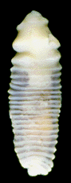
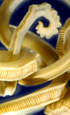
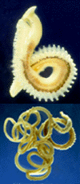
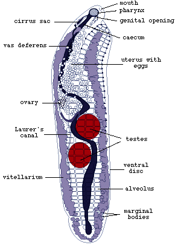
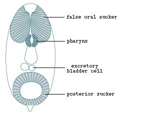

---
aliases:
  - Aspidogastrea
title: Aspidogastrea
---

## Phylogeny 

-   « Ancestral Groups  
    -  [Platyhelminthes](../Platyhelminthes.md))
    -  [Bilateria](../../Bilateria.md))
    -  [Animals](../../../Animals.md))
    -  [Eukarya](../../../../Eukarya.md))
    -   [Tree of Life](../../../../Tree_of_Life.md)

-   ◊ Sibling Groups of  Platyhelminthes
    -   Aspidogastrea
    -  [Cestodaria](Cestodaria.md))

-   » Sub-Groups 

# [[Aspidogastrea]] 

 

## #has_/text_of_/abstract 

> The **Aspidogastrea** (Ancient Greek: ἀσπίς aspis “shield”, γαστήρ gaster “stomach/pouch”) is a small group of flukes comprising about 80 species. It is a subclass of the trematoda, and sister group to the Digenea. Species range in length from approximately one millimeter to several centimeters. They are parasites of freshwater and marine molluscs and vertebrates (cartilaginous and bony fishes and turtles). Maturation may occur in the mollusc or vertebrate host. None of the species has any economic importance, but the group is of very great interest to biologists because it has several characters which appear to be archaic.
>
> [Wikipedia](https://en.wikipedia.org/wiki/Aspidogastrea) 

## Introduction

[Klaus Rohde]()

The Aspidogastrea is a small group of flukes comprising about 80
species. It belongs to the Trematoda, which comprises the two subclasses
Aspidogastrea and Digenea. Species range in length from approximately
one mm to several cm. They are parasites of freshwater and marine
molluscs and vertebrates (cartilaginous and bony fishes and turtles).
Maturation may occur in the mollusc or vertebrate host. None of the
species has any economic importance, but the group is of very great
interest to biologists because it has several characters which appear to
be archaic. For example, the hosts of aspidogastreans include
chondrichthyan fishes (sharks, rays and chimaeras), a group that is 450
million years old, whereas the sister group of the aspidogastreans, the
digeneans, are known from teleost fishes (210 million years old) as well
as from various \"higher\" vertebrates; very few species have invaded
chondrichthyans secondarily.

Aspidogastreans have a nervous system of extraordinary complexity,
greater than that of related free-living forms, and - likewise - they
have a very great number of sensory receptors of many different types.
Their life cycle is much simpler than that of digenean trematodes,
including a mollusc and a facultative or compulsory vertebrate host.
There are no multiplicative larval stages in the mollusc host, as known
from all digenean trematodes. Furthermore, host specificity of most
aspidogastreans is very low, i.e., they infect a wide range of hosts,
whereas a typical digenean trematode is restricted to few species (at
least of molluscs). Aspidogastreans may survive for many days or even
weeks outside a host in simple media (water, saline solution). All this
has led to the suggestions that aspidogastreans are archaic trematodes,
not yet well adapted to specific hosts, which have given rise to the
more \"advanced\" digenean trematodes, and that the complex life cycles
of digenean trematodes have evolved from the simple ones of
aspidogastreans (Rohde, 1972, further references therein).

### Characteristics

Shared characteristics of the group are a large ventral disc with a
large number of small alveoli (suckerlets) (Fig. 1, see also [Structure of the juvenile and adult](http://www.tolweb.org/accessory/Juvenile_&_Adult_Aspidogastrea?acc_id=1791))
or a row of suckers and a tegument with short protrusions, so-called
microtubercles.
)

Figure 1. Whole mount of *Multicotyle purvisi* (redrawn from Rohde,
1972).

Larvae have a posterior sucker and in some species a short posterior
appendage; they either possess a number of ciliated patches, or they are
non-ciliated (Fig.2), see [Structure of the larvae](http://www.tolweb.org/accessory/Structure_of_the_Aspidogastrea_Larva?acc_id=1792)
page.
)

Figure 2. Larva of *Lobatostoma manteri* (redrawn from Rohde, 1973a).

Most studies deal with taxonomy and light as well as
electron-microscopic structure. [Embryology and development](http://www.tolweb.org/accessory/Development_of_Aspidogastrea?acc_id=1793)
has been studied in few species. Host specificity is usually low, and
several species were shown to be able to survive for long periods
outside the host (see [Host specificity and survival outside the host](http://www.tolweb.org/accessory/Aspidogastrea_Host_Specificity?acc_id=1794)).
Little is known on the [effects on the host](http://www.tolweb.org/accessory/Effects_of_Aspidogastrea_on_the_Host?acc_id=1795).
The [life cycles](http://www.tolweb.org/accessory/Life_Cycles_of_Aspidogastrea?acc_id=1796)
of several species are known.

### The Families of the Aspidogastrea

Gibson (1987) and Rohde (2001) distinguish four families of
Aspidogastrea:

-   The **Rugogastridae** include a single genus, *Rugogaster*, with two
    species from the rectal glands of holocephalan fishes. It is
    characterised by a single row of rugae (transverse thickenings of
    the tegument) developing from the posterior wall of the anteriorly
    located ventral sucker, numerous testes, and two caeca. Species of
    all other families have a single caecum and either one or two
    testes.
-   The **Stichocotylidae** include the single species *Stichocotyle
    nephropis* from the intestine of elasmobranchs. It has a single
    ventral row of well separated suckers.
-   The **Multicalycidae** include the single genus *Multicalyx* from
    the intestine of holocephalans and elasmobranchs. It is
    characterised by a single ventral row of alveoli separated by
    transverse septa.
-   The **Aspidogastridae** includes species infecting molluscs,
    teleosts and turtles. The ventral adhesive disc bears either three
    or four rows of alveoli. Rohde distinguishes three subfamilies of
    Aspidogastridae, the Rohdellinae, Cotylaspidinae and
    Aspidogastrinae. The first subfamily includes the single species
    *Rohdella siamensis* from freshwater teleosts; the terminal male and
    female genital ducts are united to form a hermaphroditic duct, which
    is absent in the other two subfamilies. The Cotylaspidinae have an
    adhesive disc bearing three, and the Aspidogastrinae have an
    adhesive disc bearing four longitudinal rows of alveoli. The genera
    *Cotylogaster*, *Cotylaspis* and *Lissemysia* of the Cotylaspidinae
    differ in the absence or presence of a cirrus pouch and the number
    of testes (one or two), the genera *Multicotyle*, *Lobatostoma*,
    *Aspidogaster*, *Lophotaspis* and *Sychnocotyle* of the
    Aspidogastrinae also differ in the number of testes (one or two),
    the absence or presence of a cirrus pouch, and - in addition - in
    the absence or presence of head lobes and/or papillae on the
    adhesive disc.

-  ) [Key to the Families, Subfamilies and Genera of     Aspidogastrea](http://www.tolweb.org/accessory/Key_to_Aspidogastrea?acc_id=1789)
-  ) [List of     Synonyms](http://www.tolweb.org/accessory/List_of_Synonyms?acc_id=2631)

### Discussion of Phylogenetic Relationships

The tree presented here is a preliminary one and must be confirmed by
DNA studies. It shows four families, the Aspidogastridae infecting
teleosts and turtles, and the Stichocotylidae, Multicalycidae and
Rugogastridae infecting chondrichthyans (holocephalans and
elasmobranchs). A synapomorphy for all Aspidogastrea is the presence of
an adhesive disc, a synapomorphy of the Aspidogastridae is an adhesive
disc which is subdivided into three or four rows of alveoli, a
synapomorphy of the other three families is an adhesive disc consisting
of a single longitudinal row of suckers, rugae or deep alveoli. An
adhesive disc consisting of a row of suckers is apomorphic for the
Stichocotylidae, an adhesive disc consisting of a single row of deep
alveoli is apomorphic for the Multicalycidae, and an adhesive disc
consisting of rugae is apomorphic for the Rugogastridae. The
plesiomorphic state within the Aspidogastrea is likely to be a
posterior, undivided sucker as found in larval aspidogastreans and
digeneans.

         ========= Aspidogastridae (hosts:Teleostei, Chelonia)
         |
         |  ====== Multicalycidae (hosts:Elasmobranchii, Holocephali) 
    =====|  |
         ===|===== Rugogastridae (hosts:Holocephali)  
            |
            ====== Stichocotylidae (hosts:Elasmobranchii) 

The four families of aspidogastreans are also recognized by Gibson
(1987) and Rohde (2001). Gibson (1987, also Gibson and Chinabut 1984)
further recognized two orders, the Aspidogastrida with the single family
Aspidogastridae, and the Stichocotylida including the Stichocotylidae,
Multicalycidae and Rugogastridae. However, similarities between species
of these two orders are so great that distinction at the level of orders
does not seem justified.

The sister group of the Aspidogastrea is the Digenea, both comprising
the Trematoda. Synapomorphies of the trematodes are presence of a
Laurer\'s canal, a posterior sucker (transformed to an adhesive disc in
the Aspidogastrea), and life cycles involving molluscs and vertebrates.
DNA studies have consistently supported this sister group relationship.
The question of whether vertebrates or molluscs are the original hosts
of the trematodes, has not been resolved (see discussion in Rohde 2001).

## Title Illustrations

---------------------------------------------------------------------------)
Scientific Name ::     Rugogaster hyrdolagi
Creator              Shirley Dawson
Specimen Condition   Dead Specimen
Copyright ::            © 1998 [Klaus Rohde](http://metz.une.edu.au/%7Ekrohde/) 

---------------------------------------------------------------------------
 
Scientific Name ::     Multicalyx
Creator              Shirley Dawson
Specimen Condition   Dead Specimen
Copyright ::            © 1998 [Klaus Rohde](http://metz.une.edu.au/%7Ekrohde/) 

---------------------------------------------------------------------------
 
Scientific Name ::     Multicalyx elegans (top), Multicalyx sp. (bottom))
Creator              Shirley Dawson
Specimen Condition   Dead Specimen
Copyright ::            © 1998 [Klaus Rohde](http://metz.une.edu.au/%7Ekrohde/) 

## Confidential Links & Embeds: 

### #is_/same_as :: [Aspidogastrea](/_Standards/bio/bio~Domain/Eukarya/Animal/Bilateria/Platyhelminthes/Aspidogastrea.md) 

### #is_/same_as :: [Aspidogastrea.public](/_public/bio/bio~Domain/Eukarya/Animal/Bilateria/Platyhelminthes/Aspidogastrea.public.md) 

### #is_/same_as :: [Aspidogastrea.internal](/_internal/bio/bio~Domain/Eukarya/Animal/Bilateria/Platyhelminthes/Aspidogastrea.internal.md) 

### #is_/same_as :: [Aspidogastrea.protect](/_protect/bio/bio~Domain/Eukarya/Animal/Bilateria/Platyhelminthes/Aspidogastrea.protect.md) 

### #is_/same_as :: [Aspidogastrea.private](/_private/bio/bio~Domain/Eukarya/Animal/Bilateria/Platyhelminthes/Aspidogastrea.private.md) 

### #is_/same_as :: [Aspidogastrea.personal](/_personal/bio/bio~Domain/Eukarya/Animal/Bilateria/Platyhelminthes/Aspidogastrea.personal.md) 

### #is_/same_as :: [Aspidogastrea.secret](/_secret/bio/bio~Domain/Eukarya/Animal/Bilateria/Platyhelminthes/Aspidogastrea.secret.md)

