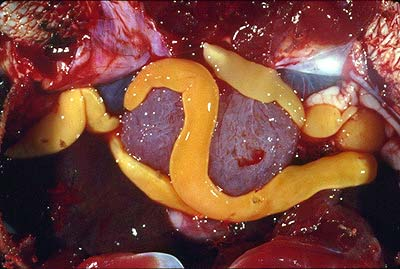
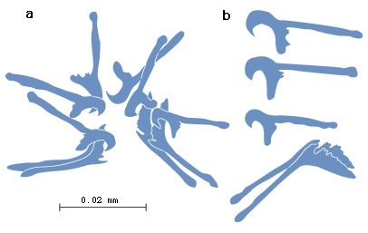
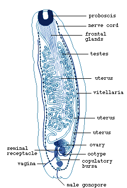

---
aliases:
  - Amphilinidea
title: Amphilinidea
---

## Phylogeny 

-   « Ancestral Groups  
    -  [Cestodaria](../Cestodaria.md) 
    -  [Platyhelminthes](../../Platyhelminthes.md) 
    -  [Bilateria](../../../Bilateria.md) 
    -  [Animals](../../../../Animals.md) 
    -  [Eukarya](../../../../../Eukarya.md) 
    -   [Tree of Life](../../../../../Tree_of_Life.md)

-   ◊ Sibling Groups of  Cestodaria
    -   Amphilinidea

-   » Sub-Groups
    -   [Amphilina foliacea](Amphilina_foliacea)
    -   [Amphilina japonica](Amphilina_japonica)
    -   [Gigantolina elongata](Gigantolina_elongata)
    -   [Gigantolina magna](Gigantolina_magna)
    -   [Schizochoerus janickii](Schizochoerus_janickii)
    -   [Schizochoerus africanus](Schizochoerus_africanus)
    -   [Schizochoerus         liguloideus](Schizochoerus_liguloideus)
    -   [Schizochoerus         paragonopora](Schizochoerus_paragonopora)

# [[Amphilinidea]]

Amphilinidae 

 

## #has_/text_of_/abstract 

> Amphilinidae is a family of parasitic flatworms of the phylum Platyhelminthes. It is the only family in the monotypic order **Amphilinidea**. Amphilinids are Cestodes, yet differ from true tapeworms (Eucestoda) as their bodies are unsegmented and not divided into proglottids. "Amphilinids are large worms which have a flattened leaf-like body. Only 8 amphilinid species are known." "The adults are hermaphroditic. A muscular proboscis is located at the anterior end, and is sometimes very weakly developed or absent." They live in the body cavities of freshwater turtles and teleost fish as adults, and in the bodies of various crustaceans as juveniles. Apart from a little studied parasitism of sturgeon, these flatworms have very little economic importance. Biologically, they have gained attention for their potential to shed light on the phylogeny of tapeworms.
>
> [Wikipedia](https://en.wikipedia.org/wiki/Amphilinidae) 

## Introduction

[Klaus Rohde]()

Only 8 amphilinid species are known. The amphilinids are large worms
(several cm long) which, in contrast to the true tapeworms (Eucestoda),
have a flattened leaf-like body that is not divided into proglottids
(false \"segments\"). Larvae have 10 peculiarly shaped hooks of several
types at the posterior end, which are retained by the adult. They are
parasites in the body cavity of freshwater and marine teleost fishes and
freshwater turtles (Dubinina, 1982). They have little economic
significance, although one species was shown to affect sturgeon, the
producers of caviar, adversely. Amphilinids are of considerable interest
to biologists, because they may cast light on the phylogeny of tapeworms
and of related forms. Most studies deal with the taxonomy as well as the
light- and electron microscopic structure of a few species. [Life cycles](http://www.tolweb.org/accessory/Amphilinidea_Life_Cycles?acc_id=1776)
are known only for a few species and little is known of their [effects on the host](http://www.tolweb.org/accessory/Amphilinidea_Effects_on_the_Host?acc_id=1777).

[A key to the species of Amphilinidea is available here](http://www.tolweb.org/accessory/Key_to_Amphilinidea?acc_id=1775).

### Characteristics

The Amphilinidea are large (several cm long), hermaphroditic,
non-"segmented" flatworms whose adult stages live in the body cavity of
turtles and teleost fish and use crustaceans as intermediate hosts. More
detail is available on the [Life cycles](http://www.tolweb.org/accessory/Amphilinidea_Life_Cycles?acc_id=1776)
page. They have 10 hooks of several types at the posterior end (Fig.1),
and a posteriorly located large seminal receptacle and ovary.
 

Figure 1. Hooks of larval *Amphilina foliacea*. a. Arrangement of hooks
in the larva, b. Shape of hooks in greater detail (redrawn from
Dubinina, 1982).

The uterus extends from the ovary to the anterior end, back again to the
posterior end, and forward to open at the anterior end. Small follicular
yolk glands and testes are scattered over large parts of the body.
Amphilinids lack an intestine (Fig. 2).
 

Figure 2. Juvenile *Amphilina foliacea*. Note uterine opening at
anterior end, and vaginal and male pores at posterior end (redrawn from
Dubinina, 1982).

For more information see [Structure of the larva](http://www.tolweb.org/accessory/Structure_of_the_Amphilinidea_Larva?acc_id=1779)
and [Structure of the juvenile and adult](http://www.tolweb.org/accessory/Amphilinidea_Juvenile_and_Adult?acc_id=1778)
pages.

### Discussion of Phylogenetic Relationships

Bandoni and Brooks (1987) have revised the Amphilinidea and made the
first and only analysis of the group using phylogenetic systematics
(cladistics). The analysis of 46 character states of 30 morphological
(light-microscopic) characters produced the tree illustrated above. They
distinguish three genera with altogether eight species, mainly based on
the shape of the uterus (N-shaped or looped), shape of the body
(elliptical, fusiform or elongate), whether vagina crossing or not
crossing male duct, distribution of the testes and whether testes paired
or not paired, whether vagina simple or bifurcate, shape of ovary,
whether gonopore separate or common. Important characters, such as the
structure of the protonephridial system, are not included, and the tree
will almost certainly have to be revised using additional characters.

Gibson (1994) has given a key to the species (see also Schmidt, 1986),
and Dubinina (1982), in her detailed monograph of the Amphilinidea, has
discussed the position of the group in the phylum Platyhelminthes.

### Synonyms

The genus and species names listed first are those from Dubinina (1982).
They are used in the text, because they are supported by the best
descriptions and widely used in the literature. The names proposed by
Bandoni and Brooks (1987), which are used in the [tree](#tree), are here
marked with an asterisk.

*Amphilina foliacea\**
:   synonyms *Monostomum foliaceum*, *Amphilina neritina*

*Amphilina japonica\**
:   synonyms *A. bipunctata*, *A. foliacea*

*Gephyrolina paragonopora*
:   synonyms *Amphilina paragonopora*, *Hunteroides mystel*,
*Schizochoerus paragonopora\**

*Schizochoerus liguloideus\**
:   synonyms *Monostomum liguloideum*, *Amphilina liguloidea*

*Nesolecithus janickii*
:   synonyms *Amphilina liguloidea*, *Monostomum liguloideum*,
*Schizochoerus janickii\**

*Nesolecithus africanus*
:   synonym *Schizochoerus africanus\**

*Austramphilina elongata*
:   synonyms *Kosterina Kuiperi*, *Gigantolina elongata\**

*Gigantolina magna\**
:   synonyms *Amphilina magna*, *Gyrometra albotaenia*, *Gyrometra
kunduchi*

## Title Illustrations

---------------------------------------------------------------------------

scientific_name ::     Gigantolina elongata, Chelodina longicollis
Comments             Adult Austramphilina elongata in the body cavity of a long-necked turtle, Chelodina longicollis
Creator              photo by Russ Hobbs
specimen_condition ::  Live Specimen
copyright ::            © 1998 [Klaus Rohde](http://metz.une.edu.au/%7Ekrohde/) 

## Confidential Links & Embeds: 

### #is_/same_as :: [[/_Standards/bio/bio~Domain/Eukarya/Animal/Bilateria/Platyhelminthes/Cestodaria/Amphilinidea|Amphilinidea]] 

### #is_/same_as :: [[/_public/bio/bio~Domain/Eukarya/Animal/Bilateria/Platyhelminthes/Cestodaria/Amphilinidea.public|Amphilinidea.public]] 

### #is_/same_as :: [[/_internal/bio/bio~Domain/Eukarya/Animal/Bilateria/Platyhelminthes/Cestodaria/Amphilinidea.internal|Amphilinidea.internal]] 

### #is_/same_as :: [[/_protect/bio/bio~Domain/Eukarya/Animal/Bilateria/Platyhelminthes/Cestodaria/Amphilinidea.protect|Amphilinidea.protect]] 

### #is_/same_as :: [[/_private/bio/bio~Domain/Eukarya/Animal/Bilateria/Platyhelminthes/Cestodaria/Amphilinidea.private|Amphilinidea.private]] 

### #is_/same_as :: [[/_personal/bio/bio~Domain/Eukarya/Animal/Bilateria/Platyhelminthes/Cestodaria/Amphilinidea.personal|Amphilinidea.personal]] 

### #is_/same_as :: [[/_secret/bio/bio~Domain/Eukarya/Animal/Bilateria/Platyhelminthes/Cestodaria/Amphilinidea.secret|Amphilinidea.secret]] 

