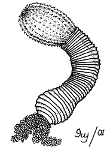

---
aliases:
  - Priapulida
title: Priapulida
---

# [[Priapulida]] 

## Penis Worms 

 

## #has_/text_of_/abstract 

> **Priapulida** (priapulid worms, from Gr. πριάπος, priāpos 'Priapus' + Lat. -ul-, diminutive), 
> sometimes referred to as penis worms, is a phylum of unsegmented marine worms. 
> 
> The name of the phylum relates to the Greek god of fertility, 
> because their general shape and their extensible spiny introvert (eversible) proboscis 
> may resemble the shape of a human penis. 
> 
> They live in the mud, except for a few tropical meiobenthic species which live in medium- to coarse-grained sands, and are found in comparatively shallow waters to deep waters and no warmer than 12–13°C. Some species show a remarkable tolerance for hydrogen sulfide, anoxia and low salinity. Halicryptus spinulosus appears to prefer brackish shallow waters. They can be quite abundant in some areas. In an Alaskan bay as many as 85 adult individuals of Priapulus caudatus per square meter has been recorded, while the density of its larvae can be as high as 58,000 per square meter (5,390 per square foot).
>
> Together with Echiura and Sipuncula, they were once placed in the taxon Gephyrea, but consistent morphological and molecular evidence supports their belonging to Ecdysozoa, which also includes arthropods and nematodes. Fossil findings show that the mouth design of the stem-arthropod Pambdelurion is identical with that of priapulids, indicating that their mouth is an original trait inherited from the last common ancestor of both priapulids and arthropods, even if modern arthropods no longer possess it. Among Ecdysozoa, their nearest relatives are Kinorhyncha and Loricifera, with which they constitute the Scalidophora clade named after the spines covering the introvert (scalids). They feed on slow-moving invertebrates, such as polychaete worms.
>
> Some analyses suggest that Priapulida may represent a basal lineage within Ecdysozoa, leading to their classification as "living fossils". Priapulid-like fossils are known at least as far back as the Middle Cambrian. They were likely major predators of the Cambrian period. However, crown-group priapulids cannot be recognized until the Carboniferous. 22 extant species of priapulid worms are known, half of them being of meiobenthic size.
>
> [Wikipedia](https://en.wikipedia.org/wiki/Priapulida) 

## Phylogeny 

-   « Ancestral Groups  
    -  [Bilateria](../Bilateria.md))
    -  [Animals](../../Animals.md))
    -  [Eukarya](../../../Eukarya.md))
    -   [Tree of Life](../../../Tree_of_Life.md)

-   ◊ Sibling Groups of  Bilateria
    -   [Deuterostomia](Deutero.md)
    -  [Arthropoda](Arthropoda.md))
    -  [Onychophora](Onychophora.md))
    -   [Tardigrade](Tardigrade.md)
    -  [Nematoda](Nematoda.md))
    -  [Nematomorpha](Nematomorpha.md))
    -  [Kinorhyncha](Kinorhyncha.md))
    -  [Loricifera](Loricifera.md))
    -   Priapulida
    -   [Arrow_Worm](Arrow_Worm.md)
    -  [Gastrotricha](Gastrotricha.md))
    -  [Rotifera](Rotifera.md))
    -  [Gnathostomulida](Gnathostomulida.md))
    -   [Limnognathia maerski](Limnognathia_maerski)
    -  [Cycliophora](Cycliophora.md))
    -  [Mesozoa](Mesozoa.md))
    -  [Platyhelminthes](Platyhelminthes.md))
    -  [Annelida](Annelida.md))
    -  [Bryozoa](Bryozoa.md))
    -  [Sipuncula](Sipuncula.md))
    -  [Mollusca](Mollusca.md))
    -  [Nemertea](Nemertea.md))
    -  [Entoprocta](Entoprocta.md))
    -  [Phoronida](Phoronida.md))
    -  [Brachiopoda](Brachiopoda.md))

-   » Sub-Groups 
	-   *Priapulidae*
	-   *Tubiluchidae*
	-   *Maccabaeidae*

## Title Illustrations

External features of a priapulid worm.
Drawing by Ivy Livingstone. Copyright © 2001
[BIODIDAC](http://biodidac.bio.uottawa.ca/index.htm)

--------------------------------------------------------------------------

Copyright ::   © 2001 [BIODIDAC](http://biodidac.bio.uottawa.ca/index.htm) 

## Confidential Links & Embeds: 

### #is_/same_as :: [Priapulida](/_Standards/bio/bio~Domain/Eukarya/Animal/Bilateria/Priapulida.md) 

### #is_/same_as :: [Priapulida.public](/_public/bio/bio~Domain/Eukarya/Animal/Bilateria/Priapulida.public.md) 

### #is_/same_as :: [Priapulida.internal](/_internal/bio/bio~Domain/Eukarya/Animal/Bilateria/Priapulida.internal.md) 

### #is_/same_as :: [Priapulida.protect](/_protect/bio/bio~Domain/Eukarya/Animal/Bilateria/Priapulida.protect.md) 

### #is_/same_as :: [Priapulida.private](/_private/bio/bio~Domain/Eukarya/Animal/Bilateria/Priapulida.private.md) 

### #is_/same_as :: [Priapulida.personal](/_personal/bio/bio~Domain/Eukarya/Animal/Bilateria/Priapulida.personal.md) 

### #is_/same_as :: [Priapulida.secret](/_secret/bio/bio~Domain/Eukarya/Animal/Bilateria/Priapulida.secret.md)

