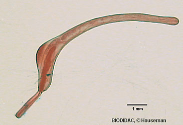
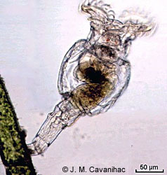

---
aliases:
  - Rotifera
title: Rotifera
---

# [[Rotifera]] 

Rotifers 

 
 

## #has_/text_of_/abstract 

> The rotifers (, from Latin rota 'wheel' and -fer 'bearing'), sometimes called wheel animals or wheel animalcules, make up a phylum (**Rotifera** ) of microscopic and near-microscopic pseudocoelomate animals.
>
> They were first described by Rev. John Harris in 1696, and other forms were described by Antonie van Leeuwenhoek in 1703. Most rotifers are around 0.1–0.5 mm (0.0039–0.0197 in) long (although their size can range from 50 μm (0.0020 in) to over 2 mm (0.079 in)), and are common in freshwater environments throughout the world with a few saltwater species.
>
> Some rotifers are free swimming and truly planktonic, others move by inchworming along a substrate, and some are sessile, living inside tubes or gelatinous holdfasts that are attached to a substrate. About 25 species are colonial (e.g., Sinantherina semibullata), either sessile or planktonic. Rotifers are an important part of the freshwater zooplankton, being a major foodsource and with many species also contributing to the decomposition of soil organic matter. Genetic evidence indicates that the parasitic acanthocephalans are a highly specialised group of rotifers.
>
> Most species of the rotifers are cosmopolitan, but there are also some endemic species, like Cephalodella vittata to Lake Baikal. Recent barcoding evidence, however, suggests that some 'cosmopolitan' species, such as Brachionus plicatilis, B. calyciflorus, Lecane bulla, among others, are actually species complexes. In some recent treatments, rotifers are placed with acanthocephalans in a larger clade called Syndermata.
>
> In June 2021, biologists reported the restoration of bdelloid rotifers after being frozen for 24,000 years in the Siberian permafrost. The earliest record of the rotifer clade is of an acanthocephalan from the Middle Jurassic of China. Earlier purported fossils of rotifers have been suggested in Devonian and Permian fossil beds.
>
> [Wikipedia](https://en.wikipedia.org/wiki/Rotifer) 

## Phylogeny 

-   « Ancestral Groups  
    -  [Bilateria](../Bilateria.md) 
    -  [Animals](../../Animals.md) 
    -  [Eukarya](../../../Eukarya.md) 
    -   [Tree of Life](../../../Tree_of_Life.md)

-   ◊ Sibling Groups of  Bilateria
    -   [Deuterostomia](Deutero.md)
    -  [Arthropoda](Arthropoda.md) 
    -  [Onychophora](Onychophora.md) 
    -   [Tardigrade](Tardigrade.md)
    -  [Nematoda](Nematoda.md) 
    -  [Nematomorpha](Nematomorpha.md) 
    -  [Kinorhyncha](Kinorhyncha.md) 
    -  [Loricifera](Loricifera.md) 
    -  [Priapulida](Priapulida.md) 
    -   [Arrow_Worm](Arrow_Worm.md)
    -  [Gastrotricha](Gastrotricha.md) 
    -   Rotifera
    -  [Gnathostomulida](Gnathostomulida.md) 
    -   [Limnognathia maerski](Limnognathia_maerski)
    -  [Cycliophora](Cycliophora.md) 
    -  [Mesozoa](Mesozoa.md) 
    -  [Platyhelminthes](Platyhelminthes.md) 
    -  [Annelida](Annelida.md) 
    -  [Bryozoa](Bryozoa.md) 
    -  [Sipuncula](Sipuncula.md) 
    -  [Mollusca](Mollusca.md) 
    -  [Nemertea](Nemertea.md) 
    -  [Entoprocta](Entoprocta.md) 
    -  [Phoronida](Phoronida.md) 
    -  [Brachiopoda](Brachiopoda.md) 

-   » Sub-Groups
    -   [Acanthocephala](Acanthocephala)
    -   [Seisonidea](Seisonidea)
    -   [Bdelloidea](Bdelloidea)
    -   [Ploima](Ploima)
    -   [Flosculariacea](Flosculariacea)
    -   [Collothecacea](Collothecacea)

## Title Illustrations

--------------------------------------------------------------------------- 
) 
scientific_name ::     Acanthocephala
Comments             with proboscis extended
Creator              Houseman
specimen_condition ::  Dead Specimen
Sex ::                Female
copyright ::            © [BIODIDAC](http://biodidac.bio.uottawa.ca/index.htm) 

--------------------------------------------------------------------------

scientific_name ::  Bdelloidea
Creator           J. M. Cavanihac
copyright ::         © [BIODIDAC](http://biodidac.bio.uottawa.ca/index.htm) 

## Confidential Links & Embeds: 

### #is_/same_as :: [[/_Standards/bio/bio~Domain/Eukarya/Animal/Bilateria/Rotifera|Rotifera]] 

### #is_/same_as :: [[/_public/bio/bio~Domain/Eukarya/Animal/Bilateria/Rotifera.public|Rotifera.public]] 

### #is_/same_as :: [[/_internal/bio/bio~Domain/Eukarya/Animal/Bilateria/Rotifera.internal|Rotifera.internal]] 

### #is_/same_as :: [[/_protect/bio/bio~Domain/Eukarya/Animal/Bilateria/Rotifera.protect|Rotifera.protect]] 

### #is_/same_as :: [[/_private/bio/bio~Domain/Eukarya/Animal/Bilateria/Rotifera.private|Rotifera.private]] 

### #is_/same_as :: [[/_personal/bio/bio~Domain/Eukarya/Animal/Bilateria/Rotifera.personal|Rotifera.personal]] 

### #is_/same_as :: [[/_secret/bio/bio~Domain/Eukarya/Animal/Bilateria/Rotifera.secret|Rotifera.secret]] 

