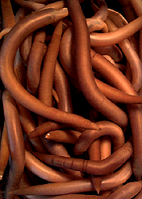

---
aliases:
  - Sipuncula
title: Sipuncula
---

# [[Sipuncula]] 

## Peanut Worms 
)

## #has_/text_of_/abstract 

> The **Sipuncula** or Sipunculida (common names sipunculid worms or peanut worms) is a class containing about 162 species of marine annelid worms, that have secondarily lost their segmentation. Sipuncula was once considered a phylum of unsegmented worms, but was demoted to a class of Annelida, based on recent molecular work.
>
> Sipunculans vary in size but most species are under 10 cm (4 in) in length. The body is divided into an unsegmented, bulbous trunk and a narrower, anterior section, called the "introvert", which can be retracted into the trunk. The mouth is at the tip of the introvert and is surrounded in most groups by a ring of short tentacles. With no hard parts, the body is flexible and mobile. Although found in a range of habitats throughout the world's oceans, the majority of species live in shallow water habitats, burrowing under the surface of sandy and muddy substrates. Others live under stones, in rock crevices or in other concealed locations.
>
> Most sipunculans are deposit feeders, extending the introvert to gather food particles and draw them into the mouth, and retracting the introvert when feeding conditions are unsuitable or danger threatens. With a few exceptions, reproduction is sexual and involves a planktonic larval stage. Sipunculid worms are used as food in some countries in south-east Asia.
>
> [Wikipedia](https://en.wikipedia.org/wiki/Sipuncula) 

## Phylogeny 

-   « Ancestral Groups  
    -  [Bilateria](../Bilateria.md) 
    -  [Animals](../../Animals.md) 
    -  [Eukarya](../../../Eukarya.md) 
    -   [Tree of Life](../../../Tree_of_Life.md)

-   ◊ Sibling Groups of  Bilateria
    -   [Deuterostomia](Deutero.md)
    -  [Arthropoda](Arthropoda.md) 
    -  [Onychophora](Onychophora.md) 
    -   [Tardigrade](Tardigrade.md)
    -  [Nematoda](Nematoda.md) 
    -  [Nematomorpha](Nematomorpha.md) 
    -  [Kinorhyncha](Kinorhyncha.md) 
    -  [Loricifera](Loricifera.md) 
    -  [Priapulida](Priapulida.md) 
    -   [Arrow_Worm](Arrow_Worm.md)
    -  [Gastrotricha](Gastrotricha.md) 
    -  [Rotifera](Rotifera.md) 
    -  [Gnathostomulida](Gnathostomulida.md) 
    -   [Limnognathia maerski](Limnognathia_maerski)
    -  [Cycliophora](Cycliophora.md) 
    -  [Mesozoa](Mesozoa.md) 
    -  [Platyhelminthes](Platyhelminthes.md) 
    -  [Annelida](Annelida.md) 
    -  [Bryozoa](Bryozoa.md) 
    -   Sipuncula
    -  [Mollusca](Mollusca.md) 
    -  [Nemertea](Nemertea.md) 
    -  [Entoprocta](Entoprocta.md) 
    -  [Phoronida](Phoronida.md) 
    -  [Brachiopoda](Brachiopoda.md) 

-   » Sub-Groups 

## Title Illustrations

------------------------------------------------------------------------------- 
)
Scientific Name ::  Phascolopsis gouldii
Creator           David Remsen
Copyright ::         © 1995 [Marine Biological Laboratory, Woods Hole](http://www.mbl.edu/) 

## Confidential Links & Embeds: 

### #is_/same_as :: [[/_Standards/bio/bio~Domain/Eukarya/Animal/Bilateria/Sipuncula|Sipuncula]] 

### #is_/same_as :: [[/_public/bio/bio~Domain/Eukarya/Animal/Bilateria/Sipuncula.public|Sipuncula.public]] 

### #is_/same_as :: [[/_internal/bio/bio~Domain/Eukarya/Animal/Bilateria/Sipuncula.internal|Sipuncula.internal]] 

### #is_/same_as :: [[/_protect/bio/bio~Domain/Eukarya/Animal/Bilateria/Sipuncula.protect|Sipuncula.protect]] 

### #is_/same_as :: [[/_private/bio/bio~Domain/Eukarya/Animal/Bilateria/Sipuncula.private|Sipuncula.private]] 

### #is_/same_as :: [[/_personal/bio/bio~Domain/Eukarya/Animal/Bilateria/Sipuncula.personal|Sipuncula.personal]] 

### #is_/same_as :: [[/_secret/bio/bio~Domain/Eukarya/Animal/Bilateria/Sipuncula.secret|Sipuncula.secret]] 

