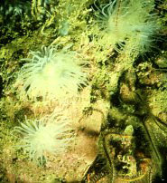
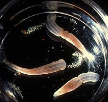

---
aliases:
  - Actiniaria
title: Actiniaria
---

## Phylogeny 

-   « Ancestral Groups  
    -  [Zoantharia](../Zoantharia.md))
    -  [Anthozoa](../../Anthozoa.md))
    -  [Cnidaria](../../../Cnidaria.md))
    -  [Animals](../../../../Animals.md))
    -  [Eukarya](../../../../../Eukarya.md))
    -   [Tree of Life](../../../../../Tree_of_Life.md)

-   ◊ Sibling Groups of  Zoantharia
    -   Actiniaria
    -  [Scleractinia](Scleractinia.md))

-   » Sub-Groups
    -  [Protantheae](Actiniaria/Protantheae.md))
    -  [Endocoelantheae](Actiniaria/Endocoelantheae.md))
    -  [Nynantheae](Actiniaria/Nynantheae.md))

# Actiniaria

## Sea Anemones 

)

-   [Protantheae](Actiniaria/Protantheae.md "go to ToL page"))*
-   [Endocoelantheae](Actiniaria/Endocoelantheae.md "go to ToL page"))*
-   [Nynantheae](Actiniaria/Nynantheae.md "go to ToL page"))*

Containing group:[Zoantharia](../Zoantharia.md))

### Characteristics

Anthozoa (Dodecacorallia), the proximal end of which is either rounded,
physa-like or forms a more or less well-developed, flat pedal disc,
without or with basilar muscles. Column smooth or provided with
verrucae, tenaculi, vesicles, marginal spherules or pseudospherules or
other specialisations \[sic\] of variable structure, often divisible
into different regions, sometimes with spirocysts and with nematocyst
batteries, rarely with ectodermal muscles. Margin indistinct or
distinct, sometimes separated from the tentacles by a more or less
developed fosse. Tentacles retractile or not, usually arranged
hexamerously in alternating cycles but sometimes in radial series at
least in the case of those communicating with the endocoels, usually
simple, more rarely knobbed at the apex or branched or provided with
papillae, exceptionally absent. Sphincter absent or present, endodermal
to mesogloeal. Oral disc usually circular, but, sometimes drawn out into
lobes of varying appearance. Actinopharynx shorter or longer usually
with siphonoglyphs, typically two in number but varying from one to
several. Siphonoglyphs usually connected with directive mesenteries, but
very exceptionally the single siphonoglyph is more or less wholly
separated from the actinopharynx. Pairs of mesenteries usually arranged
in cycles, usually 6 + 6 + 12 etc. , a variable number of pairs perfect.
From the stage with 6 pairs or later the subsequent mesenteries grow
either (a) from the pedal disc upwards, or (b) from the oral disc
downward, or (c) from the limbus and margin about simultaneously.
Retractors of mesenteries of variable appearance from diffuse to
circumscribed. Parietobasilar muscles more or less strong, in elongate
individuals usually forming a well differentiated parietal muscle
together with the parietal part of the longitudinal mesenterial muscles.
Basilar muscles present or absent. Ciliated tracts of the filaments as a
rule present. Acontia present or absent. Gonads situated at the same
level as the filaments; their distribution variable, occasionally
present only on the mesenteries of the last cycle, which sometimes lack
filaments. Cnidom: spirocysts, atrichs, holotrichs, microbasic *b*- and
*p*-mastigophors, microbasic and macrobasic amastigophors (these types
never simultaneously present in any single individual).

### References

Carlgren, O. 1949. A Survey of the Ptychodactiaria, Corallimorpharia and
Actiniaria. Kungl. Svenska Vetenskapsakadamiens Handlingar, series 4,
volume 1, number 1.

## Title Illustrations

From left to right:

-   Protanthea simplex (Protantheae: Gonactiniidae).\
    Oban (Scotland) taken in Lock Melfort, Scotland.\
    Photo copyright © 2000, Robin Harvey, S.M.B.A.
-   Nematostella vectensis with egg masses (Nynantheae: Edwardsiidae).\
    Permission by Prof. C. Hand to take this picture in the Bodega
    Marine Lab, University of California is gratefully acknowledged.\
    Photo copyright © 2000, Ron Ates.
-   Diadumene cincta (Nynantheae: Diadumenidae).\
    The Netherlands.\
    Photo copyright © 2000, Ron Ates.
)

  --------
  Copyright ::   © 2000 Robin Harvey
  --------


  -------
  Copyright ::   © 2000 Ron Ates
  -------
)

  -------
  Copyright ::   © 2000 Ron Ates
  -------

## Confidential Links & Embeds: 

### #is_/same_as :: [Actiniaria](/_Standards/bio/bio~Domain/Eukarya/Animal/Cnidaria/Anthozoa/Zoantharia/Actiniaria.md) 

### #is_/same_as :: [Actiniaria.public](/_public/bio/bio~Domain/Eukarya/Animal/Cnidaria/Anthozoa/Zoantharia/Actiniaria.public.md) 

### #is_/same_as :: [Actiniaria.internal](/_internal/bio/bio~Domain/Eukarya/Animal/Cnidaria/Anthozoa/Zoantharia/Actiniaria.internal.md) 

### #is_/same_as :: [Actiniaria.protect](/_protect/bio/bio~Domain/Eukarya/Animal/Cnidaria/Anthozoa/Zoantharia/Actiniaria.protect.md) 

### #is_/same_as :: [Actiniaria.private](/_private/bio/bio~Domain/Eukarya/Animal/Cnidaria/Anthozoa/Zoantharia/Actiniaria.private.md) 

### #is_/same_as :: [Actiniaria.personal](/_personal/bio/bio~Domain/Eukarya/Animal/Cnidaria/Anthozoa/Zoantharia/Actiniaria.personal.md) 

### #is_/same_as :: [Actiniaria.secret](/_secret/bio/bio~Domain/Eukarya/Animal/Cnidaria/Anthozoa/Zoantharia/Actiniaria.secret.md)

