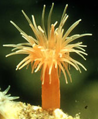

## Phylogeny 

-   « Ancestral Groups  
    -  [Actiniaria](../Actiniaria.md))
    -  [Zoantharia](../../Zoantharia.md))
    -  [Anthozoa](../../../Anthozoa.md))
    -  [Cnidaria](../../../../Cnidaria.md))
    -  [Animals](../../../../../Animals.md))
    -  [Eukarya](../../../../../../Eukarya.md))
    -   [Tree of Life](../../../../../../Tree_of_Life.md)

-   ◊ Sibling Groups of  Actiniaria
    -  [Protantheae](Protantheae.md))
    -  [Endocoelantheae](Endocoelantheae.md))
    -   Nynantheae

-   » Sub-Groups
    -  [Athenaria](Nynantheae/Athenaria.md))
    -  [Boloceroidaria](Nynantheae/Boloceroidaria.md))
    -  [Thenaria](Nynantheae/Thenaria.md))

# Nynantheae 
)))

-   [Athenaria](Nynantheae/Athenaria.md "go to ToL page"))*
-   [Boloceroidaria](Nynantheae/Boloceroidaria.md "go to ToL page"))*
-   [Thenaria](Nynantheae/Thenaria.md "go to ToL page"))*

Containing group:[Actiniaria](../Actiniaria.md))

### Characteristics

Actiniaria with a rounded or flat base with or without basilar muscles.
Column smooth or with outgrowths of one sort or another, rarely (and
then especially in the uppermost part) provided with ectodermal muscles.
Sphincter absent or present, endodermal or mesogloeal. Tentacles simple
or complex, commonly arranged in cycles, sometimes in radial rows.
Siphonoglyphs usually attached to directives, rarely to non-directives,
when directives are absent. Mesenteries as a rule arranged in cycles,
commonly hexamerously. Secondary mesenteries always develop in exocoels.
The pairs of non-directives consist of two mesenteries whose retractors
face one another, rarely unpaired mesenteries occur. Mesenterial
filaments always with ciliated tracts. Holotrichous nematocysts only
exceptionally present, and never in the endoderm.

### References

Carlgren, O. 1949. A Survey of the Ptychodactiaria, Corallimorpharia and
Actiniaria. Kungl. Svenska Vetenskapsakadamiens Handlingar, series 4,
volume 1, number 1.

## Title Illustrations

From left to right:

-   Diadumene cincta (Thenaria: Diadumenidae).\
    The Netherlands.
-   Peachia hastata (Athenaria: Haloclavidae).\
    France. Collection and donation of this specimen by Dr. R. Dekker
    (NIOZ, Texel, Netherlands) is gratefully acknowledged.
-   Bunodeopsis strumosa (Boloceroidaria: Boloceroididae).\
    Greece.

Photographs copyright © 2000, Ron Ates.


  -------
  Copyright ::   © 2000 Ron Ates
  -------
)

  -------
  Copyright ::   © 2000 Ron Ates
  -------
)

  -------
  Copyright ::   © 2000 Ron Ates
  -------

## Confidential Links & Embeds: 

### #is_/same_as ::[Nynantheae](Nynantheae.md)) 

### #is_/same_as :: [Nynantheae.public](/_public/bio/bio~Domain/Eukarya/Animal/Cnidaria/Anthozoa/Zoantharia/Actiniaria/Nynantheae.public.md) 

### #is_/same_as :: [Nynantheae.internal](/_internal/bio/bio~Domain/Eukarya/Animal/Cnidaria/Anthozoa/Zoantharia/Actiniaria/Nynantheae.internal.md) 

### #is_/same_as :: [Nynantheae.protect](/_protect/bio/bio~Domain/Eukarya/Animal/Cnidaria/Anthozoa/Zoantharia/Actiniaria/Nynantheae.protect.md) 

### #is_/same_as :: [Nynantheae.private](/_private/bio/bio~Domain/Eukarya/Animal/Cnidaria/Anthozoa/Zoantharia/Actiniaria/Nynantheae.private.md) 

### #is_/same_as :: [Nynantheae.personal](/_personal/bio/bio~Domain/Eukarya/Animal/Cnidaria/Anthozoa/Zoantharia/Actiniaria/Nynantheae.personal.md) 

### #is_/same_as :: [Nynantheae.secret](/_secret/bio/bio~Domain/Eukarya/Animal/Cnidaria/Anthozoa/Zoantharia/Actiniaria/Nynantheae.secret.md)

