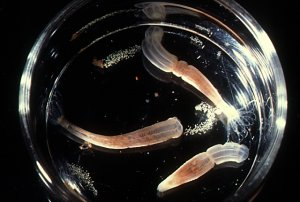

## Phylogeny 

-   « Ancestral Groups  
    -  [Athenaria](../Athenaria.md))
    -  [Nynantheae](../../Nynantheae.md))
    -  [Actiniaria](../../../Actiniaria.md))
    -  [Zoantharia](../../../../Zoantharia.md))
    -  [Anthozoa](../../../../../Anthozoa.md))
    -  [Cnidaria](../../../../../../Cnidaria.md))
    -  [Animals](../../../../../../../Animals.md))
    -  [Eukarya](../../../../../../../../Eukarya.md))
    -   [Tree of Life](../../../../../../../../Tree_of_Life.md)

-   ◊ Sibling Groups of  Athenaria
    -   Edwardsiidae
    -   [Halcampoididae](Halcampoididae)
    -  [Haloclavidae](Haloclavidae.md))
    -   [Andresiidae](Andresiidae)
    -   [Halcampidae](Halcampidae)
    -   [Limnactiniidae](Limnactiniidae)
    -   [Haliactiidae](Haliactiidae)
    -   [Octineonidae](Octineonidae)
    -  [Andwakiidae](Andwakiidae.md))

-   » Sub-Groups
    -   [Edwardsia](Edwardsia)
    -   [Isoedwardsia](Isoedwardsia)
    -   [Halcampogeton](Halcampogeton)
    -   [Paraedwardsia](Paraedwardsia)
    -   [Synhalcampella](Synhalcampella)
    -   [Fagesia](Fagesia)
    -   [Nematostella](Nematostella)
    -   [Drillactis](Drillactis)
    -   [Metedwardsia](Metedwardsia)

# Edwardsiidae 
)

-   *[Edwardsia](Edwardsia)*
-   *[Isoedwardsia](Isoedwardsia)*
-   *[Halcampogeton](Halcampogeton)*
-   *[Paraedwardsia](Paraedwardsia)*
-   *[Synhalcampella](Synhalcampella)*
-   *[Fagesia](Fagesia)*
-   *[Nematostella](Nematostella)*
-   *[Drillactis](Drillactis)*
-   *[Metedwardsia](Metedwardsia)*

Containing group:[Athenaria](../Athenaria.md))

## Introduction

Carlgren (1949) referred Halcampogeton and Synhalcampella, which
previously had been placed in the Halcampoididae to the Edwardsiidae
because they have only 8 perfect mesenteries.

### Characteristics

Athenaria with elongate, vermiform body usually divisible at least into
two regions, a long scapus provided with a cuticle and a short upper
scapulus. Often there is also a rounded, naked physa at the aboral end
and a very short, thin capitulum immediately below the tentacles. No
sphincter or acontia. Mesenteries divisible into 8 macro- and at least 4
microcnemes. Of the macrocnemes there are two pairs of directives and
four lateral mesenteries, two on each side, whose retractors face the
ventral directives. Retractors diffuse to strongly restricted. Parietal
muscles always distinct.

### References

Carlgren, O. 1949. A Survey of the Ptychodactiaria, Corallimorpharia and
Actiniaria. Kungl. Svenska Vetenskapsakadamiens Handlingar, series 4,
volume 1, number 1.

## Title Illustrations

Nematostella vectensis with egg masses.\
Photo copyright © 2000, Ron Ates.\
Permission by Prof. C. Hand to take this picture in the Bodega Marine
Lab, University of California is gratefully acknowledged.
)

  -------
  Copyright ::   © 2000 Ron Ates
  -------

## Confidential Links & Embeds: 

### #is_/same_as :: [Edwardsiidae](/_Standards/bio/bio~Domain/Eukarya/Animal/Cnidaria/Anthozoa/Zoantharia/Actiniaria/Nynantheae/Athenaria/Edwardsiidae.md) 

### #is_/same_as :: [Edwardsiidae.public](/_public/bio/bio~Domain/Eukarya/Animal/Cnidaria/Anthozoa/Zoantharia/Actiniaria/Nynantheae/Athenaria/Edwardsiidae.public.md) 

### #is_/same_as :: [Edwardsiidae.internal](/_internal/bio/bio~Domain/Eukarya/Animal/Cnidaria/Anthozoa/Zoantharia/Actiniaria/Nynantheae/Athenaria/Edwardsiidae.internal.md) 

### #is_/same_as :: [Edwardsiidae.protect](/_protect/bio/bio~Domain/Eukarya/Animal/Cnidaria/Anthozoa/Zoantharia/Actiniaria/Nynantheae/Athenaria/Edwardsiidae.protect.md) 

### #is_/same_as :: [Edwardsiidae.private](/_private/bio/bio~Domain/Eukarya/Animal/Cnidaria/Anthozoa/Zoantharia/Actiniaria/Nynantheae/Athenaria/Edwardsiidae.private.md) 

### #is_/same_as :: [Edwardsiidae.personal](/_personal/bio/bio~Domain/Eukarya/Animal/Cnidaria/Anthozoa/Zoantharia/Actiniaria/Nynantheae/Athenaria/Edwardsiidae.personal.md) 

### #is_/same_as :: [Edwardsiidae.secret](/_secret/bio/bio~Domain/Eukarya/Animal/Cnidaria/Anthozoa/Zoantharia/Actiniaria/Nynantheae/Athenaria/Edwardsiidae.secret.md)

