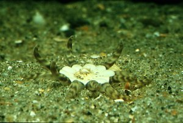

---
aliases:
  - Haloclavidae
title: Haloclavidae
---

## Phylogeny 

-   « Ancestral Groups  
    -  [Athenaria](../Athenaria.md) 
    -  [Nynantheae](../../Nynantheae.md) 
    -  [Actiniaria](../../../Actiniaria.md) 
    -  [Zoantharia](../../../../Zoantharia.md) 
    -  [Anthozoa](../../../../../Anthozoa.md) 
    -  [Cnidaria](../../../../../../Cnidaria.md) 
    -  [Animals](../../../../../../../Animals.md) 
    -  [Eukarya](../../../../../../../../Eukarya.md) 
    -   [Tree of Life](../../../../../../../../Tree_of_Life.md)

-   ◊ Sibling Groups of  Athenaria
    -  [Edwardsiidae](Edwardsiidae.md) 
    -   [Halcampoididae](Halcampoididae)
    -   Haloclavidae
    -   [Andresiidae](Andresiidae)
    -   [Halcampidae](Halcampidae)
    -   [Limnactiniidae](Limnactiniidae)
    -   [Haliactiidae](Haliactiidae)
    -   [Octineonidae](Octineonidae)
    -  [Andwakiidae](Andwakiidae.md) 

-   » Sub-Groups
    -   [Haloclava](Haloclava)
    -   [Anemonactis](Anemonactis)
    -   [Metapeachia](Metapeachia)
    -   [Mesacmaea](Mesacmaea)
    -   [Harenactis](Harenactis)
    -   [Peachia](Peachia)
    -   [Oractis](Oractis)

# Haloclavidae 

-   *[Haloclava](Haloclava)*
-   *[Anemonactis](Anemonactis)*
-   *[Metapeachia](Metapeachia)*
-   *[Mesacmaea](Mesacmaea)*
-   *[Harenactis](Harenactis)*
-   *[Peachia](Peachia)*
-   *[Oractis](Oractis)*

Containing group:[Athenaria](../Athenaria.md) 

### Characteristics

Body elongate, aboral end physa-like or forming a physa sometimes
broadly adherent in Mesacmaea. Column either smooth or with hollow or
solid papillae or suckers rarely with cinclides, rarely divisible into
physa, scapus and scapulus. No sphincter or rarely a weak or moderately
developed diffuse one (in Mesacmaea and Oractis). Tentacles short,
sometimes capitate, usually simple, never numerous, the inner shorter or
of same length as the outer ones. A single, ventral, usually very strong
siphonoglyph, which is occasionally more or less completely separated
from the other part of the actinopharynx, and sometimes drawn out at its
oral end into a more or less folded conchula. Perfect pairs of
mesenteries varying in number, usually they are all macrocnemes, in
Oractis only 8 mesenteries are perfect. Retractors usually strong.

### References

Carlgren, O. 1949. A Survey of the Ptychodactiaria, Corallimorpharia and
Actiniaria. Kungl. Svenska Vetenskapsakadamiens Handlingar, series 4,
volume 1, number 1.

## Title Illustrations

Peachia hastata.\
Photo copyright © 2000, Ron Ates.\
France. Collection and donation of this specimen by Dr. R. Dekker (NIOZ,
Texel, Netherlands) is gratefully acknowledged.
 

  -------
  copyright ::   © 2000 Ron Ates
  -------

## Confidential Links & Embeds: 

### #is_/same_as :: [[/_Standards/bio/bio~Domain/Eukarya/Animal/Cnidaria/Anthozoa/Zoantharia/Actiniaria/Nynantheae/Athenaria/Haloclavidae|Haloclavidae]] 

### #is_/same_as :: [[/_public/bio/bio~Domain/Eukarya/Animal/Cnidaria/Anthozoa/Zoantharia/Actiniaria/Nynantheae/Athenaria/Haloclavidae.public|Haloclavidae.public]] 

### #is_/same_as :: [[/_internal/bio/bio~Domain/Eukarya/Animal/Cnidaria/Anthozoa/Zoantharia/Actiniaria/Nynantheae/Athenaria/Haloclavidae.internal|Haloclavidae.internal]] 

### #is_/same_as :: [[/_protect/bio/bio~Domain/Eukarya/Animal/Cnidaria/Anthozoa/Zoantharia/Actiniaria/Nynantheae/Athenaria/Haloclavidae.protect|Haloclavidae.protect]] 

### #is_/same_as :: [[/_private/bio/bio~Domain/Eukarya/Animal/Cnidaria/Anthozoa/Zoantharia/Actiniaria/Nynantheae/Athenaria/Haloclavidae.private|Haloclavidae.private]] 

### #is_/same_as :: [[/_personal/bio/bio~Domain/Eukarya/Animal/Cnidaria/Anthozoa/Zoantharia/Actiniaria/Nynantheae/Athenaria/Haloclavidae.personal|Haloclavidae.personal]] 

### #is_/same_as :: [[/_secret/bio/bio~Domain/Eukarya/Animal/Cnidaria/Anthozoa/Zoantharia/Actiniaria/Nynantheae/Athenaria/Haloclavidae.secret|Haloclavidae.secret]] 

