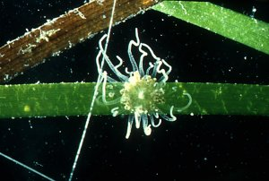

## Phylogeny 

-   « Ancestral Groups  
    -  [Nynantheae](../Nynantheae.md))
    -  [Actiniaria](../../Actiniaria.md))
    -  [Zoantharia](../../../Zoantharia.md))
    -  [Anthozoa](../../../../Anthozoa.md))
    -  [Cnidaria](../../../../../Cnidaria.md))
    -  [Animals](../../../../../../Animals.md))
    -  [Eukarya](../../../../../../../Eukarya.md))
    -   [Tree of Life](../../../../../../../Tree_of_Life.md)

-   ◊ Sibling Groups of  Nynantheae
    -  [Athenaria](Athenaria.md))
    -   Boloceroidaria
    -  [Thenaria](Thenaria.md))

-   » Sub-Groups
    -   [Boloceroididae](Boloceroididae)
    -   [Nevadneidae](Nevadneidae)

# Boloceroidaria 
)

-   *[Boloceroididae](Boloceroididae)*
-   *[Nevadneidae](Nevadneidae)*

Containing group:[Nynantheae](../Nynantheae.md))

### Characteristics

Nynantheae without basilar muscles. Aboral end of the body not
physa-like. Longitudinal muscles and sometimes spirocysts in the
ectoderm of the column. No distinct sphincter. Perfect pairs of
mesenteries usually few, 6 or (especially in the case of asexual
propagation) rather more. Longitudinal muscles of mesenteries weak.

### References

Carlgren, O. 1949. A Survey of the Ptychodactiaria, Corallimorpharia and
Actiniaria. Kungl. Svenska Vetenskapsakadamiens Handlingar, series 4,
volume 1, number 1.

## Title Illustrations

Bunodeopsis strumosa.\
Greece.\
Photo copyright © 2000, Ron Ates.
)

  -------
  Copyright ::   © 2000 Ron Ates
  -------

## Confidential Links & Embeds: 

### #is_/same_as :: [Boloceroidaria](/_Standards/bio/bio~Domain/Eukarya/Animal/Cnidaria/Anthozoa/Zoantharia/Actiniaria/Nynantheae/Boloceroidaria.md) 

### #is_/same_as :: [Boloceroidaria.public](/_public/bio/bio~Domain/Eukarya/Animal/Cnidaria/Anthozoa/Zoantharia/Actiniaria/Nynantheae/Boloceroidaria.public.md) 

### #is_/same_as :: [Boloceroidaria.internal](/_internal/bio/bio~Domain/Eukarya/Animal/Cnidaria/Anthozoa/Zoantharia/Actiniaria/Nynantheae/Boloceroidaria.internal.md) 

### #is_/same_as :: [Boloceroidaria.protect](/_protect/bio/bio~Domain/Eukarya/Animal/Cnidaria/Anthozoa/Zoantharia/Actiniaria/Nynantheae/Boloceroidaria.protect.md) 

### #is_/same_as :: [Boloceroidaria.private](/_private/bio/bio~Domain/Eukarya/Animal/Cnidaria/Anthozoa/Zoantharia/Actiniaria/Nynantheae/Boloceroidaria.private.md) 

### #is_/same_as :: [Boloceroidaria.personal](/_personal/bio/bio~Domain/Eukarya/Animal/Cnidaria/Anthozoa/Zoantharia/Actiniaria/Nynantheae/Boloceroidaria.personal.md) 

### #is_/same_as :: [Boloceroidaria.secret](/_secret/bio/bio~Domain/Eukarya/Animal/Cnidaria/Anthozoa/Zoantharia/Actiniaria/Nynantheae/Boloceroidaria.secret.md)

