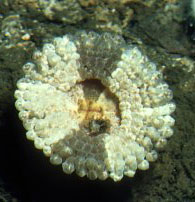
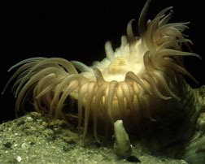

---
aliases:
  - Thenaria
title: Thenaria
---

## Phylogeny 

-   « Ancestral Groups  
    -  [Nynantheae](../Nynantheae.md) 
    -  [Actiniaria](../../Actiniaria.md) 
    -  [Zoantharia](../../../Zoantharia.md) 
    -  [Anthozoa](../../../../Anthozoa.md) 
    -  [Cnidaria](../../../../../Cnidaria.md) 
    -  [Animals](../../../../../../Animals.md) 
    -  [Eukarya](../../../../../../../Eukarya.md) 
    -   [Tree of Life](../../../../../../../Tree_of_Life.md)

-   ◊ Sibling Groups of  Nynantheae
    -  [Athenaria](Athenaria.md) 
    -  [Boloceroidaria](Boloceroidaria.md) 
    -   Thenaria

-   » Sub-Groups
    -  [Endomyaria](Thenaria/Endomyaria.md) 
    -  [Mesomyaria](Thenaria/Mesomyaria.md) 
    -  [Acontiaria](Thenaria/Acontiaria.md) 

# Thenaria 

) 

-   [Endomyaria](Thenaria/Endomyaria.md "go to ToL page"))*
-   [Mesomyaria](Thenaria/Mesomyaria.md "go to ToL page"))*
-   [Acontiaria](Thenaria/Acontiaria.md "go to ToL page"))*

Containing group:[Nynantheae](../Nynantheae.md) 

## Introduction

Carlgren (1949) writes about the classification of Thenaria:

Stephenson (1921 p. 541) did not accept the subtribe Thenaria proposed
by me, but divided the genera belonging to this group at once into two,
Endomyaria and Mesomyaria, the latter including also the genera provided
with acontia. As, however, some genera with acontia have no sphincter,
it became necessary to set the genera with acontia apart, in a group of
equal rank with the Endo- and Mesomyaria (see Stephenson 1935 pp. 28-9).
But as I have pointed out several times, it is very doubtful whether the
three groups include genera which are always genetically related to each
other. For instance the family Aliciidae has certainly nothing to do
with the other Endomyaria, but its origin may be found in the subtribe
Boloceroidaria. The Mesomyaria also is, to my mind, not a genetically
homogenous group, because the mesogloeal sphincter may sometimes have
arisen directly from undifferentiated endodermal circular muscles of the
column, sometimes from an already differentiated endodermal sphincter.
That an endodermal sphincter can in fact become transformed into a more
or less mesogloeal one can be seen in Isosisyonis \[sic\] alba (CARLGREN
1927 p. 54). I have now examined smaller specimens of this species and
find that they have an endodermal aggregate sphincter. The Acontiaria
also is probably not homogeneous. In support of this opinion the genus
Nemanthus gives an instance. At the place where the acontia occur in
this genus, organs have appeared which are partly different in structure
from acontia. If, therefore, I retain these groups, it is for practical
reasons and is only a provisional arrangement.

### Characteristics

Nyantheae \[sic\] with basilar muscles. Aboral end flattened and usually
abherent \[sic\], distinctly differentiated from the column. Bodywall of
variable appearance, sometimes divisible into different regions; often
with verrucae, marginal spherules or pseudospherules, vesicles or other
protuberances. Sphincter usually endodermal or mesogloeal, but sometimes
there is no sphincter. Tentacles and mesenteries usually numerous, the
former cyclically or radially arranged. Mesenteries rarely
differentiated into macro- and microcnemes. Retractors weak or strong,
rarely circumscribed. Acontia present or absent.

### References

Carlgren, O. 1949. A Survey of the Ptychodactiaria, Corallimorpharia and
Actiniaria. Kungl. Svenska Vetenskapsakadamiens Handlingar, series 4,
volume 1, number 1.

## Title Illustrations

From left to right:

-   Aureliana heterocera (Endomyaria: Aurelianidae).\
    Permission by Mr. P.G. Tranter to take this picture in the Marine
    Biological Station, Plymouth, England is gratefully acknowledged.
-   Hormathia digitata (Acontiaria: Hormathiidae).\
    Northern North Sea. Collection and donation of this specimen by
    Prof. N. Daan (RIVO, IJmuiden, Netherlands) is gratefully
    acknowledged.
-   Diadumene cincta (Acontiaria: Diadumenidae).\
    The Netherlands.

Photographs copyright © 2000, Ron Ates.
 

  -------
  copyright ::   © 2000 Ron Ates
  -------
 

  -------
  copyright ::   © 2000 Ron Ates
  -------


  -------
  copyright ::   © 2000 Ron Ates
  -------

## Confidential Links & Embeds: 

### #is_/same_as :: [[/_Standards/bio/bio~Domain/Eukarya/Animal/Cnidaria/Anthozoa/Zoantharia/Actiniaria/Nynantheae/Thenaria|Thenaria]] 

### #is_/same_as :: [[/_public/bio/bio~Domain/Eukarya/Animal/Cnidaria/Anthozoa/Zoantharia/Actiniaria/Nynantheae/Thenaria.public|Thenaria.public]] 

### #is_/same_as :: [[/_internal/bio/bio~Domain/Eukarya/Animal/Cnidaria/Anthozoa/Zoantharia/Actiniaria/Nynantheae/Thenaria.internal|Thenaria.internal]] 

### #is_/same_as :: [[/_protect/bio/bio~Domain/Eukarya/Animal/Cnidaria/Anthozoa/Zoantharia/Actiniaria/Nynantheae/Thenaria.protect|Thenaria.protect]] 

### #is_/same_as :: [[/_private/bio/bio~Domain/Eukarya/Animal/Cnidaria/Anthozoa/Zoantharia/Actiniaria/Nynantheae/Thenaria.private|Thenaria.private]] 

### #is_/same_as :: [[/_personal/bio/bio~Domain/Eukarya/Animal/Cnidaria/Anthozoa/Zoantharia/Actiniaria/Nynantheae/Thenaria.personal|Thenaria.personal]] 

### #is_/same_as :: [[/_secret/bio/bio~Domain/Eukarya/Animal/Cnidaria/Anthozoa/Zoantharia/Actiniaria/Nynantheae/Thenaria.secret|Thenaria.secret]] 

