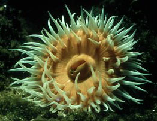
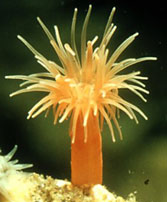

## Phylogeny 

-   « Ancestral Groups  
    -  [Thenaria](../Thenaria.md))
    -  [Nynantheae](../../Nynantheae.md))
    -  [Actiniaria](../../../Actiniaria.md))
    -  [Zoantharia](../../../../Zoantharia.md))
    -  [Anthozoa](../../../../../Anthozoa.md))
    -  [Cnidaria](../../../../../../Cnidaria.md))
    -  [Animals](../../../../../../../Animals.md))
    -  [Eukarya](../../../../../../../../Eukarya.md))
    -   [Tree of Life](../../../../../../../../Tree_of_Life.md)

-   ◊ Sibling Groups of  Thenaria
    -  [Endomyaria](Endomyaria.md))
    -  [Mesomyaria](Mesomyaria.md))
    -   Acontiaria

-   » Sub-Groups
    -   [Acontiophoridae](Acontiophoridae)
    -   [Bathyphelliidae](Bathyphelliidae)
    -   [Isophelliidae](Isophelliidae)
    -   [Hormathiidae](Hormathiidae)
    -   [Sagartiomorphidae](Sagartiomorphidae)
    -   [Sagartiidae](Sagartiidae)
    -   [Metridiidae](Metridiidae)
    -   [Aiptasiidae](Aiptasiidae)
    -   [Aiptasiomorphidae](Aiptasiomorphidae)
    -   [Diadumenidae](Diadumenidae)
    -   [Nemanthidae](Nemanthidae)

# Acontiaria 

)

-   *[Acontiophoridae](Acontiophoridae)*
-   *[Bathyphelliidae](Bathyphelliidae)*
-   *[Isophelliidae](Isophelliidae)*
-   *[Hormathiidae](Hormathiidae)*
-   *[Sagartiomorphidae](Sagartiomorphidae)*
-   *[Sagartiidae](Sagartiidae)*
-   *[Metridiidae](Metridiidae)*
-   *[Aiptasiidae](Aiptasiidae)*
-   *[Aiptasiomorphidae](Aiptasiomorphidae)*
-   *[Diadumenidae](Diadumenidae)*
-   *[Nemanthidae](Nemanthidae)*

Containing group:[Thenaria](../Thenaria.md))

### Characteristics

Thenaria with acontia or acontia-like organs. Sphincter sometimes absent
or endodermal, more commonly mesogloeal.

### References

Carlgren, O. 1949. A Survey of the Ptychodactiaria, Corallimorpharia and
Actiniaria. Kungl. Svenska Vetenskapsakadamiens Handlingar, series 4,
volume 1, number 1.

## Title Illustrations

Left:\
Sagartia elegans (Sagartiidae). Scotland.

Right:\
Diadumene cincta (Diadumenidae). The Netherlands.

Photographs copyright © 2000, Ron Ates.
)

  -------
  Copyright ::   © 2000 Ron Ates
  -------


  -------
  Copyright ::   © 2000 Ron Ates
  -------

## Confidential Links & Embeds: 

### #is_/same_as :: [Acontiaria](/_Standards/bio/bio~Domain/Eukarya/Animal/Cnidaria/Anthozoa/Zoantharia/Actiniaria/Nynantheae/Thenaria/Acontiaria.md) 

### #is_/same_as :: [Acontiaria.public](/_public/bio/bio~Domain/Eukarya/Animal/Cnidaria/Anthozoa/Zoantharia/Actiniaria/Nynantheae/Thenaria/Acontiaria.public.md) 

### #is_/same_as :: [Acontiaria.internal](/_internal/bio/bio~Domain/Eukarya/Animal/Cnidaria/Anthozoa/Zoantharia/Actiniaria/Nynantheae/Thenaria/Acontiaria.internal.md) 

### #is_/same_as :: [Acontiaria.protect](/_protect/bio/bio~Domain/Eukarya/Animal/Cnidaria/Anthozoa/Zoantharia/Actiniaria/Nynantheae/Thenaria/Acontiaria.protect.md) 

### #is_/same_as :: [Acontiaria.private](/_private/bio/bio~Domain/Eukarya/Animal/Cnidaria/Anthozoa/Zoantharia/Actiniaria/Nynantheae/Thenaria/Acontiaria.private.md) 

### #is_/same_as :: [Acontiaria.personal](/_personal/bio/bio~Domain/Eukarya/Animal/Cnidaria/Anthozoa/Zoantharia/Actiniaria/Nynantheae/Thenaria/Acontiaria.personal.md) 

### #is_/same_as :: [Acontiaria.secret](/_secret/bio/bio~Domain/Eukarya/Animal/Cnidaria/Anthozoa/Zoantharia/Actiniaria/Nynantheae/Thenaria/Acontiaria.secret.md)

