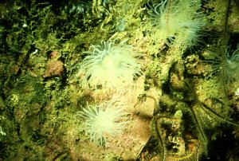

---
aliases:
  - Protanthea
title: Protanthea
---

## Phylogeny 

-   « Ancestral Groups  
    -  [Protantheae](../Protantheae.md))
    -  [Actiniaria](../../Actiniaria.md))
    -  [Zoantharia](../../../Zoantharia.md))
    -  [Anthozoa](../../../../Anthozoa.md))
    -  [Cnidaria](../../../../../Cnidaria.md))
    -  [Animals](../../../../../../Animals.md))
    -  [Eukarya](../../../../../../../Eukarya.md))
    -   [Tree of Life](../../../../../../../Tree_of_Life.md)

-   ◊ Sibling Groups of  Protantheae
    -  [Gonactinia](Gonactinia.md))
    -   Protanthea

-   » Sub-Groups 

# *Protanthea* 
)

-   *Protanthea simplex* [Carlgren 1891]

Containing group:[Protantheae](../Protantheae.md))

### Characteristics

Gonactiniidae with broad pedal disc. Column broader at the margin than
at the base. Longitudinal muscle layer and nerve-stratum of the column
well developed. No sphincter. Tentacles long, numerous, at the base a
little constricted, at the apex not swollen. Oral disc wide, conical.
Only 8 mesenteries perfect, 12 pairs of mesenteries fertile and with
filaments. Weak sterile mesenteries without filaments in the upper part
of the body. Retractors weak, diffuse, parietobasilar muscles weak.
Cnidom: see the family.

### References

Carlgren, O. 1949. A Survey of the Ptychodactiaria, Corallimorpharia and
Actiniaria. Kungl. Svenska Vetenskapsakadamiens Handlingar, series 4,
volume 1, number 1.

## Title Illustrations

Protanthea simplex.\
Oban (Scotland) taken in Lock Melfort, Scotland.\
Copyright © 2000, Robin Harvey, S.M.B.A.


  ------------
  Copyright ::   © 2000 Robin Harvey, S.M.B.A.
  ------------

## Confidential Links & Embeds: 

### #is_/same_as :: [Protanthea](/_Standards/bio/bio~Domain/Eukarya/Animal/Cnidaria/Anthozoa/Zoantharia/Actiniaria/Protantheae/Protanthea.md) 

### #is_/same_as :: [Protanthea.public](/_public/bio/bio~Domain/Eukarya/Animal/Cnidaria/Anthozoa/Zoantharia/Actiniaria/Protantheae/Protanthea.public.md) 

### #is_/same_as :: [Protanthea.internal](/_internal/bio/bio~Domain/Eukarya/Animal/Cnidaria/Anthozoa/Zoantharia/Actiniaria/Protantheae/Protanthea.internal.md) 

### #is_/same_as :: [Protanthea.protect](/_protect/bio/bio~Domain/Eukarya/Animal/Cnidaria/Anthozoa/Zoantharia/Actiniaria/Protantheae/Protanthea.protect.md) 

### #is_/same_as :: [Protanthea.private](/_private/bio/bio~Domain/Eukarya/Animal/Cnidaria/Anthozoa/Zoantharia/Actiniaria/Protantheae/Protanthea.private.md) 

### #is_/same_as :: [Protanthea.personal](/_personal/bio/bio~Domain/Eukarya/Animal/Cnidaria/Anthozoa/Zoantharia/Actiniaria/Protantheae/Protanthea.personal.md) 

### #is_/same_as :: [Protanthea.secret](/_secret/bio/bio~Domain/Eukarya/Animal/Cnidaria/Anthozoa/Zoantharia/Actiniaria/Protantheae/Protanthea.secret.md)

