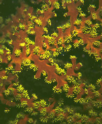
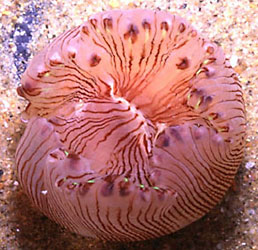
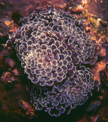

## Phylogeny 

-   « Ancestral Groups  
    -  [Zoantharia](../Zoantharia.md))
    -  [Anthozoa](../../Anthozoa.md))
    -  [Cnidaria](../../../Cnidaria.md))
    -  [Animals](../../../../Animals.md))
    -  [Eukarya](../../../../../Eukarya.md))
    -   [Tree of Life](../../../../../Tree_of_Life.md)

-   ◊ Sibling Groups of  Zoantharia
    -  [Actiniaria](Actiniaria.md))
    -   Scleractinia

-   » Sub-Groups
    -  [Fungiina](Scleractinia/Fungiina.md))
    -  [Faviina](Scleractinia/Faviina.md))
    -  [Caryophylliina](Scleractinia/Caryophylliina.md))
    -   [Dendrophylliidae](Dendrophylliidae)

# Scleractinia

## Stony star corals 

[Sandra L. Romano and Stephen D. Cairns]()

†
-   *Pachythecalina* †
-   *Archaeocoeniina*
-   *Archaeofungiina* †
-   *Stylina* †
-   [Fungiina](Scleractinia/Fungiina.md "go to ToL page"))*
-   *Astraeoina*
-   [Faviina](Scleractinia/Faviina.md "go to ToL page"))*
-   [Caryophylliina](Scleractinia/Caryophylliina.md "go to ToL page"))*
-   *Distichophylliina* †
-   *Meandriina*
-   *Poritiina*
-   *[Dendrophylliina](Dendrophylliidae)*

Classification after Veron (1995: 110).

Containing group:[Zoantharia](../Zoantharia.md))

### Information on the Internet

-   [Neogene Marine Biota of Tropical     America](http://porites.geology.uiowa.edu/index.htm)
-   [NOAA Coral Health and Monitoring     Program](http://wwww.coral.noaa.gov/)

## Introduction

The Scleractinia (scler = hard, actinia = ray), or stony star corals,
are polyp animals that are found exclusively in marine habitats. They
are very similar to sea anemones but they secrete a hard skeleton. Stony
star corals are divided ecologically into two groups. One group, the
reef-builders, are the best known scleractinian corals. They are found
mostly in the clear, shallow waters of the tropics. The second group
does not build reefs and is found in all regions of the oceans,
including temperate and polar regions from relatively shallow waters
down to 6000 m. An example of a non-reef-building-coral is *Tubastraea
coccinea*.

The most recent taxonomic revision of the Scleractinia (Veron, 1995,
2000) divides the order into 13 suborders of which 7 have living
representatives. Nine of these suborders were present in the
Mid-Triassic (240 million years ago) when the Scleractinia first appear
in the fossil record. Three more suborders originated in the Jurassic
(200 million years ago) and one suborder originated in the
Mid-Cretaceous (100 million years ago). These suborders are
differentiated from one another primarily by characteristics of the
septa \-- the radial partitions of the skeleton that serve to separate
and support the mesenteries of the polyp.

This page is currently under construction and will be greatly amplified
in the near future.

### References

Veron, J. E. N. 1995. Corals in Space and Time: The Biogeography and
Evolution of the Scleractinia. University of New South Wales Press,
Sydney, 321 pp.

Veron, J. E. N. 2000. Corals of the World. Australian Institute of
Marine Science, Townsville. 3 vol.

Williams, G. C. 1986. What are Corals? Sagittarius, 1(2): 11-15.

## Title Illustrations

-   *Tubastraea micrantha*: A living colony having branches about 2 cm
    in diameter, collected from shallow water off Pelau. Although
    azooxanthellate, this species often attains a colony size of up to a
    meter and thus contributes to reef structure. (Photograph copyright
    © D. Faulkner).
-   *Letepsammia formosissima*: A highly inflated living specimen from
    off South Africa (about 100 m). Diameter of polyp about 50 mm.
    (Photograph from Wiliams, 1986, copyright © 1986 Gary C. Williams,
    California Academy of Sciences).
-   *Euphyllia ancora* A living colony covered with expanded tentacles,
    collected from shallow water off Pelau. This species belongs to a
    group that consists exclusively of shallow water, zooxanthellate,
    reef corals. (Photograph copyright © D. Faulkner)
)

  ------
  Copyright ::   © D. Faulkner
  ------
)

  --------------------
  Copyright ::   © 1986 Gary C. Williams, California Academy of Sciences
  --------------------
)

  ------
  Copyright ::   © D. Faulkner
  ------

## Confidential Links & Embeds: 

### #is_/same_as :: [Scleractinia](/_Standards/bio/bio~Domain/Eukarya/Animal/Cnidaria/Anthozoa/Zoantharia/Scleractinia.md) 

### #is_/same_as :: [Scleractinia.public](/_public/bio/bio~Domain/Eukarya/Animal/Cnidaria/Anthozoa/Zoantharia/Scleractinia.public.md) 

### #is_/same_as :: [Scleractinia.internal](/_internal/bio/bio~Domain/Eukarya/Animal/Cnidaria/Anthozoa/Zoantharia/Scleractinia.internal.md) 

### #is_/same_as :: [Scleractinia.protect](/_protect/bio/bio~Domain/Eukarya/Animal/Cnidaria/Anthozoa/Zoantharia/Scleractinia.protect.md) 

### #is_/same_as :: [Scleractinia.private](/_private/bio/bio~Domain/Eukarya/Animal/Cnidaria/Anthozoa/Zoantharia/Scleractinia.private.md) 

### #is_/same_as :: [Scleractinia.personal](/_personal/bio/bio~Domain/Eukarya/Animal/Cnidaria/Anthozoa/Zoantharia/Scleractinia.personal.md) 

### #is_/same_as :: [Scleractinia.secret](/_secret/bio/bio~Domain/Eukarya/Animal/Cnidaria/Anthozoa/Zoantharia/Scleractinia.secret.md)

