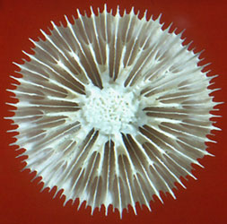
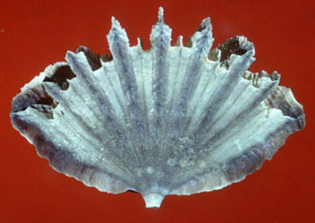

---
aliases:
  - Caryophylliina
title: Caryophylliina
---

## Phylogeny 

-   « Ancestral Groups  
    -  [Scleractinia](../Scleractinia.md) 
    -  [Zoantharia](../../Zoantharia.md) 
    -  [Anthozoa](../../../Anthozoa.md) 
    -  [Cnidaria](../../../../Cnidaria.md) 
    -  [Animals](../../../../../Animals.md) 
    -  [Eukarya](../../../../../../Eukarya.md) 
    -   [Tree of Life](../../../../../../Tree_of_Life.md)

-   ◊ Sibling Groups of  Scleractinia
    -  [Fungiina](Fungiina.md) 
    -  [Faviina](Faviina.md) 
    -   Caryophylliina
    -   [Dendrophylliidae](Dendrophylliidae)

-   » Sub-Groups
    -  [Caryophyllioidea](Caryophylliina/Caryophyllioidea.md) 
    -  [Flabelloidea](Caryophylliina/Flabelloidea.md) 

# Caryophylliina 

[Stephen D. Cairns]()
)
† ) occurs only in the fossil record, whereas the other two
superfamilies contain both fossil and Recent taxa.

Containing group:[Scleractinia](../Scleractinia.md) 

## Introduction

The caryophylliines are known from the early Jurassic (180 million years
ago) to the Recent, and occur in most marine environments to a depth of
3200 m. They are an extremely diverse group, consisting of 91 living
genera and 457 living species (Cairns et al., 1999). Although some
species form large colonies that may contribute to both shallow-water
and deep-water reef/bank structure, most members of this suborder are
small (less than 30 mm) and inconspicuous, occurring in cryptic
shallow-water environments or in cold (as low as -1°C), dark, deep
waters. Although several other scleractinian families occur in deep
water (e.g., Dendrophylliidae, Micrabaciidae, Fungiacyathidae), the
caryophylliines have been the most successful in exploiting the deep-sea
realm. Because many occur below the euphotic zone or cryptically in
shallow water, most species are azooxanthellate (do not contain
symbiotic unicellular dinoflagellates) and therefore rarely attain a
large size.

### Characteristics

Suborders within the Scleractinia are distinguished by the structure of
their septa. The septa of the caryophylliines are lamellar, composed of
one fan system of simple, very small trabeculae (minitrabeculate),
resulting in a smooth or nearly smooth inner margin (Vaughan and Wells,
1943; Wells, 1956).

The superfamilies within this suborder are characterized by the
structure of their walls (theca). The most primitive of the three
superfamilies, the Volzeioidea, have an exclusively epithecate wall (see
Stolarski, 1995, 1996); that of the Flabelloidea is marginothecate; and
that of the Caryophyllioidea is septo- or parathecate. In the latter two
cases a nontrabecular deposit of epitheca or textura may be added to the
exterior of the corallum (Stolarski, 1995).

### Discussion of Phylogenetic Relationships

No phylogenetic analysis has been performed on the suprageneric taxa of
the Caryophylliina; however, Stolarski (1995, 1996), Romano and Palumbi
(1996), and Romano and Cairns (2000) are currently investigating and
reassessing the higher level relationships in the suborder by using
characteristics of the corallum microstructure and DNA sequencing,
respectively (see Scleractinia branch page). Roniewicz and Morycowa
(1993) and Veron (1995: 110) should also be consulted for more recent,
non-cladistic evolutionary trees of all scleractinian families.

### Classification

The higher classification of the suborder Caryophylliina is in a state
of flux as more information is being discovered through microstructural
and molecular analyses. Stolarski (1996, 2000) has best summarized the
conflicting morphological characters, which resulted in two fairly
different classification hypotheses for the superfamilies and families
of the caryophylliines, which are both different from the classification
presented here. In general, we agree with he work of Stolarski (2000),
and, in general, adopt his \"Hypothesis A\", but with some modifications
that reflect a more traditional view. Thus, we continue to recognize the
superfamily Flabelloidea and place the Guyniidae in that superfamily,
but we do accept his new family Stenocyathidae, which he places in the
superfamily Caryophyllioidea, and his new family Schizocyathidae, which
he places in the superfamily Volzeioidea.

### References

Cairns S. D., B. W. Hoeksema, and J. van der Land. 1999. Appendix: List
of Extant Stony Corals. Attol Research Bulletin, 459:13-46.

Romano, S. L. and S. R. Palumbi. 1996. Evolution of scleractinian corals
inferred from molecular systematics. Science, 271: 640-642.

Romano, S. L. and S. D. Cairns. in press. Molecular Phylogenetic
Hypotheses from the Evolution of Scleractinian Corals. Bulletin of
Marine Science.

Roniewicz, E. and E. Morycowa. 1993. Evolution of the Scleractinia in
the light of microstructural data. Courier Forschungsinstitut
Senkenberg, 164: 233-240.

Stolarski, J. 1995. Ontogenetic development of the thecal structures in
caryophylliine scleractinian corals. Acta Palaeontologica Polonica, 40:
19-44.

Stolarski, J. 1996. Gardineria \-- a scleractinian living fossil. Acta
Palaeontologica Polonica, 41: 339-367.

Stolarski, J. 2000. Origin and phylogeny of Guyniidae (Scleractinia) in
the light of microstructural data. Lethaia, 33: 13-38.

Vaughan, T. W., and J. W. Wells. 1943. Revision of the suborders,
families, and genera of the Scleractinia. Geological Society of America,
Special Papers, 44: 363 pp.

Veron, J. E. N. 1995. Corals in Space and Time. 321 pp. UNSW Press,
Sydney.

Wells, J. W. 1956. Scleractinia. Pp. F328-F444 In: Moore, R. C (editor)
Treatise on Invertebrate Paleontology, Part F: Coelenterata. University
of Kansas Press, Lawrence.

## Title Illustrations

Left to right:

-   *Deltocyathus rotulus* Calicular view of a skeleton collected from
    off Sabah, Borneo (depth 871 m). This species represents the
    superfamily Caryophyllioidea. Diameter of calice 30 mm. Copyright
    © S. D. Cairns 2002.
-   *Flabellum deludens*: Side view of a skeleton collected from the
    Philippines (depth 289 m). This species represents the superfamily
    Flabelloidea. Width of corallum 45 mm. Copyright © S. D. Cairns
    2002.
)
)
::::::::::::::::::::::

## Confidential Links & Embeds: 

### #is_/same_as :: [Caryophylliina](/_Standards/bio/bio~Domain/Eukarya/Animal/Cnidaria/Anthozoa/Zoantharia/Scleractinia/Caryophylliina.md) 

### #is_/same_as :: [Caryophylliina.public](/_public/bio/bio~Domain/Eukarya/Animal/Cnidaria/Anthozoa/Zoantharia/Scleractinia/Caryophylliina.public.md) 

### #is_/same_as :: [Caryophylliina.internal](/_internal/bio/bio~Domain/Eukarya/Animal/Cnidaria/Anthozoa/Zoantharia/Scleractinia/Caryophylliina.internal.md) 

### #is_/same_as :: [Caryophylliina.protect](/_protect/bio/bio~Domain/Eukarya/Animal/Cnidaria/Anthozoa/Zoantharia/Scleractinia/Caryophylliina.protect.md) 

### #is_/same_as :: [Caryophylliina.private](/_private/bio/bio~Domain/Eukarya/Animal/Cnidaria/Anthozoa/Zoantharia/Scleractinia/Caryophylliina.private.md) 

### #is_/same_as :: [Caryophylliina.personal](/_personal/bio/bio~Domain/Eukarya/Animal/Cnidaria/Anthozoa/Zoantharia/Scleractinia/Caryophylliina.personal.md) 

### #is_/same_as :: [Caryophylliina.secret](/_secret/bio/bio~Domain/Eukarya/Animal/Cnidaria/Anthozoa/Zoantharia/Scleractinia/Caryophylliina.secret.md)

