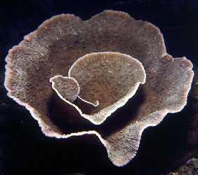
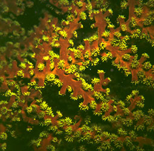
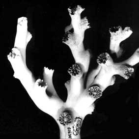
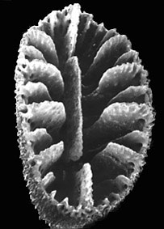
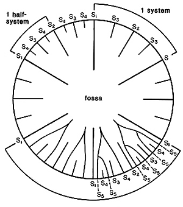
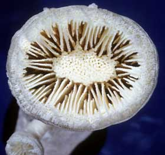

---
title: Dendrophylliidae
---

## Phylogeny 

-   « Ancestral Groups  
    -  [Scleractinia](../Scleractinia.md))
    -  [Zoantharia](../../Zoantharia.md))
    -  [Anthozoa](../../../Anthozoa.md))
    -  [Cnidaria](../../../../Cnidaria.md))
    -  [Animals](../../../../../Animals.md))
    -  [Eukarya](../../../../../../Eukarya.md))
    -   [Tree of Life](../../../../../../Tree_of_Life.md)

-   ◊ Sibling Groups of  Scleractinia
    -  [Fungiina](Fungiina.md))
    -  [Faviina](Faviina.md))
    -  [Caryophylliina](Caryophylliina.md))
    -   Dendrophylliidae

-   » Sub-Groups 

## Dendrophylliina 

# Dendrophylliidae [Gray 1847] 

[Stephen D. Cairns]()

Classification after Cairns (2001). Those genera marked with a cross
(† ) are known only from the
fossil record, whereas the unmarked genera contain living and, in some
cases, fossil species as well.

Containing group:[Scleractinia](../Scleractinia.md))

## Introduction

Dendrophylliids are known from the Early Cretaceous (about 120 million
years ago) to the Recent, and are widespread in today\'s oceans from the
North Sea to the Subantarctic, ranging in depths from 0 to 2165 meters.
Because most dendrophylliid genera and species do not rely on
unicellular, photosyntethic zooxanthellae symbionts, they can live in
deep-water environments or cryptic (caves or under ledges) shallow-water
habitats that do not receive light. Only a few genera (*Turbinaria* and
*Duncanopsammia*, and some species of *Heteropsammia*) contain
zooxanthellae in their polyps and consequently manufacture large
skeletons that contribute to shallow water reef structure. The remaining
genera and species (approximately 149 of the 166 Recent species, 90%)
are azooxanthellate. There are an additional 198 exclusively fossil
species (Cairns, 2001). The azooxanthellate dendrophylliids range in
size from small solitary, interstitial coralla only 5 mm in maximum
diameter (e.g., *Notophyllia*) to large colonies up to a meter in
diameter (e.g., *Enallopsammia*) that, together with similar colonies,
contribute to the framework of deep-water coral banks found at depths of
600-800 m in the Straits of Florida (Cairns and Stanley, 1982).

------------------------
)
)

**Left (top):** *Dendrophyllia oldroydae*: Holotypic colony, collected
from off California (depth 366 m). This species is an example of a
colonial, azooxanthellate dendrophylliid. Colony 83 mm in height (from
Cairns, 1994). **Right (bottom):** *Notophyllia recta*: Calicular view
(SEM) of a skeleton collected off Victoria, Australia (depth 110 m),
exemplifying a solitary, unattached dendrophylliid. Greater calicular
diameter 5 mm. Photograph from Cairns and Parker, 1992. Copyright © 1992
South Australian Museum.

------------------------

As stated above, dendrophylliids occur as solitary polyps or as colonies
of interconnected polyps. Most colonial dendrophylliids are firmly
attached to a substrate, probably in order to stabilize their larger
mass, but solitary coralla may be attached or free, some on or in a
sandy substrate. Two genera (*Heteropsammia* and *Wadeopsammia*) have an
obligatory symbiosis with a sipunculid worm (Yonge, 1975), which burrows
into the base of the solitary corallum and moves the coral from place to
place. Some genera (i.e., *Endopachys, Eguchipsammia, Balanophyllia*)
are known to asexually bud smaller coralla from their edges, the parent
corallum continuing to increase in size, and one genus (*Notophyllia*)
asexually propagates by transverse division. Six genera are hosts for
the galls of ascothoracidan Crustacea (Grygier and Zibrowius, 1985), and
two genera are hosts for burrows of acrothoracican cirripeds (Grygier
and Newman, 1985; Cairns and Zibrowius, 1997).

Although dendrophylliids are common in the marine environment, they are
inconspicuous and therefore are not well known and have not received
many common names. However, many of the scientific names of the genera
end in the suffix \"-*psammia*\", from the Greek *psammos* (meaning
sand), which is an allusion to the fact that the skeletal porosity of
all dendrophylliids confers a rough, sandy texture to the touch, like
that of fine sandpaper.

### Characteristics

The most distinctive feature of the dendrophylliids is their irregularly
porous thecal wall, called a synapticulotheca, the pores and tissue
lining the pores being continuous from the outside to the inside of the
corallum. Some genera also have a thin epitheca that overlays part or
all of the synapticulotheca. The septa are also sometimes porous.
Otherwise, dendrophylliids are similar to the caryophylliids, having
lamellar, smooth-edged septa (minitrabeculate), and a variety of
columellar and palar structures. The septa of many, but not all,
dendrophylliid genera are arranged according to the so-called Pourtalès
plan (Text-Figure), which is not found in any other family. This
arrangement results in septa of higher cycles being longer and fusing in
front of septa of lower cycles in a distinctive pattern (see Wells,
1956: fig. 239).

------------------------
){align="middle"}    
){align="middle"}

**Left (top):** Composite cross-sectional diagram of a calice
illustrating various septal insertion patterns: upper right system with
three cycles of septa, upper left system with four cycles, and lower two
systems with various stages of development of the Poutralès plan.
Numbers refer to cycle to which septa belong (from Cairns, 1994).
**Right (bottom):** *Balanophyllia malouinensis*: Calicular view of a
skeleton collected from Tierra del Fuego (depth 512 m), illustrating the
Pourtalès plan of septal arrangement. This species is an example of a
solitary, attached dendrophylliid. Greater calicular diameter 12 mm.
Copyright © 2002 S. D. Cairns.

------------------------

Other papers containing significant information on living
dendrophylliids include: Cairns (1977, 2001), van der Horst (1922,
1927), Marshall (1996), Veron and Pichon (1980), and Zibrowius (1973,
1980).

### Discussion of Phylogenetic Relationships

A phylogenetic analysis of the 29 dendrophylliid genera was performed by
Cairns (2001) based exclusively on gross morphological characters. The
tree does not support the separation of the family into two subfamilies,
but does aggregate those genera having a solitary corallum from those
that are colonial. Furthermore, the colonial genera are divided into
three clades: one having quasicolonial branching; a second having
arborescent branching; and a third having non-arborescent colonies.
Cairns (2001) considered this to be a poorly supported phylogenetic
hypothesis and recommended farther study using characteristics of the
soft parts and molecular sequencing, when possible.

The monophyly of this family is well supported by 16S mtDNA sequences
(Romano and Cairns, 2000), which unites all six dendrophylliid genera
tested as a clade. Other published molecular analyses also place the
dendrophylliid genera in a separate clade (Romano and Palumbi, 1996;
Veron, et al., 1996).

### References

Cairns, S. D. 1977. A review of the Recent species of Balanophyllia
(Anthozoa: Scleractinia) in the western Atlantic, with descriptions of
four new species. Proceedings of the Biological Society of Washington,
90(1): 132-148.

Cairns, S. D. 1979. The deep-water Scleractinia of the Caribbean Sea and
adjacent waters. Studies on the Fauna of Curaçao and other Caribbean
Islands, 57: 341 pp.

Cairns, S. D. 1994. Scleractinia of the temperate North Pacific.
Smithsonian Contributions to Zoology, 557: 150 pp.

Cairns, S. D. 2001. A Generic Revision and Phylogenetic Analysis of the
Dendrophylliidae (Cnidaria: Scleractinia). Smithsonian Contributions to
Zoology, 615: 75 pp.

Cairns, S. D., B. W. Hoeksema, and J. van der Land. 1999. Appendix: List
of Extant Stony Corals. Atoll Research Bulletin, 459: 13-46.

Cairns, S. D. and S. A. Parker. 1992. Review of the Recent Scleractinia
(Stony Corals) of South Australia, Victoria and Tasmania. Records of the
South Australian Museum, Monograph Series, 3: 82 pp.

Cairns, S. D. and G. D. Stanley. 1982. Ahermatypic coral banks: living
and fossil counterparts. Proceedings of the Fourth International Coral
Reef Symposium, Manila, 1: 611-618.

Cairns, S. D. and Zibrowius. 1997. Cnidaria, Anthozoa: Zooxanthellate
Scleractinia from the Philippine and Indonesian regions. Mémoires du
Muséum National d\'Histoire Naturelle, 172: 27-243.

Chevalier, J.-P. 1987. Ordre des Scléractiniares: Systematique. Pp.
679-753 In: Grassé, P. (editor) Traité de Zoologie, 3(3) Masson, Paris.

Grygier, M. J. and W. A. Newman. 1985. Motility and calcareous parts in
extant and fossil Acrothoracica (Crustacea: Cirripedia), based primarily
upon new species burrowing in the deep-sea scleractinian coral
Enallopsammia. Transactions of the San Diego Society of Natural History,
21: 1-22.

Horst, C. J. van der. 1922. The Madreporaria of the Siboga Expedition.
Part 3: Eupsammidae. Siboga-Expeditie, 16c: 45-75.

Horst, C. J. van der. 1927. Eupsammid corals from South Africa. Union of
South Africa Fisheries and Marine Biological Survey Report No. 5 for the
year 1925, Special Report 2: 7 pp.

Marshall, A. T. 1996. Calcification in hermatypic and ahermatypic
corals. Science, 271: 637-639.

Romano, S. L. and S. D. Cairns. 2000. Molecular phylogenetic hypotheses
for the evolution of scleractinian corals. Bulletin of Marine Science,
67(3): 1043-1068.

Romano, S. L. and S. R. Palumbi. 1996. Evolution of scleractinian corals
inferred from molecular systematics. Science, 271: 640-642.

Vaughan, T. W. and J. W. Wells. 1943. Revision of the suborders,
families, and genera of the Scleractinia. Geological Society of America,
Special Papers, 44: 363 pp.

Veron, J. E. N., D. M. Odorico, C. A. Chen, and D. J. Miller. 1996.
Reassessing evolutionary relationships of scleractinian corals. Coral
Reefs, 15: 1-9.

Veron, J. E. N and M. Pichon. 1980. Scleractinia of eastern Australia.
Part 3. Australian Institute of Marine Sciences, Monograph Series, 4:
422 pp.

Wells, J. W. 1956. Scleractinia. Pp. F328-F444 In: Moore, R. C. (editor)
Treatise of Invertebrate Paleontology, Part F: Coelenterata. University
of Kansas Press, Lawrence.

Yonge, C. M. 1975. A note on mutualism between sipunculans and
scleractinian corals. Proceedings of the International Symposium on the
Biology of Sipuncula and Echiura, pp. 305-311.

Zibrowius, H. 1973. Révision des espèces actuelles du genre
Enallopsammia Michelotti, 1871, et description de E. marenzelleri,
nouvelle espèce bathyale à large distribution: Océan Indien et
Atlantique central (Madreporaria, Dendrophylliidae). Beaufortia,
21(276): 37-54.

Zibrowius, H. 1980. Les Scléractiniaires de la Méditeranée et de
l\'Atlantique nord-oriental. Memoires de l\'Institut Océanographique,
Monaco, 11: 284 pp.

Zibrowius, H. and M. J. Grygier. 1985. Diversity and range of
scleractinian coral hosts of Ascothoracida (Crustacea: maxillopoda).
Annals de l\'Institut Océanographique, Paris, 61(2): 115-138.

## Title Illustrations

-   *Turbinaria sp.*: A living colony about 1 m in diameter, collected
    from shallow water off Pelau. This is an attached, colonial
    dendrophylliid that contains zooxanthellae and contributes to reef
    structure. (Photograph copyright © D. Faulkner)
-   *Tubastraea micrantha*: A living colony having branches about 20 mm
    in diameter, collected from shallow water off Pelau. Although
    azooxanthellate, this species often attains a colony size of up to a
    meter and thus contributes to reef structure. (Photograph copyright
    © D. Faulkner).
)
)
::::::::::::::::::::::::::::::

## Confidential Links & Embeds: 

### #is_/same_as ::[Dendrophylliina](Dendrophylliina.md)) 

### #is_/same_as :: [Dendrophylliina.public](/_public/bio/bio~Domain/Eukarya/Animal/Cnidaria/Anthozoa/Zoantharia/Scleractinia/Dendrophylliina.public.md) 

### #is_/same_as :: [Dendrophylliina.internal](/_internal/bio/bio~Domain/Eukarya/Animal/Cnidaria/Anthozoa/Zoantharia/Scleractinia/Dendrophylliina.internal.md) 

### #is_/same_as :: [Dendrophylliina.protect](/_protect/bio/bio~Domain/Eukarya/Animal/Cnidaria/Anthozoa/Zoantharia/Scleractinia/Dendrophylliina.protect.md) 

### #is_/same_as :: [Dendrophylliina.private](/_private/bio/bio~Domain/Eukarya/Animal/Cnidaria/Anthozoa/Zoantharia/Scleractinia/Dendrophylliina.private.md) 

### #is_/same_as :: [Dendrophylliina.personal](/_personal/bio/bio~Domain/Eukarya/Animal/Cnidaria/Anthozoa/Zoantharia/Scleractinia/Dendrophylliina.personal.md) 

### #is_/same_as :: [Dendrophylliina.secret](/_secret/bio/bio~Domain/Eukarya/Animal/Cnidaria/Anthozoa/Zoantharia/Scleractinia/Dendrophylliina.secret.md)

