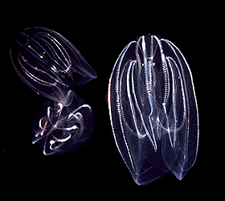

---
aliases:
  - Ctenophora
title: Ctenophora
---

## Phylogeny 

-   « Ancestral Groups  
    -  [Animals](../Animals.md))
    -  [Eukarya](../../Eukarya.md))
    -   [Tree of Life](../../Tree_of_Life.md)

-   ◊ Sibling Groups of  Animals
    -  [Bilateria](Bilateria.md))
    -  [Myxozoa](Myxozoa.md))
    -  [Cnidaria](Cnidaria.md))
    -   Ctenophora
    -  [Placozoa](Placozoa.md))
    -   [Sponge](Sponge.md)

-   » Sub-Groups 

# [[Ctenophora]]

#is_a/bio-Phylum  
#is_a :: [[../../../Taxon_Rank/bio~Kingdom/bio~Phylum|bio~Phylum]]  

Comb Jellies 

## #has_/text_of_/abstract 

> **Ctenophora** (; sg.: ctenophore  from Ancient Greek  κτείς (kteis)  'comb' and  φέρω (pherō)  'to carry') 
> is a phylum of marine invertebrates, commonly known as comb jellies, 
> that inhabit sea waters worldwide. 
> 
> They are notable for the groups of cilia they use for swimming (commonly referred to as "combs"), 
> and they are the largest animals to swim with the help of cilia.
>
> Depending on the species, adult ctenophores range from a few millimeters to 1.5 m (5 ft) in size. 
> 186 living species are recognised.
>
> Their bodies consist of a mass of jelly, with a layer two cells thick on the outside, 
> and another lining the internal cavity. 
> 
> The phylum has a wide range of body forms, including 
> - the egg-shaped cydippids with a pair of retractable tentacles that capture prey, 
> - the flat, generally combless platyctenids, and 
> - the large-mouthed beroids, which prey on other ctenophores.
>
> Almost all ctenophores function as predators, 
> taking prey ranging from microscopic larvae and rotifers to the adults of small crustaceans; 
> the exceptions are juveniles of two species, 
> which live as parasites on the salps on which adults of their species feed.
>
> Despite their soft, gelatinous bodies, fossils thought to represent ctenophores appear in Lagerstätten (well-preserved fossil beds) dating as far back as the early Cambrian, about 525 million years ago. The position of the ctenophores in the "tree of life" has long been debated in molecular phylogenetics studies. Biologists proposed that ctenophores constitute the second-earliest branching animal lineage, with sponges being the sister-group to all other multicellular animals (Porifera sister hypothesis). Other biologists contend that ctenophores diverged earlier than sponges (Ctenophora sister hypothesis), which themselves appeared before the split between cnidarians and bilaterians. Pisani et al. reanalyzed the data and suggested that the computer algorithms used for analysis were misled by the presence of specific ctenophore genes that were markedly different from those of other species. Follow up analysis by Whelan et al. (2017) yielded further support for the 'Ctenophora sister' hypothesis; the issue remains a matter of taxonomic dispute. Schultz et al. (2023) found irreversible changes in synteny in the sister of the Ctenophora, the Myriazoa, consisting of the rest of the animals.
>
> [Wikipedia](https://en.wikipedia.org/wiki/Ctenophora) 

## Title Illustrations
  --------------------------------------------------------------------------------

Scientific Name ::   Mnemiopsis
Acknowledgements   Photograph from Gray Museum Slide Collection
Copyright ::          © 1995 [Marine Biological Laboratory, Woods Hole](http://www.mbl.edu/) 

## Confidential Links & Embeds: 

### #is_/same_as :: [Ctenophora](/_Standards/bio/bio~Domain/Eukarya/Animal/Ctenophora.md) 

### #is_/same_as :: [Ctenophora.public](/_public/bio/bio~Domain/Eukarya/Animal/Ctenophora.public.md) 

### #is_/same_as :: [Ctenophora.internal](/_internal/bio/bio~Domain/Eukarya/Animal/Ctenophora.internal.md) 

### #is_/same_as :: [Ctenophora.protect](/_protect/bio/bio~Domain/Eukarya/Animal/Ctenophora.protect.md) 

### #is_/same_as :: [Ctenophora.private](/_private/bio/bio~Domain/Eukarya/Animal/Ctenophora.private.md) 

### #is_/same_as :: [Ctenophora.personal](/_personal/bio/bio~Domain/Eukarya/Animal/Ctenophora.personal.md) 

### #is_/same_as :: [Ctenophora.secret](/_secret/bio/bio~Domain/Eukarya/Animal/Ctenophora.secret.md)

