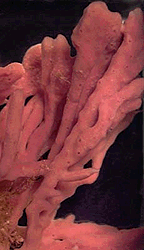
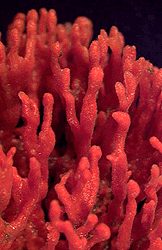

---
aliases:
- banaog
- belaki
- didi laot
- esponges de mar
- espongha
- gąbki
- houbovci
- hubky
- hái-mî tōng-bu̍t
- käsnad
- liifaa ykn sarphaphuu
- Parazoa
- pintys
- Porifera
- Porifero
- poríferos
- puqyala
- sapɔ
- sbwng
- Schwämm
- Schwämme
- sfungjeri
- sienieläimet
- sifongo-bahari
- span
- Spoensn
- Sponge
- Sponges
- spongulo
- sponjo
- sponsdier
- sponsdieren
- spoonge
- Spoonze
- spoue
- spužve
- spúinse
- sunger
- svampar
- svampdjur
- svampdýr
- svampedyr
- svamper
- Swaampen
- Swammdeerter
- szivacsok
- süngerler
- süngərlər
- sūkļi
- táłtłʼááh yilcháazhii
- động vật thân lỗ
- σπόγγος
- болоттар
- болытлар
- ведьзем
- водни гъби
- губкі
- губка
- губкавлӓ
- губкалар
- губки
- зныгъойтæ
- сунђери
- сунѓери
- սպունգներ
- ספוגיים
- إسفنجيات
- اسفنج دریایی
- اسفنجيات
- اسپنج
- فایلم پوریفیرا
- موریانوالے
- स्पंज
- পরিফেরা
- স্পঞ্জ
- பஞ்சுயிரி
- స్పంజిక
- ಸ್ಪಂಜು ಪ್ರಾಣಿಗಳು
- സ്പോഞ്ച്
- ฟองน้ำ
- စပန်းရေမြှုပ်
- ღრუბლები
- ሰፍነግ
- អេប៉ុងហ្ស៍
- 多孔动物门
- 多孔動物門
- 海綿動物
- 海綿動物門
- 해면동물
title: Porifera
has_id_wikidata: Q18960
dv_has_:
  name_:
    af: sponsdier
    am: ሰፍነግ
    ar: إسفنجيات
    arz: اسفنجيات
    as: স্পঞ্জ
    az: süngərlər
    ba: болоттар
    be: губкі
    be-tarask: губкі
    bew: didi laot
    bg: водни гъби
    bn: পরিফেরা
    br: spoue
    ca: esponges de mar
    ceb: banaog
    cs: houbovci
    cv: губка
    cy: sbwng
    da: svampedyr
    de: Schwämme
    diq: sunger
    el: σπόγγος
    eo: spongulo
    et: käsnad
    eu: belaki
    fa: اسفنج دریایی
    fi: sienieläimet
    frr: Swaampen
    ga: spúinse
    gl: poríferos
    he: ספוגיים
    hi: स्पंज
    hr: spužve
    hu: szivacsok
    hy: սպունգներ
    io: sponjo
    is: svampdýr
    ja: 海綿動物
    ka: ღრუბლები
    kk: губкалар
    km: អេប៉ុងហ្ស៍
    kn: ಸ್ಪಂಜು ಪ್ರಾಣಿಗಳು
    ko: 해면동물
    ku: Parazoa
    ky: губкалар
    lb: Schwämm
    lfn: Porifero
    li: Spoonze
    lld: sponges
    lt: pintys
    lv: sūkļi
    mk: сунѓери
    ml: സ്പോഞ്ച്
    mrj: губкавлӓ
    ms: span
    mul: Porifera
    my: စပန်းရေမြှုပ်
    myv: ведьзем
    nan: hái-mî tōng-bu̍t
    nb: svamper
    nds: Swammdeerter
    nl: sponsdieren
    nn: svampar
    nv: táłtłʼááh yilcháazhii
    oc: Porifera
    om: liifaa ykn sarphaphuu
    os: зныгъойтæ
    pl: gąbki
    pnb: موریانوالے
    qu: puqyala
    ru: губки
    sco: spoonge
    sd: اسپنج
    sh: spužve
    sk: hubky
    sl: spužve
    sq: sfungjeri
    sr: сунђери
    sv: svampdjur
    sw: sifongo-bahari
    ta: பஞ்சுயிரி
    te: స్పంజిక
    th: ฟองน้ำ
    tl: espongha
    tr: süngerler
    tt: болытлар
    tw: sapɔ
    uk: губки
    ur: فایلم پوریفیرا
    vi: động vật thân lỗ
    vls: Spoensn
    wuu: 多孔动物门
    yue: 海綿動物
    zh: 多孔动物门
    zh-cn: 多孔动物门
    zh-hans: 多孔动物门
    zh-hant: 海綿動物門
    zh-hk: 多孔動物門
    zh-tw: 海綿動物門
---
# [[Sponge]] 

#is_a/bio-Phylum  
#is_a :: [[../../../Taxon_Rank/bio~Kingdom/bio~Phylum|bio~Phylum]]  

Sponges 

  

## #has_/text_of_/abstract 

> Sponges or sea sponges are primarily marine invertebrates of the animal phylum **Porifera** 
> (meaning 'pore bearer'), a basal clade and a sister taxon of the diploblasts. 
> 
> They are sessile filter feeders that are bound to the seabed, 
> and are one of the most ancient members of macrobenthos, 
> with many historical species being important reef-building organisms.
>
> Sponges are multicellular organisms consisting of jelly-like mesohyl sandwiched between two thin layers of cells, and usually have tube-like bodies full of pores and channels that allow water to circulate through them. They have unspecialized cells that can transform into other types and that often migrate between the main cell layers and the mesohyl in the process. They do not have complex nervous, digestive or circulatory systems. Instead, most rely on maintaining a constant water flow through their bodies to obtain food and oxygen and to remove wastes, usually via flagella movements of the so-called "collar cells".
>
> 
>
> Sponges are believed to have been the first outgroup to branch off the evolutionary tree from the last common ancestor of all animals, with fossil evidence of primitive sponges such as Otavia from as early as the Tonian period (around 800 Mya). The branch of zoology that studies sponges is spongiology.
>
> [Wikipedia](https://en.wikipedia.org/wiki/Sponge) 

## Phylogeny 

-   « Ancestral Groups  
    -  [Animals](../Animals.md) 
    -  [Eukarya](../../Eukarya.md) 
    -   [Tree of Life](../../Tree_of_Life.md)

-   ◊ Sibling Groups of  Animals
    -  [Bilateria](Bilateria.md) 
    -  [Myxozoa](Myxozoa.md) 
    -  [Cnidaria](Cnidaria.md) 
    -  [Ctenophora](Ctenophora.md) 
    -  [Placozoa](Placozoa.md) 
    -   Porifera

-   » Sub-Groups 
	-   *Calcarea*
	    -   *Calcinea*
	    -   *Calcaronea*
	-   *Hexactinellida*
	    -   *Amphidiscophora*
	    -   *Hexasterophora*
	-   *Demospongiae*
	    -   *Homoscleromorpha*
	    -   *Tetractinomorpha*
	    -   *Ceractinomorpha*
	

## Title Illustrations

-------------------------------------------------------------------------------
 
scientific_name ::  Haliclona
Creator           David Remsen
copyright ::         © 1995 [Marine Biological Laboratory, Woods Hole](http://www.mbl.edu/) 

-------------------------------------------------------------------------------
 
scientific_name ::  Microciona
Creator           David Remsen
copyright ::         © 1995 [Marine Biological Laboratory, Woods Hole](http://www.mbl.edu/) 
-------------------------------------------------------------------------------

## Confidential Links & Embeds: 

### #is_/same_as :: [[/_Standards/bio/bio~Domain/Eukarya/Animal/Sponge|Sponge]] 

### #is_/same_as :: [[/_public/bio/bio~Domain/Eukarya/Animal/Sponge.public|Sponge.public]] 

### #is_/same_as :: [[/_internal/bio/bio~Domain/Eukarya/Animal/Sponge.internal|Sponge.internal]] 

### #is_/same_as :: [[/_protect/bio/bio~Domain/Eukarya/Animal/Sponge.protect|Sponge.protect]] 

### #is_/same_as :: [[/_private/bio/bio~Domain/Eukarya/Animal/Sponge.private|Sponge.private]] 

### #is_/same_as :: [[/_personal/bio/bio~Domain/Eukarya/Animal/Sponge.personal|Sponge.personal]] 

### #is_/same_as :: [[/_secret/bio/bio~Domain/Eukarya/Animal/Sponge.secret|Sponge.secret]] 

