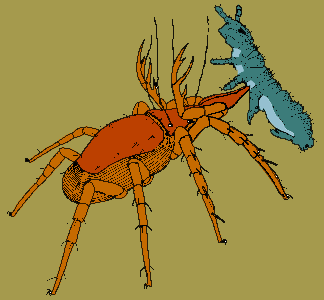

---
title: Trombidiformes
---

# [[Trombidiformes]] 

Trombidiform mites 

 

## #has_/text_of_/abstract 

> **Trombidiformes** is a large, diverse order of mites.
>
> [Wikipedia](https://en.wikipedia.org/wiki/Trombidiformes) 

## Introduction

[Heather Proctor]()

The Trombidiformes is a huge and diverse assemblage of mites,
characterized more by the lack of characters found in the other major
group of acariform mites (Sarcoptiformes) than by many synapomorphies of
their own (Lindquist 1996). It includes some medically important mites
(chiggers, scrub itch mites) and many agriculturally important ones.
Among the latter are spider mites (Tetranychidae) and gall mites
(Eriophyidae). With the exclusion of the Sphaerolichida, the
Trombidiformes is also known as the Prostigmata because the openings to
the tracheal system are towards the dorsal prosoma of the mite.

### Characteristics

According to OConnor (1984), the Trombidiformes are characterized by
several charcters that unite the Prostigmata (which makes up the
majority of the group) with the Sphaerolychidae and Lordalychidae. These
characters are: anamorphic segments AN and PA not added in ontogeny;
hysterosomal segment C with fewer than four pairs of setae; and
hysterosomal segments D and E with fewer than two pairs of setae.
OConnor\'s cladogram also indicates that the character \'hysterosoma
without primary segmentation\' is a feature of the Trombidiformes;
however, as it also occurs in a number of sarcoptiform taxa, it is not a
unique character. Lindquist (1996) notes that most (but not all) members
of the Trombidiformes can be differentiated from the Sarcoptiformes by
having chelicerae with a hooklike or styletlike movable digit rather
than the ancestral chelate form. Likewise, many trombidiform mites have
a padlike or rayed median empodium in contrast to the clawlike or
disk-shaped empodium of sarcoptiforms. Within the Trombidiformes, the
Prostigmata are united by having the **stigmatal openings** to the
tracheal system located **anteriorly** (e.g. on the prodorsum or near
the base of the mouthparts).

### Discussion of Phylogenetic Relationships

OConnor (1984) performed a cladistic analysis of the major taxa within
the Acariformes and determined that the Sphaerolichida and Prostigmata
shared two developmental and two setal characters, while the Prostigmata
were united by the presence of anterior openings to the tracheal system.
Lindquist (1996) and Norton et al. (1993) provide recent cladograms of
taxa within the Prostigmata. As these relationships are based on
unpublished analyses, it is difficult to discuss the rationale for
linking different taxa; however, Lindquist (1996) does provide a list of
characters uniting the superfamily Eriophyoidea.

There are several differences between Lindquist\'s tree, presented
above, and that of Norton et al. (see below). While both divide the
Prostigmata into three major groups, the Anystina, Eleutherengona and
Eupodina, Lindquist nests the Eleutherengona within the Anystina while
Norton et al. present them as completely separate clades:

                          ================== Parasitengona
                       ===|
            ==Anystina=|  ================== Anystidae
            |          |
            |          ===================== other Anystina
            |
            |             ================== Labidostommatidae
            |             |
         ===|             |  =============== Eupodoidea
         |  |          ===|  |
         |  |          |  ===|  ============ Tydeoidea
         |  ==Eupodina=|     ===|
         |             |        ============ Eriophyoidea
         |             |
         |             |  ================== Bdelloidea
         |             ===|
         |                =              ?== Halacaroidea
    =====|
         |                               === Tetranychoidae
         |                            ===|
         |                         ===|  === Cheyletoidea
         |                      ===|  |
         |                   ===|  |  ====== Raphignathoidea
         |                   |  |  |
         |                   |  |  ========= Pterygosomatoidea
         |                ===|  |
         ==Eleutherengona=|  |  ============ Pomerantzioidea
                          |  |
                          |  |     ========= Pseudocheylidae
                          |  |  ===|
                          |  ===|  ========= Heterostigmata
                          |     |
                          |     ============ Stigmocheylidae
                          |
                          ================== Paratydeidae

Other differences are that Norton et al. shift Bdelloidea and
Halacaroidea to the base of the Eupodina, and depict the Parasitengona
as relatively derived within the Anystina. Finally, Norton et al. have
moved a number of groups typically considered to belong to the Anystina
(Pterygosomatoidea, Pomerantzioidea, Pseudocheylidae, Paratydeidae and
Stigmocheylidae) to the Eleutherengona; however, they do not provide the
rationale for this restructuring.

## Phylogeny 

-   « Ancestral Groups  
    -   [Acariformes](../Acariformes.md)
    -   [Mite](../../Mite.md)
    -  [Arachnida](../../../Arachnida.md))
    -  [Arthropoda](../../../../../Arthropoda.md))
    -  [Bilateria](../../../../../../Bilateria.md))
    -  [Animals](../../../../../../../Animals.md))
    -  [Eukarya](../../../../../../../../Eukarya.md))
    -   [Tree of Life](../../../../../../../../Tree_of_Life.md)

-   ◊ Sibling Groups of  Acariformes
    -   Trombidiformes

-   » Sub-Groups
    -   [Parasitengona](Trombidiformes/Parasitengona.md)

## Title Illustrations

---------------------------------------------------------------------------------
**Cunaxa** (Cunaxidae) feeding on a springtail (Collembola). Drawing
copyright © 1998 H.Proctor & D.Walter.)
Copyright ::   © 1998 [Heather Proctor](http://www.biology.ualberta.ca/faculty/heather_proctor/) 

## Confidential Links & Embeds: 

### #is_/same_as ::[Trombidiformes](Trombidiformes.md)) 

### #is_/same_as :: [Trombidiformes.public](/_public/bio/bio~Domain/Eukarya/Animals/Bilateria/Arthropoda/Chelicerata/Arachnida/Mite/Acariformes/Trombidiformes.public.md) 

### #is_/same_as :: [Trombidiformes.internal](/_internal/bio/bio~Domain/Eukarya/Animals/Bilateria/Arthropoda/Chelicerata/Arachnida/Mite/Acariformes/Trombidiformes.internal.md) 

### #is_/same_as :: [Trombidiformes.protect](/_protect/bio/bio~Domain/Eukarya/Animals/Bilateria/Arthropoda/Chelicerata/Arachnida/Mite/Acariformes/Trombidiformes.protect.md) 

### #is_/same_as :: [Trombidiformes.private](/_private/bio/bio~Domain/Eukarya/Animals/Bilateria/Arthropoda/Chelicerata/Arachnida/Mite/Acariformes/Trombidiformes.private.md) 

### #is_/same_as :: [Trombidiformes.personal](/_personal/bio/bio~Domain/Eukarya/Animals/Bilateria/Arthropoda/Chelicerata/Arachnida/Mite/Acariformes/Trombidiformes.personal.md) 

### #is_/same_as :: [Trombidiformes.secret](/_secret/bio/bio~Domain/Eukarya/Animals/Bilateria/Arthropoda/Chelicerata/Arachnida/Mite/Acariformes/Trombidiformes.secret.md)

