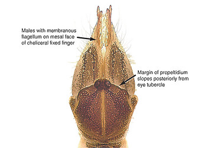
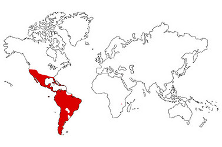
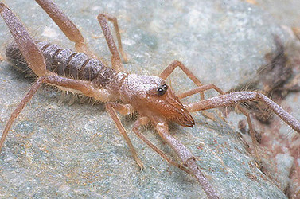

---
title: Ammotrechidae
---

# [[Ammotrechidae]] 

## #has_/text_of_/abstract 

> **Ammotrechidae** is a family of solifuges distributed in the Americas and the Caribbean Islands. It includes 26 described genera and 95 species. Members of this family can be distinguished from members of other families by the absence of claws on tarsi of leg I, tarsal segmentation 1-2-2-(2-4), pedipalps with pairs of lateroventral spines, and by males having an immovable flagellum on the mesal face of each chelicerum. The propeltidium of the Ammotrechidae is recurved.
>
> The common names used for Ammotrechidae are curve-faced solifugids and sand runners. They live in arid regions, such as dune and rocky habitats. They are carnivores which feed mainly on other invertebrates. Ammotrechidae have relatively high metabolic rates, which allow them to be voracious predators. They feed by masticating their prey and sucking out the liquids. They are preyed upon by other vertebrates. Species of Ammotrechidae are found to be cannibalistic. Males and females dig shallow burrows for protection and nesting.
>
> The species in North America are found in the South to Southwest and are rarely longer than 2 inches. Though they can be pests, they are considered beneficial because they feed on scorpions, spiders, and termites.
>
> [Wikipedia](https://en.wikipedia.org/wiki/Ammotrechidae) 

### Characteristics

Male ammotrechids have a fixed, non-rotatable membranous flagellum
attached to the mesal face of each chelicera. 
)\
\

 

### Geographic Distribution

Members of the family Ammotrechidae are known from North America,
Central America, South America, and the Caribbean Islands. 

 
)\

## Phylogeny 

-   « Ancestral Groups  
    -  [Solifugae](../Solifugae.md))
    -  [Arachnida](../../Arachnida.md))
    -  [Arthropoda](../../../../Arthropoda.md))
    -  [Bilateria](../../../../../Bilateria.md))
    -  [Animals](../../../../../../Animals.md))
    -  [Eukarya](../../../../../../../Eukarya.md))
    -   [Tree of Life](../../../../../../../Tree_of_Life.md)

-   ◊ Sibling Groups of  Solifugae
    -   Ammotrechidae

-   » Sub-Groups
    -  [Ammotrechinae](Ammotrechidae/Ammotrechinae.md))
	-   [Ammotrechinae](Ammotrechidae/Ammotrechinae.md "go to ToL page"))*
	-   *Mortola mortola*
	-   *Nothopuga*
	-   *Oltacola*
	-   *Saronominae*
	-   *Chileotrecha atacamensis*
	-   *Eutrecha longirostris*
	-   *Xenotrecha huebneri*
	-   *Happlodontus proterus* †

## Title Illustrations
  ------------

  Scientific Name ::     Ammotrechula pilosa Muma
  Specimen Condition   Live Specimen
  Sex ::                Male
  Life Cycle Stage ::     Adult
  Copyright ::            © 2003 Warren E. Savary

## Confidential Links & Embeds: 

### #is_/same_as ::[Ammotrechidae](Ammotrechidae.md)) 

### #is_/same_as :: [Ammotrechidae.public](/_public/bio/bio~Domain/Eukarya/Animals/Bilateria/Arthropoda/Chelicerata/Arachnida/Solifugae/Ammotrechidae.public.md) 

### #is_/same_as :: [Ammotrechidae.internal](/_internal/bio/bio~Domain/Eukarya/Animals/Bilateria/Arthropoda/Chelicerata/Arachnida/Solifugae/Ammotrechidae.internal.md) 

### #is_/same_as :: [Ammotrechidae.protect](/_protect/bio/bio~Domain/Eukarya/Animals/Bilateria/Arthropoda/Chelicerata/Arachnida/Solifugae/Ammotrechidae.protect.md) 

### #is_/same_as :: [Ammotrechidae.private](/_private/bio/bio~Domain/Eukarya/Animals/Bilateria/Arthropoda/Chelicerata/Arachnida/Solifugae/Ammotrechidae.private.md) 

### #is_/same_as :: [Ammotrechidae.personal](/_personal/bio/bio~Domain/Eukarya/Animals/Bilateria/Arthropoda/Chelicerata/Arachnida/Solifugae/Ammotrechidae.personal.md) 

### #is_/same_as :: [Ammotrechidae.secret](/_secret/bio/bio~Domain/Eukarya/Animals/Bilateria/Arthropoda/Chelicerata/Arachnida/Solifugae/Ammotrechidae.secret.md)

