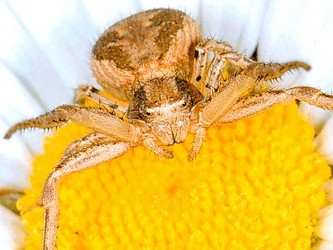
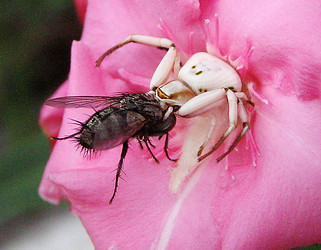

---
aliases:
- Thomisidae
- Thomisida
- "crab spider"
- "flower spider"
- "flower crab spider"
title: Thomisidae
---

# [[Crab_Spider]] 

## #has_/text_of_/abstract 

> The **Thomisidae** are a family of spiders, including about 170 genera and over 2,100 species. 
> The common name crab spider is often linked to species in this family, 
> but is also applied loosely to many other families of spiders. 
> 
> Many members of this family are also known as flower spiders or flower crab spiders.
>
> [Wikipedia](https://en.wikipedia.org/wiki/Thomisidae) 

## Phylogeny 

-   « Ancestral Groups  
    -  [Dionycha](../Dionycha.md))
    -  [Entelegynae](../../../Entelegynae.md))
    -  [Araneomorphae](../../../../Araneomorphae.md))
    -   [Spider](../../../../../Spider.md)
    -  [Arachnida](../../../../../../Arachnida.md))
    -  [Arthropoda](../../../../../../../../Arthropoda.md))
    -  [Bilateria](../../../../../../../../../Bilateria.md))
    -  [Animals](../../../../../../../../../../Animals.md))
    -  [Eukarya](../../../../../../../../../../../Eukarya.md))
    -   [Tree of Life](../../../../../../../../../../../Tree_of_Life.md)

-   ◊ Sibling Groups of  Dionycha
    -   [Jumping_Spider](Jumping_Spider.md)
    -   Thomisidae
    -  [Clubionidae](Clubionidae.md))

-   » Sub-Groups 
	-   *Acentroscelus*
	-   *Acracanthostoma*
	-   *Alcimochthes*
	-   *Amyciaea*
	-   *Angaeus*
	-   *Ansiea*
	-   *Aphantochilus*
	-   *Apyretina*
	-   *Ascurisoma*
	-   *Avelis*
	-   *Bassaniana*
	-   *Bassaniodes*
	-   *Boliscodes*
	-   *Boliscus*
	-   *Bomis*
	-   *Bonapruncinia*
	-   *Borboropactus*
	-   *Bucranium*
	-   *Camaricus*
	-   *Carcinarachne*
	-   *Cebrenninus*
	-   *Ceraarachne*
	-   *Cetratus*
	-   *Coenypha*
	-   *Coriarachne*
	-   *Corynethrix*
	-   *Cozyptila*
	-   *Cupa*
	-   *Cymbacha*
	-   *Cymbachina*
	-   *Cynathea*
	-   *Cyriogonus*
	-   *Deltoclita*
	-   *Demogenes*
	-   *Diaea*
	-   *Dietopsa*
	-   *Dimizonops*
	-   *Diplotychus*
	-   *Domatha*
	-   *Ebelingia*
	-   *Ebrechtella*
	-   *Emplesiogonus*
	-   *Epicadinus*
	-   *Epicadus*
	-   *Epidius*
	-   *Erissoides*
	-   *Erissus*
	-   *Felsina*
	-   *Firmicus*
	-   *Geraesta*
	-   *Gnoerichia*
	-   *Haedanula*
	-   *Haplotmarus*
	-   *Hedana*
	-   *Henriksenia*
	-   *Herbessus*
	-   *Heriaesynaema*
	-   *Heriaeus*
	-   *Heterogriffus*
	-   *Hewittia*
	-   *Hexommulocymus*
	-   *Holopelus*
	-   *Iphoctesis*
	-   *Isala*
	-   *Isaloides*
	-   *Lampertia*
	-   *Latifrons*
	-   *Ledouxia*
	-   *Loxobates*
	-   *Loxoporetes*
	-   *Lycopus*
	-   *Lysiteles*
	-   *Majellula*
	-   *Martus*
	-   *Massuria*
	-   *Mastira*
	-   *Mecaphesa*
	-   *Megapyge*
	-   *Metadiaea*
	-   *Misumena*
	-   *Misumenoides*
	-   *Misumenops*
	-   *Modysticus*
	-   *Monaeses*
	-   *Musaeus*
	-   *Mystaria*
	-   *Narcaeus*
	-   *Nyctimus*
	-   *Ocyllus*
	-   *Onocolus*
	-   *Ostanes*
	-   *Oxytate*
	-   *Ozyptila*
	-   *Pactactes*
	-   *Pagida*
	-   *Parabomis*
	-   *Paramystaria*
	-   *Parasmodix*
	-   *Parastephanops*
	-   *Parastrophius*
	-   *Parasynema*
	-   *Pasias*
	-   *Pasiasula*
	-   *Peritraeus*
	-   *Phaenopoma*
	-   *Pharta*
	-   *Pherecydes*
	-   *Philodamia*
	-   *Philogaeus*
	-   *Phireza*
	-   *Phrynarachne*
	-   *Physoplatys*
	-   *Pistius*
	-   *Plancinus*
	-   *Plastonomus*
	-   *Platyarachne*
	-   *Platythomisus*
	-   *Poecilothomisus*
	-   *Porropis*
	-   *Pothaeus*
	-   *Prepotelus*
	-   *Pseudamyciaea*
	-   *Pseudoporrhopis*
	-   *Pycnaxis*
	-   *Pyresthesis*
	-   *Rejanellus*
	-   *Reinickella*
	-   *Rhaebobates*
	-   *Runcinia*
	-   *Saccodomus*
	-   *Sanmenia*
	-   *Scopticus*
	-   *Sidymella*
	-   *Simorcus*
	-   *Smodicinodes*
	-   *Smodicinus*
	-   *Soelteria*
	-   *Stephanopis*
	-   *Stephanopoides*
	-   *Stiphropella*
	-   *Stiphropus*
	-   *Strigoplus*
	-   *Strophius*
	-   *Sylligma*
	-   *Synaemops*
	-   *Synalus*
	-   *Synema*
	-   *Synstrophius*
	-   *Tagulinus*
	-   *Tagulis*
	-   *Takachihoa*
	-   *Talaus*
	-   *Tarrocanus*
	-   *Taypaliito*
	-   *Tharpyna*
	-   *Tharrhalea*
	-   *Thomisops*
	-   *Thomisus*
	-   *Titidiops*
	-   *Titidius*
	-   *Tmarus*
	-   *Tobias*
	-   *Trichopagis*
	-   *Ulocymus*
	-   *Uraarachne*
	-   *Wechselia*
	-   *Xysticus*
	-   *Zametopias*
	-   *Zametopina*
	-   *Zygometis*

## Title Illustrations

)

  ----------------------------------------------------------------------------
  Scientific Name ::     Arachnida:Spider:Thomisidae: Xisticus bifasciatus
  Location ::           Castel d'Aiano, Bologna Province, Emilia Romagna, Italy
  Specimen Condition   Live Specimen
  Image Use ::    [Attribution-NonCommercial 2.0 Creative Commons License](http://creativecommons.org/licenses/by-nc/2.0/).
  Copyright ::            © 2005 [Cesare Brizio](http://xoomer.virgilio.it/cebrizio/) 
  ----------------------------------------------------------------------------
)

  -------------------------------------------------------------------------
  Scientific Name ::     Thomisidae
  Location ::           Ruby, AZ, USA
  Comments             This crab spider had just caught the fly while perched in an oleander flower
  Specimen Condition   Live Specimen
  Behavior             Predation
  Sex ::                Female
  View                 Dorsolateral
  Size                 c.8mm
  Copyright ::            © 2005 [David Bygott](mailto:davidbygott@yahoo.com) 
  -------------------------------------------------------------------------

## Confidential Links & Embeds: 

### #is_/same_as ::[Crab_Spider](Crab_Spider.md)) 

### #is_/same_as :: [Crab_Spider.public](/_public/bio/bio~Domain/Eukarya/Animals/Bilateria/Arthropoda/Chelicerata/Arachnida/Spider/Araneomorphae/Entelegynae/Dictynoidea/Dionycha/Crab_Spider.public.md) 

### #is_/same_as :: [Crab_Spider.internal](/_internal/bio/bio~Domain/Eukarya/Animals/Bilateria/Arthropoda/Chelicerata/Arachnida/Spider/Araneomorphae/Entelegynae/Dictynoidea/Dionycha/Crab_Spider.internal.md) 

### #is_/same_as :: [Crab_Spider.protect](/_protect/bio/bio~Domain/Eukarya/Animals/Bilateria/Arthropoda/Chelicerata/Arachnida/Spider/Araneomorphae/Entelegynae/Dictynoidea/Dionycha/Crab_Spider.protect.md) 

### #is_/same_as :: [Crab_Spider.private](/_private/bio/bio~Domain/Eukarya/Animals/Bilateria/Arthropoda/Chelicerata/Arachnida/Spider/Araneomorphae/Entelegynae/Dictynoidea/Dionycha/Crab_Spider.private.md) 

### #is_/same_as :: [Crab_Spider.personal](/_personal/bio/bio~Domain/Eukarya/Animals/Bilateria/Arthropoda/Chelicerata/Arachnida/Spider/Araneomorphae/Entelegynae/Dictynoidea/Dionycha/Crab_Spider.personal.md) 

### #is_/same_as :: [Crab_Spider.secret](/_secret/bio/bio~Domain/Eukarya/Animals/Bilateria/Arthropoda/Chelicerata/Arachnida/Spider/Araneomorphae/Entelegynae/Dictynoidea/Dionycha/Crab_Spider.secret.md)

