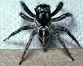
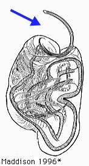

---
title: Euophryinae
---

# [[Euophryinae]] 

 
Copyright ::   © 1994-1995 [Wayne Maddison](http://salticidae.org/wpm/home.html) 

## Introduction

[Wayne Maddison]() 

A large group of salticids that is well-represented in both the New and
Old Worlds, especially in the tropics. At least some species (e.g.
Corythalia and New World Habrocestum) are known to be ant-specialists,
and have specialized chelicerae that may be related to ant-feeding.
Relationships within the euophryines are particularly confusing, and we
are very far from obtaining reasonable generic delimitations.

### Characteristics

Euophryines are characterized by a terminal, spiral embolus that is
separated from the tegulum by an expandable distal hematodocha:

(from Maddison 1996)

However, this form of palpus may simply be the primitive form from which
the dendryphantines and other groups (such as the synagelines) arose,
and thus the euophyines may be paraphyletic (Maddison, 1996).

## Phylogeny 

-   « Ancestral Groups  
    -   [Jumping_Spider](../Jumping_Spider.md)
    -  [Dionycha](../../Dionycha.md))
    -  [Entelegynae](../../../../Entelegynae.md))
    -  [Araneomorphae](../../../../../Araneomorphae.md))
    -   [Spider](../../../../../../Spider.md)
    -  [Arachnida](../../../../../../../Arachnida.md))
    -  [Arthropoda](../../../../../../../../../Arthropoda.md))
    -  [Bilateria](../../../../../../../../../../Bilateria.md))
    -  [Animals](../../../../../../../../../../../Animals.md))
    -  [Eukarya](../../../../../../../../../../../../Eukarya.md))
    -   [Tree of Life](../../../../../../../../../../../../Tree_of_Life.md)

-   ◊ Sibling Groups of  Salticidae
    -   [Lyssomaninae](Lyssomaninae.md)
    -   [Spartaeinae](Spartaeinae.md)
    -   [Amycinae](Amycinae.md)
    -   [Thiodininae](Thiodininae.md)
    -   [Hisponinae](Hisponinae.md)
    -   [Synemosyninae](Synemosyninae.md)
    -   [Hyetussinae](Hyetussinae.md)
    -   [Sitticinae](Sitticinae.md)
    -   [Plexippinae](Plexippinae.md)
    -   [Pelleninae](Pelleninae.md)
    -   [Heliophaninae](Heliophaninae.md)
    -   [Salticus](Salticus)
    -   [Miscellaneous salticids with a fixed         embolus](Miscellaneous_salticids_with_a_fixed_embolus)
    -   [Dendryphantinae](Dendryphantinae.md)
    -   Euophryinae
    -   [Synagelinae](Synagelinae.md)
    -   [Ballinae](Ballinae.md)
    -   [Miscellaneous salticids with a free         embolus](Miscellaneous_salticids_with_a_free_embolus)

-   » Sub-Groups
    -   [Amphidraus](Amphidraus)
    -   [Chalcoscirtus](Chalcoscirtus)
    -   [Cobanus](Cobanus)
    -   [Corythalia](Corythalia)
    -   [Euophrys](Euophrys)
    -   [Habrocestum](Habrocestum)
    -   [Maeota dichrura](Maeota_dichrura)
    -   [Neon](Neon)
    -   [Neonella](Neonella)
    -   [Pensacola](Pensacola)
    -   [Sidusa](Sidusa)
    -   [Talavera](Talavera)
    -   [Tylogonus](Tylogonus)
    -   [Unidentified         Euophryinae](Unidentified_Euophryinae)

	-   *Anasaitis*
	-   *[Amphidraus](Amphidraus)*
	-   *Asaphobelis*
	-   *Ascyltus*
	-   *Athamas*
	-   *Bathippus*
	-   *Belliena*
	-   *Bindax*
	-   *Canama*
	-   *[Chalcoscirtus](Chalcoscirtus)*
	-   *Chalcotropis*
	-   *Chloridusa*
	-   *[Cobanus](Cobanus)*
	-   *Colyttus*
	-   *Commoris*
	-   *Coryphasia*
	-   *[Corythalia](Corythalia)*
	-   *Cynapes*
	-   *Cytaea*
	-   *Donoessus*
	-   *Emathis*
	-   *Ergane*
	-   *[Euophrys](Euophrys)*
	-   *Euryattus*
	-   *Eustirognathus*
	-   *[Habrocestum](Habrocestum)*
	-   *Ilargus*
	-   *Klamathia*
	-   *Laufeia*
	-   *Lepidemathis*
	-   *[Maeota](Maeota_dichrura)*
	-   *Maratus*
	-   *Margaromma*
	-   *Mopiopia*
	-   *[Neon](Neon)*
	-   *[Neonella](Neonella)*
	-   *Ocnotelus*
	-   *[Pensacola](Pensacola)*
	-   *Plotius*
	-   *Pristobaeus*
	-   *Pystira*
	-   *Saitis*
	-   *Semnolius*
	-   *Servaea*
	-   *[Sidusa](Sidusa)*
	-   *Siloca*
	-   *Spilargis*
	-   *Stoides*
	-   *[Talavera](Talavera)*
	-   *Tariona*
	-   *Thiania*
	-   *Thorelliola*
	-   *Thyenula*
	-   *[Tylogonus](Tylogonus)*
	-   *Udvardya*
	-   *Zenodorus*
	-   *[Unidentified     Euophryinae](Unidentified_Euophryinae)*

## Confidential Links & Embeds: 

### #is_/same_as ::[Euophryinae](Euophryinae.md)) 

### #is_/same_as :: [Euophryinae.public](/_public/bio/bio~Domain/Eukarya/Animals/Bilateria/Arthropoda/Chelicerata/Arachnida/Spider/Araneomorphae/Entelegynae/Dictynoidea/Dionycha/Jumping_Spider/Euophryinae.public.md) 

### #is_/same_as :: [Euophryinae.internal](/_internal/bio/bio~Domain/Eukarya/Animals/Bilateria/Arthropoda/Chelicerata/Arachnida/Spider/Araneomorphae/Entelegynae/Dictynoidea/Dionycha/Jumping_Spider/Euophryinae.internal.md) 

### #is_/same_as :: [Euophryinae.protect](/_protect/bio/bio~Domain/Eukarya/Animals/Bilateria/Arthropoda/Chelicerata/Arachnida/Spider/Araneomorphae/Entelegynae/Dictynoidea/Dionycha/Jumping_Spider/Euophryinae.protect.md) 

### #is_/same_as :: [Euophryinae.private](/_private/bio/bio~Domain/Eukarya/Animals/Bilateria/Arthropoda/Chelicerata/Arachnida/Spider/Araneomorphae/Entelegynae/Dictynoidea/Dionycha/Jumping_Spider/Euophryinae.private.md) 

### #is_/same_as :: [Euophryinae.personal](/_personal/bio/bio~Domain/Eukarya/Animals/Bilateria/Arthropoda/Chelicerata/Arachnida/Spider/Araneomorphae/Entelegynae/Dictynoidea/Dionycha/Jumping_Spider/Euophryinae.personal.md) 

### #is_/same_as :: [Euophryinae.secret](/_secret/bio/bio~Domain/Eukarya/Animals/Bilateria/Arthropoda/Chelicerata/Arachnida/Spider/Araneomorphae/Entelegynae/Dictynoidea/Dionycha/Jumping_Spider/Euophryinae.secret.md)

