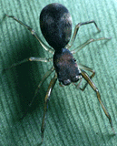

## Phylogeny 

-   « Ancestral Groups  
    -   [Hyetussinae](../Hyetussinae.md)
    -   [Jumping_Spider](../../Jumping_Spider.md)
    -  [Dionycha](../../../Dionycha.md))
    -  [Entelegynae](../../../../../Entelegynae.md))
    -  [Araneomorphae](../../../../../../Araneomorphae.md))
    -   [Spider](../../../../../../../Spider.md)
    -  [Arachnida](../../../../../../../../Arachnida.md))
    -  [Arthropoda](../../../../../../../../../../Arthropoda.md))
    -  [Bilateria](../../../../../../../../../../../Bilateria.md))
    -  [Animals](../../../../../../../../../../../../Animals.md))
    -  [Eukarya](../../../../../../../../../../../../../Eukarya.md))
    -   [Tree of Life](../../../../../../../../../../../../../Tree_of_Life.md)

-   ◊ Sibling Groups of  Hyetussinae
    -   [Bredana](Bredana)
    -   [Cyllodania](Cyllodania)
    -   [Hyetussa](Hyetussa.md)
    -   Scopocira
    -   [Titanattus](Titanattus.md)
    -   [Unidentified         Hyetussinae](Unidentified_Hyetussinae)

-   » Sub-Groups 

# Scopocira 

-   *Scopocira atypica*
-   *Scopocira carinata*
-   *Scopocira dentichelis*
-   *Scopocira fuscimana*
-   *Scopocira histrio*
-   *Scopocira melanops*
-   *Scopocira panamena*
-   *Scopocira sexspinosa*
-   *Scopocira tenella*
-   *Scopocira vivida*

Containing group: [Hyetussinae](../Hyetussinae.md)

### Information on the Internet

Proszynski\'s Catalogue entry for
[Scopocira](http://salticidae.org/salticid/catalog/Scopocir.htm)

## Introduction

Tentatively placed with the Hyetussinae.

## Title Illustrations



  ---------------------------------------------------------------------------
  Copyright ::   © 1994-1995 [Wayne Maddison](http://salticidae.org/wpm/home.html) 
  ---------------------------------------------------------------------------
)

  ---------------------------------------------------------------------------
  Copyright ::   © 1994-1995 [Wayne Maddison](http://salticidae.org/wpm/home.html) 
  ---------------------------------------------------------------------------

## Confidential Links & Embeds: 

### #is_/same_as ::[Scopocira](Scopocira.md)) 

### #is_/same_as :: [Scopocira.public](/_public/bio/bio~Domain/Eukarya/Animals/Bilateria/Arthropoda/Chelicerata/Arachnida/Spider/Araneomorphae/Entelegynae/Dictynoidea/Dionycha/Jumping_Spider/Hyetussinae/Scopocira.public.md) 

### #is_/same_as :: [Scopocira.internal](/_internal/bio/bio~Domain/Eukarya/Animals/Bilateria/Arthropoda/Chelicerata/Arachnida/Spider/Araneomorphae/Entelegynae/Dictynoidea/Dionycha/Jumping_Spider/Hyetussinae/Scopocira.internal.md) 

### #is_/same_as :: [Scopocira.protect](/_protect/bio/bio~Domain/Eukarya/Animals/Bilateria/Arthropoda/Chelicerata/Arachnida/Spider/Araneomorphae/Entelegynae/Dictynoidea/Dionycha/Jumping_Spider/Hyetussinae/Scopocira.protect.md) 

### #is_/same_as :: [Scopocira.private](/_private/bio/bio~Domain/Eukarya/Animals/Bilateria/Arthropoda/Chelicerata/Arachnida/Spider/Araneomorphae/Entelegynae/Dictynoidea/Dionycha/Jumping_Spider/Hyetussinae/Scopocira.private.md) 

### #is_/same_as :: [Scopocira.personal](/_personal/bio/bio~Domain/Eukarya/Animals/Bilateria/Arthropoda/Chelicerata/Arachnida/Spider/Araneomorphae/Entelegynae/Dictynoidea/Dionycha/Jumping_Spider/Hyetussinae/Scopocira.personal.md) 

### #is_/same_as :: [Scopocira.secret](/_secret/bio/bio~Domain/Eukarya/Animals/Bilateria/Arthropoda/Chelicerata/Arachnida/Spider/Araneomorphae/Entelegynae/Dictynoidea/Dionycha/Jumping_Spider/Hyetussinae/Scopocira.secret.md)

