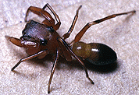

---
title: Synagelinae
---

# [[Synagelinae]] 

## Introduction

[Wayne Maddison]() 

Antlike jumping spiders distinct from the synemosynines in having an
embolus articulated against the tegulum, and from waving their second
pair of legs (instead of the first) like antennae. With the exception of
Leptorchestes which is included here tentatively, they are entirely from
the New World.

## Phylogeny 

-   « Ancestral Groups  
    -   [Jumping_Spider](../Jumping_Spider.md)
    -  [Dionycha](../../Dionycha.md))
    -  [Entelegynae](../../../../Entelegynae.md))
    -  [Araneomorphae](../../../../../Araneomorphae.md))
    -   [Spider](../../../../../../Spider.md)
    -  [Arachnida](../../../../../../../Arachnida.md))
    -  [Arthropoda](../../../../../../../../../Arthropoda.md))
    -  [Bilateria](../../../../../../../../../../Bilateria.md))
    -  [Animals](../../../../../../../../../../../Animals.md))
    -  [Eukarya](../../../../../../../../../../../../Eukarya.md))
    -   [Tree of Life](../../../../../../../../../../../../Tree_of_Life.md)

-   ◊ Sibling Groups of  Salticidae
    -   [Lyssomaninae](Lyssomaninae.md)
    -   [Spartaeinae](Spartaeinae.md)
    -   [Amycinae](Amycinae.md)
    -   [Thiodininae](Thiodininae.md)
    -   [Hisponinae](Hisponinae.md)
    -   [Synemosyninae](Synemosyninae.md)
    -   [Hyetussinae](Hyetussinae.md)
    -   [Sitticinae](Sitticinae.md)
    -   [Plexippinae](Plexippinae.md)
    -   [Pelleninae](Pelleninae.md)
    -   [Heliophaninae](Heliophaninae.md)
    -   [Salticus](Salticus)
    -   [Miscellaneous salticids with a fixed         embolus](Miscellaneous_salticids_with_a_fixed_embolus)
    -   [Dendryphantinae](Dendryphantinae.md)
    -   [Euophryinae](Euophryinae.md)
    -   Synagelinae
    -   [Ballinae](Ballinae.md)
    -   [Miscellaneous salticids with a free         embolus](Miscellaneous_salticids_with_a_free_embolus)

-   » Sub-Groups
    -   [Synageles](Synageles)
    -   [Peckhamia](Peckhamia)
    -   [Cheliferoides](Cheliferoides)
	-   *[Synageles](Synageles)*
	-   *[Peckhamia](Peckhamia)*
	-   *Consingis*
	-   *Descanso*
	-   *[Cheliferoides](Cheliferoides)*
	-   *Leptorchestes*

## Title Illustrations

)

  ---------------------------------------------------------------------------
  Copyright ::   © 1994-1995 [Wayne Maddison](http://salticidae.org/wpm/home.html) 
  ---------------------------------------------------------------------------

## Confidential Links & Embeds: 

### #is_/same_as ::[Synagelinae](Synagelinae.md)) 

### #is_/same_as :: [Synagelinae.public](/_public/bio/bio~Domain/Eukarya/Animals/Bilateria/Arthropoda/Chelicerata/Arachnida/Spider/Araneomorphae/Entelegynae/Dictynoidea/Dionycha/Jumping_Spider/Synagelinae.public.md) 

### #is_/same_as :: [Synagelinae.internal](/_internal/bio/bio~Domain/Eukarya/Animals/Bilateria/Arthropoda/Chelicerata/Arachnida/Spider/Araneomorphae/Entelegynae/Dictynoidea/Dionycha/Jumping_Spider/Synagelinae.internal.md) 

### #is_/same_as :: [Synagelinae.protect](/_protect/bio/bio~Domain/Eukarya/Animals/Bilateria/Arthropoda/Chelicerata/Arachnida/Spider/Araneomorphae/Entelegynae/Dictynoidea/Dionycha/Jumping_Spider/Synagelinae.protect.md) 

### #is_/same_as :: [Synagelinae.private](/_private/bio/bio~Domain/Eukarya/Animals/Bilateria/Arthropoda/Chelicerata/Arachnida/Spider/Araneomorphae/Entelegynae/Dictynoidea/Dionycha/Jumping_Spider/Synagelinae.private.md) 

### #is_/same_as :: [Synagelinae.personal](/_personal/bio/bio~Domain/Eukarya/Animals/Bilateria/Arthropoda/Chelicerata/Arachnida/Spider/Araneomorphae/Entelegynae/Dictynoidea/Dionycha/Jumping_Spider/Synagelinae.personal.md) 

### #is_/same_as :: [Synagelinae.secret](/_secret/bio/bio~Domain/Eukarya/Animals/Bilateria/Arthropoda/Chelicerata/Arachnida/Spider/Araneomorphae/Entelegynae/Dictynoidea/Dionycha/Jumping_Spider/Synagelinae.secret.md)

