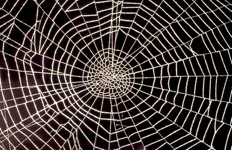

---
title: Uloboridae
---

## Phylogeny 

-   « Ancestral Groups  
    -  [Orbiculariae](../Orbiculariae.md))
    -  [Entelegynae](../../Entelegynae.md))
    -  [Araneomorphae](../../../Araneomorphae.md))
    -   [Spider](../../../../Spider.md)
    -  [Arachnida](../../../../../Arachnida.md))
    -  [Arthropoda](../../../../../../../Arthropoda.md))
    -  [Bilateria](../../../../../../../../Bilateria.md))
    -  [Animals](../../../../../../../../../Animals.md))
    -  [Eukarya](../../../../../../../../../../Eukarya.md))
    -   [Tree of Life](../../../../../../../../../../Tree_of_Life.md)

-   ◊ Sibling Groups of  Orbiculariae
    -  [Anapidae](Anapidae.md))
    -  [Mysmenidae](Mysmenidae.md))
    -  [Deinopidae](Deinopidae.md))
    -   Uloboridae
    -  [Araneidae](Araneidae.md))
    -  [Theridiosomatidae](Theridiosomatidae.md))
    -  [Symphytognathidae](Symphytognathidae.md))
    -  [Linyphiidae](Linyphiidae.md))
    -  [Pimoidae](Pimoidae.md))
    -  [Synotaxidae](Synotaxidae.md))
    -  [Cyatholipidae](Cyatholipidae.md))
    -  [Nesticidae](Nesticidae.md))
    -  [Theridiidae](Theridiidae.md))

-   » Sub-Groups 

# Uloboridae 
)

Containing group:[Orbiculariae](../Orbiculariae.md))

## Title Illustrations

)

  ---------------------------------------------------------------------------------
  Scientific Name ::     Philoponella sp.
  Location ::           Costa Rica
  Specimen Condition   Live Specimen
  Identified By        Jonathan Coddington
  Sex ::                Female
  Life Cycle Stage ::     adult
  Copyright ::            © [Jonathan Coddington](http://entomology.si.edu/StaffPages/coddington.html) 
  ---------------------------------------------------------------------------------

## Confidential Links & Embeds: 

### #is_/same_as ::[Uloboridae](Uloboridae.md)) 

### #is_/same_as :: [Uloboridae.public](/_public/bio/bio~Domain/Eukarya/Animals/Bilateria/Arthropoda/Chelicerata/Arachnida/Spider/Araneomorphae/Entelegynae/Orbiculariae/Uloboridae.public.md) 

### #is_/same_as :: [Uloboridae.internal](/_internal/bio/bio~Domain/Eukarya/Animals/Bilateria/Arthropoda/Chelicerata/Arachnida/Spider/Araneomorphae/Entelegynae/Orbiculariae/Uloboridae.internal.md) 

### #is_/same_as :: [Uloboridae.protect](/_protect/bio/bio~Domain/Eukarya/Animals/Bilateria/Arthropoda/Chelicerata/Arachnida/Spider/Araneomorphae/Entelegynae/Orbiculariae/Uloboridae.protect.md) 

### #is_/same_as :: [Uloboridae.private](/_private/bio/bio~Domain/Eukarya/Animals/Bilateria/Arthropoda/Chelicerata/Arachnida/Spider/Araneomorphae/Entelegynae/Orbiculariae/Uloboridae.private.md) 

### #is_/same_as :: [Uloboridae.personal](/_personal/bio/bio~Domain/Eukarya/Animals/Bilateria/Arthropoda/Chelicerata/Arachnida/Spider/Araneomorphae/Entelegynae/Orbiculariae/Uloboridae.personal.md) 

### #is_/same_as :: [Uloboridae.secret](/_secret/bio/bio~Domain/Eukarya/Animals/Bilateria/Arthropoda/Chelicerata/Arachnida/Spider/Araneomorphae/Entelegynae/Orbiculariae/Uloboridae.secret.md)

