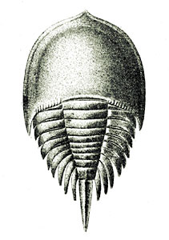

---
aliases:
- Xiphosura
- Merostomata
- "Horseshoe crab"
- "Horseshoe crabs"
title: Xiphosura
---

# [[Horseshoe_Crab]]

 

## #has_/text_of_/abstract 

> **Xiphosura** (; from Ancient Greek  ξίφος (xíphos) 'sword' and  οὐρά (ourá) 'tail', 
> in reference to its sword-like telson) is an order of arthropods related to arachnids. 
> 
> They are more commonly known as horseshoe crabs 
> (a name applied more specifically to the only extant family, Limulidae). 
> 
> They first appeared in the Hirnantian (Late Ordovician). 
> Currently, there are only four living species. 
> Xiphosura contains one suborder, Xiphosurida, and several stem-genera.
>
> The group has hardly changed in appearance in hundreds of millions of years; 
> the modern horseshoe crabs look almost identical to prehistoric genera and are considered to be living fossils. The most notable difference between ancient and modern forms is that the abdominal segments in present species are fused into a single unit in adults.
>
> Xiphosura were historically placed in the class Merostomata, 
> although this term was intended to encompass also the eurypterids, 
> whence it denoted what is now thought to be an unnatural (paraphyletic) group 
> (although this is a grouping recovered in some recent cladistic analyses). 
> 
> Although the name Merostomata is still seen in textbooks, without reference to the Eurypterida, 
> some have urged that this usage should be discouraged. 
> 
> The Merostomata label originally did not include Eurypterida, 
> although they were added in as a better understanding of the extinct group evolved. 
> 
> Now Eurypterida is classified within Sclerophorata together with the arachnids, 
> and therefore, Merostomata is now a synonym of Xiphosura. 
> 
> Several recent phylogenomic studies place Xiphosura within Arachnida, 
> often as the sister group of Ricinulei; 
> included are taxonomically comprehensive analyses of both morphology and genomes, 
> which have recovered Merostomata as a derived clade of arachnids.
>
> [Wikipedia](https://en.wikipedia.org/wiki/Xiphosura) 

### Information on the Internet

-   [Fossil and Living Horseshoe     Crabs](http://lyall.tripod.com/xipho/index.html). Lyall I. Anderson.
-   [Xiphosura](http://www.palaeos.com/Invertebrates/Arthropods/Xiphosura/Xiphosura.htm). M.Alan Kazlev.

## Phylogeny 

-   « Ancestral Groups  
    -  [Arthropoda](../../Arthropoda.md))
    -  [Bilateria](../../../Bilateria.md))
    -  [Animals](../../../../Animals.md))
    -  [Eukarya](../../../../../Eukarya.md))
    -   [Tree of Life](../../../../../Tree_of_Life.md)

-   ◊ Sibling Groups of  Arthropoda
    -  [Hexapoda](../Hexapoda.md))
    -  [Crustacea](../Crustacea.md))
    -  [Pauropoda](../Myriapoda/Pauropoda.md))
    -  [Diplopoda](../Myriapoda/Diplopoda.md))
    -  [Chilopoda](../Myriapoda/Chilopoda.md))
    -  [Symphyla](../Myriapoda/Symphyla.md))
    -  [Arachnida](Arachnida.md))
    -   [Sea_Scorpion](Sea_Scorpion.md)
    -   Xiphosura
    -   [Sea_Spider](Sea_Spider.md)
    -  [Trilobites](../Trilobites.md))

-   » Sub-Groups
    -   [Limuloidea](Horseshoe_Crab/Limuloidea.md)

## Title Illustrations

Pseudoniscus roosevelti (Siluric).
Illustration from: North American Index Fossils, Volume II, A. W. Grabau
and H. W. Shimer (eds.), A. G. Seiler & Co., New York, 1910.

## Confidential Links & Embeds: 

### #is_/same_as ::[Horseshoe_Crab](Horseshoe_Crab.md)) 

### #is_/same_as :: [Horseshoe_Crab.public](/_public/bio/bio~Domain/Eukarya/Animals/Bilateria/Arthropoda/Chelicerata/Horseshoe_Crab.public.md) 

### #is_/same_as :: [Horseshoe_Crab.internal](/_internal/bio/bio~Domain/Eukarya/Animals/Bilateria/Arthropoda/Chelicerata/Horseshoe_Crab.internal.md) 

### #is_/same_as :: [Horseshoe_Crab.protect](/_protect/bio/bio~Domain/Eukarya/Animals/Bilateria/Arthropoda/Chelicerata/Horseshoe_Crab.protect.md) 

### #is_/same_as :: [Horseshoe_Crab.private](/_private/bio/bio~Domain/Eukarya/Animals/Bilateria/Arthropoda/Chelicerata/Horseshoe_Crab.private.md) 

### #is_/same_as :: [Horseshoe_Crab.personal](/_personal/bio/bio~Domain/Eukarya/Animals/Bilateria/Arthropoda/Chelicerata/Horseshoe_Crab.personal.md) 

### #is_/same_as :: [Horseshoe_Crab.secret](/_secret/bio/bio~Domain/Eukarya/Animals/Bilateria/Arthropoda/Chelicerata/Horseshoe_Crab.secret.md)

