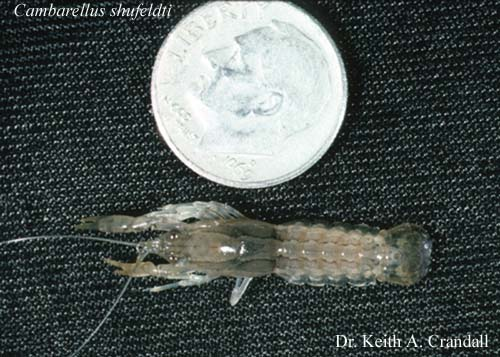

# [[Cambarellinae]] 

 
Copyright ::   © [Keith A. Crandall](http://inbio.byu.edu/Faculty/kac/crandall%5Flab/) 

## Phylogeny 

-   « Ancestral Groups  
    -  [Cambaridae](../Cambaridae.md))
    -  [Astacidea](../../../Astacidea.md))
    -  [Decapoda](../../../../Decapoda.md))
    -  [Malacostraca](../../../../../Malacostraca.md))
    -  [Crustacea](../../../../../../Crustacea.md))
    -  [Arthropoda](../../../../../../../Arthropoda.md))
    -  [Bilateria](../../../../../../../../Bilateria.md))
    -  [Animals](../../../../../../../../../Animals.md))
    -  [Eukarya](../../../../../../../../../../Eukarya.md))
    -   [Tree of Life](../../../../../../../../../../Tree_of_Life.md)

-   ◊ Sibling Groups of  Cambaridae
    -   Cambarellinae
    -  [Cambarinae](Cambarinae.md))
    -  [Cambaroides](Cambaroides.md))

-   » Sub-Groups
    -   [Cambarellus (Dirigicambarus)         shufeldtii](Cambarellus_%28Dirigicambarus%29_shufeldtii)
    -   [Cambarellus         (Pandicambarus)](Cambarellus_%28Pandicambarus%29)
    -   [Cambarellus         (Cambarellus)](Cambarellus_%28Cambarellus%29)

## Confidential Links & Embeds: 

### #is_/same_as ::[Cambarellinae](Cambarellinae.md)) 

### #is_/same_as :: [Cambarellinae.public](/_public/bio/bio~Domain/Eukarya/Animals/Bilateria/Arthropoda/Crustacea/Malacostraca/Decapoda/Astacidea/Astacidae/Cambaridae/Cambarellinae.public.md) 

### #is_/same_as :: [Cambarellinae.internal](/_internal/bio/bio~Domain/Eukarya/Animals/Bilateria/Arthropoda/Crustacea/Malacostraca/Decapoda/Astacidea/Astacidae/Cambaridae/Cambarellinae.internal.md) 

### #is_/same_as :: [Cambarellinae.protect](/_protect/bio/bio~Domain/Eukarya/Animals/Bilateria/Arthropoda/Crustacea/Malacostraca/Decapoda/Astacidea/Astacidae/Cambaridae/Cambarellinae.protect.md) 

### #is_/same_as :: [Cambarellinae.private](/_private/bio/bio~Domain/Eukarya/Animals/Bilateria/Arthropoda/Crustacea/Malacostraca/Decapoda/Astacidea/Astacidae/Cambaridae/Cambarellinae.private.md) 

### #is_/same_as :: [Cambarellinae.personal](/_personal/bio/bio~Domain/Eukarya/Animals/Bilateria/Arthropoda/Crustacea/Malacostraca/Decapoda/Astacidea/Astacidae/Cambaridae/Cambarellinae.personal.md) 

### #is_/same_as :: [Cambarellinae.secret](/_secret/bio/bio~Domain/Eukarya/Animals/Bilateria/Arthropoda/Crustacea/Malacostraca/Decapoda/Astacidea/Astacidae/Cambaridae/Cambarellinae.secret.md)

