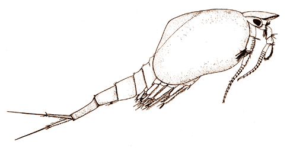

---
aliases:
- Phyllocarida
- "Sea flea"
- "Sea fleas"
title: Leptostraca
---

## [[Phyllocarida]] 

Leptostraca or Sea fleas 
)

## #has_/text_of_/abstract 

> **Phyllocarida** is a subclass of crustaceans, comprising the extant order Leptostraca 
> and the extinct orders Hymenostraca and Archaeostraca. 
> 
> This clade of marine crustaceans diversified extensively during the Ordovician.
>
> [Wikipedia](https://en.wikipedia.org/wiki/Phyllocarida) 

## Phylogeny 

-   « Ancestral Groups  
    -  [Malacostraca](../Malacostraca.md))
    -  [Crustacea](../../Crustacea.md))
    -  [Arthropoda](../../../Arthropoda.md))
    -  [Bilateria](../../../../Bilateria.md))
    -  [Animals](../../../../../Animals.md))
    -  [Eukarya](../../../../../../Eukarya.md))
    -   [Tree of Life](../../../../../../Tree_of_Life.md)

-   ◊ Sibling Groups of  Malacostraca
    -   Leptostraca
    -  [Stomatopoda](Stomatopoda.md))
    -  [Decapoda](Decapoda.md))
    -  [Peracarida](Peracarida.md))

-   » Sub-Groups 
	-   *Nebaliopsis typica*
	-   *Paranebalia longipes*
	-   *Paranebalia belizensis*
	-   *Nebalia antarctica*
	-   *Nebalia bipes*
	-   *Nebalia borealis*
	-   *Nebalia brucei*
	-   *Nebalia cannoni*
	-   *Nebalia capensis*
	-   *Nebalia chilensis*
	-   *Nebalia clausi*
	-   *Nebalia dahli*
	-   *Nebalia daytoni*
	-   *Nebalia falklandensis*
	-   *Nebalia gerkenae*
	-   *Nebalia herbstii*
	-   *Nebalia hessleri*
	-   *Nebalia ilheoensis*
	-   *Nebalia japanensis*
	-   *Nebalia lagartensis*
	-   *Nebalia longicornis*
	-   *Nebalia marerubri*
	-   *Nebalia patagonica*
	-   *Nebalia pugettensis*
	-   *Nebalia schizophthalma*
	-   *Nebalia strausi*
	-   *Sarsinebalia typhlops*
	-   *Dahlella caldariensis*
	-   *Nebaliella antarctica*
	-   *Nebaliella brevicarinata*
	-   *Nebaliella caboti*
	-   *Nebaliella declivatas*
	-   *Nebaliella extrema*
	-   *Speonebalia cannoni*
	-   *Levinebalia maria*
	-   *Levinebalia fortunata*

### Information on the Internet

[Leptostraca NSF PEET project](http://atiniui.nhm.org/peet/leptostraca/index.html). Todd Haney

## Title Illustrations

Nebalia bipes.
Drawing from R. La Follette. 1914. A Nebalia from Laguna Beach. Journal of Entomology and Zoology 6:204-208.
)

## Confidential Links & Embeds: 

### #is_/same_as ::[Phyllocarida](Phyllocarida.md)) 

### #is_/same_as :: [Phyllocarida.public](/_public/bio/bio~Domain/Eukarya/Animals/Bilateria/Arthropoda/Crustacea/Malacostraca/Phyllocarida.public.md) 

### #is_/same_as :: [Phyllocarida.internal](/_internal/bio/bio~Domain/Eukarya/Animals/Bilateria/Arthropoda/Crustacea/Malacostraca/Phyllocarida.internal.md) 

### #is_/same_as :: [Phyllocarida.protect](/_protect/bio/bio~Domain/Eukarya/Animals/Bilateria/Arthropoda/Crustacea/Malacostraca/Phyllocarida.protect.md) 

### #is_/same_as :: [Phyllocarida.private](/_private/bio/bio~Domain/Eukarya/Animals/Bilateria/Arthropoda/Crustacea/Malacostraca/Phyllocarida.private.md) 

### #is_/same_as :: [Phyllocarida.personal](/_personal/bio/bio~Domain/Eukarya/Animals/Bilateria/Arthropoda/Crustacea/Malacostraca/Phyllocarida.personal.md) 

### #is_/same_as :: [Phyllocarida.secret](/_secret/bio/bio~Domain/Eukarya/Animals/Bilateria/Arthropoda/Crustacea/Malacostraca/Phyllocarida.secret.md)

