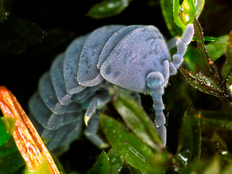

---
title: Onychiuridae
---

## Phylogeny 

-   « Ancestral Groups  
    -   [Poduromorpha](../Poduromorpha.md)
    -   [Springtail](../../Springtail.md)
    -  [Hexapoda](../../../Hexapoda.md))
    -  [Arthropoda](../../../../Arthropoda.md))
    -  [Bilateria](../../../../../Bilateria.md))
    -  [Animals](../../../../../../Animals.md))
    -  [Eukarya](../../../../../../../Eukarya.md))
    -   [Tree of Life](../../../../../../../Tree_of_Life.md)

-   ◊ Sibling Groups of  Poduromorpha
    -   Onychiuridae
    -   [Neanuridae](Neanuridae.md)

-   » Sub-Groups 

# Onychiuridae 

-   *Onychiurinae*
-   *Tetrodontophorinae*

Containing group: [Poduromorpha](../Poduromorpha.md)

## Title Illustrations

)

  ------------------------------------------------------------------------
  Scientific Name ::     Kalaphorura burmeisteri
  Specimen Condition   Live Specimen
  Copyright ::            © [Steve Hopkin](http://www.stevehopkin.co.uk/) 
  ------------------------------------------------------------------------
)

  ------------------------------------------------------------------------
  Scientific Name ::     Tetrodontophora bielanensis
  Specimen Condition   Live Specimen
  Copyright ::            © [Steve Hopkin](http://www.stevehopkin.co.uk/) 
  ------------------------------------------------------------------------

## Confidential Links & Embeds: 

### #is_/same_as ::[Onychiuridae](Onychiuridae.md)) 

### #is_/same_as :: [Onychiuridae.public](/_public/bio/bio~Domain/Eukarya/Animals/Bilateria/Arthropoda/Hexapoda/Springtail/Poduromorpha/Onychiuridae.public.md) 

### #is_/same_as :: [Onychiuridae.internal](/_internal/bio/bio~Domain/Eukarya/Animals/Bilateria/Arthropoda/Hexapoda/Springtail/Poduromorpha/Onychiuridae.internal.md) 

### #is_/same_as :: [Onychiuridae.protect](/_protect/bio/bio~Domain/Eukarya/Animals/Bilateria/Arthropoda/Hexapoda/Springtail/Poduromorpha/Onychiuridae.protect.md) 

### #is_/same_as :: [Onychiuridae.private](/_private/bio/bio~Domain/Eukarya/Animals/Bilateria/Arthropoda/Hexapoda/Springtail/Poduromorpha/Onychiuridae.private.md) 

### #is_/same_as :: [Onychiuridae.personal](/_personal/bio/bio~Domain/Eukarya/Animals/Bilateria/Arthropoda/Hexapoda/Springtail/Poduromorpha/Onychiuridae.personal.md) 

### #is_/same_as :: [Onychiuridae.secret](/_secret/bio/bio~Domain/Eukarya/Animals/Bilateria/Arthropoda/Hexapoda/Springtail/Poduromorpha/Onychiuridae.secret.md)

