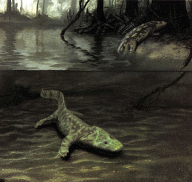

---
aliases:
- Tetrapods
- "Terrestrial Vertebrates"
Commons_category: Tetrapoda
different_from: '[[_Standards/WikiData/WD~quadruped,777371]]'
earliest_date: -390000000-01-01
has_id_wikidata: Q19159
image: "http://commons.wikimedia.org/wiki/Special:FilePath/Feuer%20Salamander%202.jpg"
instance_of: '[[_Standards/WikiData/WD~taxon,16521]]'
IPA_transcription: ˌtɛt͡ʃɹəˈpɑdə
ITIS_TSN: 914181
montage_image: "http://commons.wikimedia.org/wiki/Special:FilePath/Extant%20tetrapoda.jpg"
start_time: -367500000-01-01
subclass_of: '[[_Standards/WikiData/WD~quadruped,777371]]'
taxon_common_name:
- tetrapod
- teitreapód
- 四足总纲
taxon_name: Tetrapoda
taxon_rank: '[[_Standards/WikiData/WD~superclass,3504061]]'
title: "Terrestrial Vertebrates"
topic_s_main_template: '[[_Standards/WikiData/WD~Template_Tetrapoda,16354712]]'
UMLS_CUI: C1004206
union_of: '[[_Standards/WikiData/WD~list_of_values_as_qualifiers,23766486]]'
---

# Terrestrial Vertebrates

#is_/same_as :: [[../../../../../../../../WikiData/WD~Tetrapoda,19159|WD~Tetrapoda,19159]] 

Stegocephalians: Tetrapods and other digit-bearing vertebrates 
)

Terrestrial vertebrates, also known as tetrapods, 
are distinguished from their parent group within the superclass Osteichthyes (bony fish) 
by several key adaptations that allowed them to 
transition from aquatic to terrestrial environments. Here are some key differences:

### Limbs and Locomotion: 

One of the most significant differences between terrestrial vertebrates 
and their aquatic ancestors is the presence of limbs adapted for walking on land. 

Terrestrial vertebrates typically have four limbs with digits, 
allowing for various modes of terrestrial locomotion, 
including walking, running, hopping, and climbing. 
In contrast, their aquatic ancestors had fins for swimming.

### Respiration: 

Terrestrial vertebrates have evolved respiratory adaptations 
to facilitate gas exchange in air rather than water. 
This includes the development of lungs, which are internal organs for breathing air. 
While some terrestrial vertebrates, such as amphibians, 
may still rely on cutaneous respiration to some extent, 
lungs are the primary respiratory organs for most terrestrial vertebrates.

### Skin Modifications: 

Terrestrial vertebrates have undergone adaptations to their skin 
to prevent desiccation and regulate water balance on land. 
This may include the presence of keratinized skin, 
specialized glands for lubrication and waterproofing, 
and mechanisms for conserving body fluids.

### Reproduction: 
Terrestrial vertebrates typically lay their eggs on land or give birth to live young, 
whereas their aquatic ancestors generally spawned eggs in water. 
This transition to terrestrial reproduction 
required adaptations in egg structure, behavior, and parental care 
to ensure the survival of offspring outside of aquatic environments.

### Sensory Adaptations: 

Terrestrial vertebrates have evolved sensory adaptations 
to detect and navigate terrestrial environments. 
This includes modifications to sensory organs such as eyes, ears, and olfactory systems 
to perceive visual, auditory, and chemical cues relevant to life on land.

### Metabolism and Thermoregulation: 

Terrestrial vertebrates exhibit adaptations in metabolism and thermoregulation 
to maintain internal body temperature and energy balance in diverse terrestrial habitats. 
This may include the development of endothermy (the ability to generate internal body heat) 
in some groups, as well as behavioral adaptations for regulating body temperature, 
such as basking in sunlight or seeking shade.

Overall, the transition from aquatic to terrestrial environments 
represented a major evolutionary milestone in the history of vertebrates. 
Terrestrial vertebrates have undergone numerous adaptations to thrive on land, 
including changes in limb morphology, respiratory systems, skin structure, 
reproductive strategies, sensory capabilities, and metabolic physiology.

## Phylogeny 

Modified from Carroll (1995), Laurin and Reisz (1997), and Laurin (1998a-c). 
The position of Whatcheeria follows Lombard and Bolt (1995).
The position of the poorly known Devonian taxa 
(those in which the presence of digits is uncertain: Elginerpeton, Metaxygnathus, Ventastega, and Hynerpeton) follows Ahlberg (1998). 
Temnospondyls are often thought to be early amphibians. 
However, notice that in this phylogeny, they are not closely related to lissamphibians.

## Phylogeny 

-   « Ancestral Groups  
    -   [Sarcopterygii](../Sarc.md)
    -   [Gnathostomata](../../Gnath.md)
    -   [Vertebrata](../../../Vertebrata.md)
    -   [Craniata](../../../../Craniata.md)
    -   [Chordata](../../../../../Chordata.md)
    -   [Deuterostomia](../../../../../../Deutero.md)
    -  [Bilateria](../../../../../../../Bilateria.md))
    -  [Animals](../../../../../../../../Animals.md))
    -  [Eukarya](../../../../../../../../../Eukarya.md))
    -   [Tree of Life](../../../../../../../../../Tree_of_Life.md)

-   ◊ Sibling Groups of  Sarcopterygii
    -   Terrestrial Vertebrates

-   » Sub-Groups
    -   [Amniota](Terrestrial/Amniota.md)
    -   [Solenodonsaurus janenschi](Solenodonsaurus_janenschi)
    -   [Living Amphibians](Terrestrial/Amphibians.md)
    -   [Seymouriamorpha](Terrestrial/Seymouriamorpha.md)
    -   [Temnospondyli](Terrestrial/Temnospondyli.md)
    -   [Baphetidae](Terrestrial/Baphetidae.md)
    -   [Crassigyrinus scoticus](Crassigyrinus_scoticus)
    -   [Ichthyostega](Terrestrial/Ichthyostega.md)
    -   [Acanthostega gunnari](Acanthostega_gunnari)

### Information on the Internet

For a general introduction to tetrapods and their close relatives, try
the [Introduction to the Tetrapoda (UCMP, Berkeley)](http://www.ucmp.berkeley.edu/vertebrates/tetrapods/tetraintro.html)

## Introduction

[Michel Laurin]()

This page discusses terrestrial vertebrates and other vertebrates that
bear limbs with digits rather than fins. The muscular limb
characteristic of this clade generally has well-defined joints and
digits (fingers and toes) and is called a **chiridium**. This group
includes about 21100 extant species and a probably much greater number
of extinct species. Tetrapods are only one of the several groups of
chiridium-bearing vertebrates (see the section on classification below).

Terrestrial vertebrates have a worldwide distribution. The earliest
members of this group were moderately large (1-2.5 m body length). The
oldest known skeletal remains of terrestrial vertebrates were found in
the Upper Devonian of East Greenland (Clack, 1994). The presence of
Lower to Middle Devonian trackways in Australia has led to suggestions
that this group may have originated in the Lower Devonian, at least 400
million years ago (Warren et al., 1986), but digits are not visible in
these impressions, so these trackways may have been left by other
sarcopterygians.

The largest group of terrestrial vertebrates is Tetrapoda (see the
section \"Classification of Terrestrial Vertebrates\", below). Tetrapoda
means \"four feet\", and the group was so-named as its members
primitively had four limbs, as opposed to fins. This taxon includes
about 3000 extant species of amphibians (frogs, salamanders, and
caecilians) and approximately 18100 extant species of amniotes (mammals,
reptiles, and birds). The number of extinct species of tetrapods is of
course unknown, but about half of the currently known species of
tetrapods are extinct (Carroll, 1988).

Tetrapods originated no later than the Mississippian (about 350 million
years ago), the period from which the oldest known relatives of living
amphibians are known. Relatives of amniotes must have been present at
that time, but they have not been found so far. The fossil previously
reported (Smithson et al., 1994; Carroll, 1995) as an early
Mississippian amniote or anthracosaur (Westlothiana) is probably either
a stem-tetrapod or an early amphibian (Laurin, 1998a). Stegocephalians
(see section on classification below for a definition of this group)
originated no later than the Upper Devonian.

Tetrapods range from 9.8 mm (in the frog Psyllophryne didactyla) to 30 m
(in the blue whale) in overall length. They have a worldwide
distribution and inhabit all major habitats. Most are terrestrial, but
several have returned to the aquatic environment in which our distant
ancestors lived. Aquatic tetrapods include various salamanders
(sirenids, cryptobranchids, proteids, etc.), frogs (pipids), some
caecilians (typhlonectids), leatherback turtles, sea snakes, pinnipeds
(seals and walruses), and whales. Some tetrapods are capable of flight
(birds and bats), while others glide, such as flying squirrels,
dermopterans (sometimes called \"flying lemurs\", even though they are
not primates), and the flying dragons (Draco volans).

The page [Life History of stegocephalians](http://www.tolweb.org/accessory/Life_History_of_Stegocephalians?acc_id=468)
contains information on this complex topic.

The main breathing organ of most stegocephalians is the lung, but other
respiratory organs exist in many groups. More detail is available on the
[Breathing in stegocephalians](http://www.tolweb.org/accessory/Breathing_in_Stegocephalians?acc_id=469)
page.

Many stegocephalians have a tympanum for hearing high-frequence,
air-borne sounds, and a lateral-line organ is found in many aquatic
amphibians. For more information, see the [Hearing in stegocephalians](http://www.tolweb.org/accessory/Hearing_in_Stegocephalians?acc_id=470)
page.

### Characteristics

Stegocephalians have an extensive fossil record (Carroll, 1988).
Phylogenetic studies have revealed several derived characteristics
(synapomorphies) of stegocephalians:

Loss of several cranial bones.
:   In panderichthyids (the group of sarcopterygians most closely
    related to stegocephalians), the skull was rigidly linked to the
    shoulder girdle by several bones that disappeared early in the
    evolution of terrestrial vertebrates. The loss of these bones also
    allowed the appearance of a mobile neck that allows the head to be
    moved relative to the trunk. This decoupling allows the head to
    remain relatively stable while walking.

Loss of the opercular bones that cover the gill chamber in bony fishes.
:   The operculum was no longer needed in early choanates because they
    had lost the internal gills of their early ancestors. However, the
    operculum may have disappeared before the internal gills (Coates and
    Clack, 1991).

A reduction of the notochord and a rigid spine.
:   The vertebral centra of osteolepiforms are thin and surround the
    notochord (a rigid rod present in all chordates and that persists in
    man as the intervertebral disks) without constricting it greatly. In
    stegocephalians, the centra are thick and they constrict the
    notochord. Special articulatory surfaces (the zygapophyses) link the
    neural arches to each other.

A shorter notochord that does not extend into the braincase.
:   The notochord of osteolepiforms extended up to the vicinity of the
    pituitary.

Four muscular limbs with discrete digits (fingers and toes).
:   Osteolepiforms had fleshy fins with elements homologous to the
    humerus, radius, ulna, intermedium, ulnare, femur, tibia, fibula,
    and fibulare, but the homology of more distal limb elements is
    uncertain, and no digits were present.

A sacral rib connecting the axial skeleton (the spine) to the pelvic girdle (the hip).
:   This allows the weight of the body of tetrapods to be transmitted to
    the hind limb. There was no bony connection between the pelvic
    girdle of osteolepiforms and their axial skeleton.

The loss of dermal fin rays (the modified scales that support the fins).
:   This simply represents the elimination of a structure that was no
    longer needed and may even have been harmful on land.

These characters did not appear simultaneously and suddenly. The oldest
known stegocephalians, such as Ichthyostega and Acanthostega, possess
intermediate conditions for some of these characters and lack others.
For instance, Ichthyostega retained a subopercular, a bone that was part
of the opercular complex that covered the gill chamber of
osteolepiforms. Acanthostega retained an anocleithrum, which is one of
the elements that linked the shoulder girdle to the skull in
osteolepiforms (Coates and Clack, 1991). The notochord of Ichthyostega
and Acanthostega extended deeply into the braincase, and most of its
caudal vertebrae lacked zygapophyses (Jarvik, 1952). The connection
between the sacral rib and the pelvic girdle of Acanthostega was still
poorly defined. Finally, both Ichthyostega and Acanthostega retain
lepidotrichia in the tail, indicating that these taxa still had a caudal
fin.

The previous list includes only skeletal characters because all the
earliest groups of stegocephalians are extinct, and soft anatomical
characters can only be studied in extant taxa. The following characters
are found in tetrapods, but not in other extant vertebrates:

A layer of dead, horny cells that reduces evaporative water loss.
:   This layer is present in amniotes and in most lissamphibians.

A well-developed muscular tongue with glands.
:   However, some lissamphibians have only a primary tongue, like
    fishes. A primary tongue is simply a fleshy fold on the floor of the
    mouth that lacks intrinsic muscles and with limited mobility.

A parathyroid gland involved in controlling the level of calcium in the blood.\
A Harderian gland located anterior to the eye.
:   This gland secretes an oily liquid that lubricates the eye.

A vomeronasal (Jacobson\'s) organ.
:   This olfactory organ is located in the palate and is probably used
    to smell the food in the mouth.

The loss of the internal gills.
:   The external gills present in many aquatic and larval lissamphibians
    are new structures and are not homologous with the internal gills of
    fishes.

It is difficult to determine exactly when these characters appeared
because they are not preserved in fossils, except for indirect clues
about the internal gills, and the closest known relatives of tetrapods
are extinct. However, these characters are not found in lungfishes (the
closest extant relatives of tetrapods). Acanthostega, a Devonian
stegocephalian, still had internal gills (Coates and Clack, 1991), but
no other stegocephalian is known to have had them. Therefore, internal
gills were probably lost early in the evolution of stegocephalians, in
the Devonian or the Mississippian (about 360 million years ago), and no
tetrapod ever had internal gills.

### Classification of Terrestrial Vertebrates

\

In the past, most terrestrial choanates were included in Tetrapoda
(Gaffney, 1979). Recently, Tetrapoda was formally defined as a
crown-group (Gauthier et al., 1989). A crown-group is a clade that
includes the last common ancestor of two or more extant taxa, and all
its descendants. In this case, Tetrapoda was defined as the clade that
includes the last common ancestor of lissamphibians and amniotes, and
all its descendants. \

According to Gauthier et al. (1989), Tetrapoda included most known
fossil terrestrial vertebrates because temnospondyls were thought to be
the stem-group of amphibians, whereas embolomeres, gephyrostegids, and
seymouriamorphs were thought to be more closely related to amniotes than
to lissamphibians. Therefore, only a few very early terrestrial
vertebrates, such as Ichthyostega and Acanthostega, were excluded from
Tetrapoda.

The choanate phylogeny presented here suggests that temnospondyls,
embolomeres, gephyrostegids, and seymouriamorphs are not part of the
crown-group. If it is accurate, these taxa are not tetrapods and the
origin of the \"tetrapod limb\" predates the origin of Tetrapoda. In the
first versions of this page, all sarcopterygians bearing digits were
simply called terrestrial vertebrates because no formal phylogenetic
taxonomy of this whole clade had been proposed. Such a taxonomy was
recently published (Laurin, 1998a). The taxon Stegocephali (that
included for a long time all the vertebrates bearing a chiridium, except
for lissamphibians and amniotes) was defined as all choanates more
closely related to Temnospondyli than to Panderichthys (the closest
relative of tetrapods known to have retained paired fins). Therefore,
Stegocephali includes all taxa that bear digits, and a few
(Elginerpeton, Metaxygnathus, Ventastega, and Hynerpeton) that may
retain paired fins. Contrary to the old usage of this term, Stegocephali
now refers to a clade. The term stegocephalian will be used below
because it does not convey the hypothetical and probably somewhat
erroneous interpretation that all digit-bearing vertebrates are
terrestrial. As explained below, the earliest members of that clade were
probably primitively aquatic.

Note about the node marked Amphibia: Others restrict the name Amphibia
to descendents of the most recent common ancestor of extant amphibians
(the terminal taxon Living Amphibians in this tree). The author prefers
the usage indicated in the tree above, and the definition of Amphibia as
all tetrapods more closely related to extant amphibians than to amniotes
has historical precedence (Laurin, 1998a), but the second usage has been
fairly widespread and cannot be ignored. In this page, the term Amphibia
always refers to the node indicated in the tree above, and extant
amphibians are referred to as lissamphibians.

Note about the node marked Tetrapoda: Others expand the use of this name
to include all vertebrates that possess limbs with digits (Laurin and
Anderson, 2004). However, in this page, Tetrapoda always refers to the
node indicated in the tree above.

### Discussion of Phylogenetic Relationships

The phylogeny of stegocephalians is controversial. All systematists
agree that extant amphibians form a monophyletic group (Lissamphibia)
that is closely related to amniotes, but the origin of lissamphibians
and amniotes is controversial. Laurin and Reisz (1997, 1999), Laurin
(1998a, b), and Vallin and Laurin (2004) suggest that lepospondyls are
the stem-group of amphibians, and that diadectomorphs are more closely
related to amniotes than to lissamphibians. Consequently, many groups of
Paleozoic stegocephalians, such as temnospondyls and seymouriamorphs,
are not closely related to amniotes or to lissamphibians:

         ====================== Ichthyostega
         |
         |  =================== Loxommatidae
         |  |
         |  |  ================ Temnospondyli
         |  |  |
         |  |  |  ============= Embolomeri
         |  |  |  |
    =====|  |  |  |  ========== Seymouriamorpha
         ===|  |  |  |
            ===|  |  |     ==== Lissamphibia (frogs, salamanders, and caecilians)
               ===|  |  ===|
                  ===|  |  |||| Lepospondyli
                     ===|
                        |  ==== Diadectomorpha
                        ===|
                           ==== Amniota (mammals, reptiles, and birds)

However, most early studies and a few recent ones have suggested that
lissamphibians are derived from temnospondyls, and that diadectomorphs,
seymouriamorphs, and embolomeres are more closely related to amniotes
than to lissamphibians (Bolt, 1969; Gaffney, 1979; Gauthier et al.,
1988, 1989; Milner, 1988, 1993; Panchen and Smithson, 1988; Trueb and
Cloutier, 1991; Lombard and Sumida, 1992; Ruta et al., 2003a, b).
Lepospondyls have often been viewed as a paraphyletic group that
included early relatives of temnospondyls and lissamphibians. Therefore,
most known stegocephalians were viewed as related to either
lissamphibians or amniotes. Only Ichthyostega and other Devonian taxa
(Acanthostega, Tulerpeton) were not believed to be on one of these two
main evolutionary lineages:

         =================== Ichthyostega
         |
         |        ========== Lissamphibia (frogs, salamanders, and caecilians)
         |     ===|
         |  ===|  |||||||||| Temnospondyli
         |  |  |
         |  |  ||||||||||||| Lepospondyli
         |  |
    =====|  |  ============= Loxommatidae
         ===|  |
            |  |  ========== Embolomeri
            |  |  |
            ===|  |  ======= Seymouriamorpha
               ===|  |
                  ===|  ==== Diadectomorpha
                     ===|
                        ==== Amniota (mammals, reptiles, and birds)

Additional discussion and more detailed phylogenies can be found on the
[Phylogeny of stegocephalians](http://www.tolweb.org/accessory/Phylogeny_of_Stegocephalians?acc_id=467)
page.

### Origin of Stegocephalians

Several scenarios have been proposed to explain the origin of the
chiridium and why vertebrates ventured onto dry land. A theory found in
most popular books is that the arid climate that was once thought to
have prevailed in the Devonian had forced our sarcopterygian ancestors
to crawl out of seasonally drying ponds to reach larger, deeper bodies
of water (Romer, 1933). However, a problem with this scenario is that
the Devonian is no longer viewed as having been seasonally dry.
Furthermore, recent studies on functional morphology suggest that the
limbs may have evolved to allow our early ancestors to walk at the
bottom of shallow ponds or swamps (Edwards, 1989). Discovery of fairly
complete specimens of the Devonian choanate Acanthostega (Coates and
Clack, 1990) confirms that its limbs were poorly suited to walk on dry
land (Zimmer, 1995). The inferred presence of internal gills in
Acanthostega also confirms that this animal was still mainly aquatic
(Coates and Clack, 1991). The transition from the aquatic to the
terrestrial environment appears to have taken longer than previously
thought.

### Early Evolution of the Limbs

The presence of five fingers and toes has generally been believed to be
primitive for tetrapods and to have been the highest number of digits
that our early ancestors had. Five digits were probably present in the
earliest tetrapods, but not in the earliest stegocephalians. Recent
discoveries have demonstrated that the earliest stegocephalians had more
digits; Acanthostega had eight fingers, Ichthyostega had seven toes, and
Tulerpeton had six fingers (Lebedev, 1986; Gould, 1991). These \"extra\"
digits were quickly lost, however, because no post-Devonian
stegocephalian is known to have had more than five digits.

Coates (1991, 1996) suggested that the pentadactyl condition arose twice
(at least in the fore limb) because in his proposed phylogenies, the
Devonian polydactylous stegocephalian Tulerpeton was believed to be more
closely related to amniotes than to lissamphibians. Therefore, he argued
that the reduction from a polydactyl to a pentadactyl condition occurred
convergently in anthracosaurs (amniotes and their extinct relatives) and
in amphibians (although the pentadactyl condition in amphibians is only
know from a few specimens; most lissamphibians have only four digits in
the manus). However, reanalysis of these data, and incorporation of
Tulerpeton into a data matrix that incorporates more taxa suggests that
the pentadactyl condition appeared only once, and well before the
divergence between amphibians and anthracosaurs (Laurin, 1998c). This
conclusion results from the placement of Tulerpeton in a more basal
position in the phylogeny, outside the clade that includes all
post-Devonian (and all pentadactyl) taxa.

Four Devonian taxa tentatively included in the tree presented above are
known from fragmentary remains. The fragmentary nature of the remains of
these genera precludes a confident assessment of their affinities,
although Coates (1996) and Ahlberg (1998) have suggested that they are
more closely related to tetrapods than to panderichthyids (the closest
known relatives of tetrapods known to have retained paired fins). These
problematic taxa include Elginerpeton (Ahlberg, 1995), Ventastega
(Ahlberg et al., 1994), Metaxygnathus (Campbell and Bell, 1977), and
Hynerpeton (Daeschler et al., 1994). Their appendicular skeleton is
poorly (or not) known, so they may have retained fins. Only further
discoveries of more complete specimens will solve this question.

## Title Illustrations

---------------------------------) 
Scientific Name ::     Acanthostega gunnari and Ichthyostega
Comments             The Devonian terrestrial choanates Acanthostega (bottom) and Ichthyostega (on the shore).
Reference            first published in Discover Magazine
Creator              Illustration by Alfred Kamajian
Specimen Condition   Fossil \-- Period: Devonian
Copyright ::            © 1995 Alfred Kamajian

## Confidential Links & Embeds: 

### #is_/same_as ::[Tetrapods](Tetrapods.md)) 

### #is_/same_as :: [Tetrapods.public](/_public/bio/bio~Domain/Eukarya/Animals/Bilateria/Deutero/Chordata/Craniata/Vertebrata/Gnath/Sarc/Tetrapods.public.md) 

### #is_/same_as :: [Tetrapods.internal](/_internal/bio/bio~Domain/Eukarya/Animals/Bilateria/Deutero/Chordata/Craniata/Vertebrata/Gnath/Sarc/Tetrapods.internal.md) 

### #is_/same_as :: [Tetrapods.protect](/_protect/bio/bio~Domain/Eukarya/Animals/Bilateria/Deutero/Chordata/Craniata/Vertebrata/Gnath/Sarc/Tetrapods.protect.md) 

### #is_/same_as :: [Tetrapods.private](/_private/bio/bio~Domain/Eukarya/Animals/Bilateria/Deutero/Chordata/Craniata/Vertebrata/Gnath/Sarc/Tetrapods.private.md) 

### #is_/same_as :: [Tetrapods.personal](/_personal/bio/bio~Domain/Eukarya/Animals/Bilateria/Deutero/Chordata/Craniata/Vertebrata/Gnath/Sarc/Tetrapods.personal.md) 

### #is_/same_as :: [Tetrapods.secret](/_secret/bio/bio~Domain/Eukarya/Animals/Bilateria/Deutero/Chordata/Craniata/Vertebrata/Gnath/Sarc/Tetrapods.secret.md)

