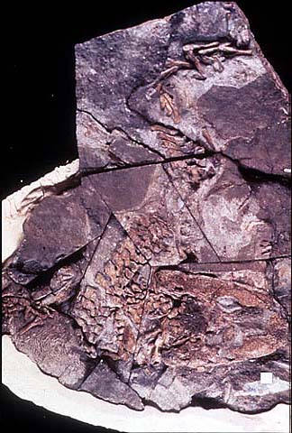
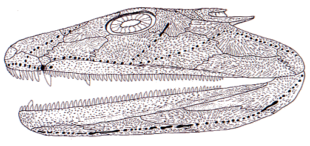
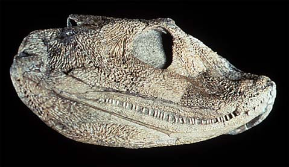
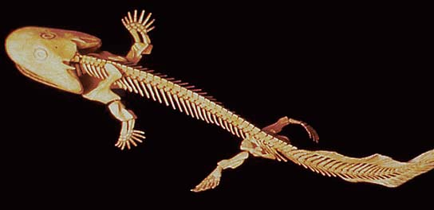

---
title: "Acanthostega gunnari"
---

## [[Acanthostega]]

Acanthostega gunnari

## #has_/text_of_/abstract 

> **Acanthostega**, from Ancient Greek ἄκανθα (ákantha), meaning "spine", and στέγη (stégē), meaning "roof", is an extinct genus of stem-tetrapod, among the first vertebrate animals to have recognizable limbs. It appeared in the late Devonian period (Famennian age) about 365 million years ago, and was anatomically intermediate between lobe-finned fishes and those that were able to come onto land.
>
> [Wikipedia](https://en.wikipedia.org/wiki/Acanthostega) 
## Introduction

[Jennifer A. Clack](http://www.tolweb.org/)

*Acanthostega gunnari* (Jarvik 1952) is one of a small but increasing
number of genera of stem-tetrapods known from the Upper Devonian, which
are providing an expanding view of the appearance of tetrapods and the
origin of limbs with digits (Coates and Clack 1990, Clack and Coates
1995, Gould 1991, Pough et al. 1996, Thomson 1993, Zimmer 1995, Clack
2002a). *Acanthostega* is represented by exceptionally well-preserved
material. Notable features are the well-ossified gill arches combined
with post-branchial lamina of the shoulder girdle, together suggesting
retention of functional internal gills; paddle-like limbs with eight
digits on each limb and a deep tail supported by finrays and accessory
internal supports (Coates 1996). It comes from the Celsius Bjerg Group
of the Famennian of East Greenland, which date from about 360 mya.

### Phylogenetic Position of *Acanthostega*

Most phylogenetic analyses place *Acanthostega* as one of the most
primitive known tetrapods, below Ichthyostega in most trees (eg. Clack
2002b, Ruta et al. 2003). However, it may lie above the recently
described *Ventastega* (Ahlberg and Clack 1998).

The author regrets the move to restrict the vernacular term 'tetrapod'
to a crown clade (Gauthier et al. 1989), thus forbidding its use in the
etymological sense to mean animals with four legs (tetra = four, pod =
leg). In this page, the term 'tetrapod' and 'stem-tetrapod' refer only
to vertebrates with limbs and digits. (Refer to the note on the
[Definition of the taxon Tetrapoda](http://www.tolweb.org/accessory/Definition_of_the_Taxon_Tetrapoda?acc_id=471)
to get more information on this topic.)

Figure 1. Articulated skeleton. Geological Museum, Copenhagen MGUH Field
number 1227. Photo M. Coates. Copyright © 1997 University Museum of
Zoology, Cambridge.
### Skull

The **skull roof** retains a number of primitive characters such as
paired median rostrals, anterior tectals and preoperculars (bones lost
in most other tetrapods), and shows unique ones including a dart-shaped
supratemporal and a tabular with both a posteriorly directed horn, and
an embayment which may have housed a persistent spiracle (Figs 2 and 3).
It lacked an intertemporal. The external nostrils were small and placed
close to the jaw margin (Clack 1994a,2002c, 2003).

Figure 2. Skull reconstruction in lateral view, J. A. Clack for J B
Johnson Club 1996. Copyright © 1997 J. A. Clack.

The **closed palate** bore large fang-pairs on the vomer, as well as an
outer row of smaller teeth and denticles, carried posteriorly along the
palatines and ectopterygoids (Clack 1994a).

The **braincase** structure falls between that of *Eusthenopteron* and
more derived stem tetrapods such as embolomeres. It was notochordal,
with small exoccipitals. The large fenestra vestibulae accommodated the
head of the stapes. The margins of the fenestra were formed by the
basioccipital and otic capsule (see also **Sensory Organs** below). The
basipterygoid processes were large and bifaceted as in other
stem-tetrapods (Clack 1994b, 1998).

The **hyobranchial** elements were fully ossified and deeply grooved as
in a lungfish such as *Neoceratodus*, except that they are strongly
ossified whereas in *Neoceratodus* they remain cartilaginous. The
grooves would have housed the afferent branchial artery carrying blood
to the internal gills, which are thus inferred to have been functional
(Coates and Clack 1991). The stapes was a short stout bone with a large
proximal footplate and a flared distal end (Clack 1989, 1994b).

Figure 3. Skull in lateral view. Geological Museum, Copenhagen MGUH
1300. Photo by M. Coates. Copyright © 1997 University Museum of Zoology,
Cambridge.

The slender **lower jaw**, in addition to the usual complement of bones,
included a Meckelian bone and a parasymphysial dental plate. The
prearticular was long and bore an area of shagreen dorsally. It was not
sutured ventrally to the surangular, angular or postsplenial and its
lower margin accommodated small Meckelian fossae. These features appear
to be primitive. The coronoids bore a row of small teeth and denticles
similar to that of the palate but there were no fang-pairs as there are
in osteoplepiforms. The dentary housed smaller and more numerous teeth
(about 75) than the maxilla plus premaxilla (about 60)(Ahlberg and Clack
1998).

### Sensory organs

The small **naris** may not have been used for breathing air as in
modern tetrapods, but given the fish-like construction of the palate,
naris and choana may have been used for chemosensory purposes as assumed
for osteolepiforms (Clack 1994a). The eyes, supported by a ring of
**sclerotic plates**, were enlarged relative to osteolepiforms. The
lateral line organs were contained in tubes running through the dermal
bones, opening by a series of pores. The **fenestra vestibulae**
(fenestra ovalis) accommodated the footplate of the stapes but the
construction of the margin excluded the basisphenoid, as in the fish
vestibular fontanelle. Internally, the otic capsules were poorly
ossified. The stapedial footplate was large relative to the size of the
braincase, and the stapes, though short compared with a fish
hyomandibula, was nevertheless a stout bone (Clack 1989, 1994b). The
system exhibits none of the degree of differentiation and refinement
seen in modern tetrapods with tympanic ears. The stapes formed the only
bony link between the braincase and the palate, apart from the basal
articulation, and may have acted as a brace between the two. It may also
have provided an origin for spiracle-operating muscles.

### Postcranial skeleton

Figure 4. Skeletal model of *Acanthostega gunnari*. Model and photo by
Eliot Goldfinger. Reproduced with permission. Copyright © 1997 Eliot
Goldfinger.

In the **axial skeleton**, about 28 - 30 notochordal, rhachitomous
centra bore neural arches which in some cases remained as paired
structures. The small atlas arches were set over a large atlantal
intercentrum. After the atlas, the arches were little differentiated.
Zygapophyses were poorly developed, but accessory articulations were
present between some neural spines. In the tail supraneural spines
articulated with some of the arches dorsally, to support the tailfin
(Fig. 4). Ribs were short in contrast to the overlapping ribs of
Ichthyostega (Clack and Coates 1995; Coates 1996).

In *Acanthostega*, the tailfin bore unjointed, long and numerous
lepidotrichia indicating a persistently aquatic animal (see below). As
in many early stem-tetrapods, elongate ovoid scutes covered the belly
only (Coates and Clack 1995; Coates 1996).

In the **shoulder girdle** of *Acanthostega*, the cleithrum and
scapulocoracoid were co-ossified, as in *Ichthyostega* and *Hynerpeton*.
Dorsally the anocleithrum was a primitive retention, as in *Tulerpeton*.
An incurved flange called the postbranchial lamina ran down the leading
edge of the shoulder girdle. In fishes this lamina forms the back of the
opercular chamber and helps direct water out of it (Coates and Clack
1991; Coates 1996).

The **humerus** was L-shaped and flattened, with accessory foramina like
those found in *Ichthyostega*. Radial and ulnar condyles were terminal.
The radius was flattened with a spatulate end, and much longer than the
triangular ulna, proportions only seen elsewhere in fishes such as
*Eusthenopteron*. The 'elbow' joint would have been held more or less
straight, and the 'wrist' was a diffuse structure formed around the arc
encompassing the long radius and short ulna. Only the intermedium is
certainly identifiable in the carpus (Fig. 5). There were eight
**digits** (Coates and Clack 1990, Coates 1991, Gould 1991).

Figure 5. Close up of left forelimb of MGUH 1227 (Geological Museum,
Copenhagen) showing eight digits. Photo M. Coates. Copyright © 1997
University Museum of Zoology, Cambridge.

The **hindlimb** was a paddle-like structure with similarities to that
of *Ichthyostega*. The femur was relatively slender with a large
rectangular adductor blade placed midway along its length. The tibia and
fibula were flattened and overlapped each other slightly in life in a
manner suitable for twisting in a swimming stroke but not for bending at
the 'knee'. The 'ankle' consisted of a few flattened tarsals, with no
obvious ankle joint . At least eight **digits** were present (Coates
1991, 1996).

### Paleoecology and Lifestyle

Most *Acanthostega* specimens came from one site representing a point
bar in an active river channel, where a series of burial events took
place, resulting in deposition of several well-articulated specimens.
These are interpreted as having been deposited in a flash-flood. The
good preservation of these specimens sugests that they had not been
carried far, and thus that the animals inhabited these channels. A few
isolated holoptychiid and lungfish scales and bones were also found in
this lens. In other localities yielding *Acanthostega* material,
*Ichthyostega*, *Holoptychius*, *Eusthenodon*, lungfish and placoderms
also occur (Bendix-Almgreen, Clack and Olsen 1990).

*Acanthostega* is interpreted as a primarily if not entirely aquatic
animal, based on the form of the limb joints and digits, the extensive
tail fin, notochordal vertebrae, lack of zygapophyses, short ribs with
poorly differentiated sacral rib, postbranchial lamina, well-ossified
hyobranchial apparatus, fish-like dentition retaining large vomerine
fangs, lateral line organs embedded in bone, small naris, large stapes,
and possibly functional spiracle. It also retains a number of primitive
features independent of its aquatic life, such as the notochordal
braincase, form of the fenestra vestibulae, persistent embryonic
braincase fissures, fish-like occiput, anocleithrum, form of the
scapulocoracoid-cleithral complex, relative lengths of radius and ulna,
retention of dermal fin rays and supraneural spines. The large number of
digits fits the hypothesis that early in limb evolution, digit number
was not fixed. All of these characters suggest that not only was
*Acanthostega* aquatic, but that it was primitively so, and not derived
from a more terrestrial forebear. Its structure supports the idea that
limbs with digits evolved for use in water, only later to be used on
land, rather than the more conventional view that it was among
sarcopterygian fishes that excursions over land first began (Clack 1997,
Clack and Coates 1995, Coates and Clack 1995).

## Phylogeny 

-   « Ancestral Groups  
    -   [Terrestrial Vertebrates](../Terrestrial.md)
    -   [Sarcopterygii](../../Sarc.md)
    -   [Gnathostomata](../../../Gnath.md)
    -   [Vertebrata](../../../../Vertebrata.md)
    -   [Craniata](../../../../../Craniata.md)
    -   [Chordata](../../../../../../Chordata.md)
    -   [Deuterostomia](../../../../../../../Deutero.md)
    -  [Bilateria](../../../../../../../../Bilateria.md))
    -  [Animals](../../../../../../../../../Animals.md))
    -  [Eukarya](../../../../../../../../../../Eukarya.md))
    -   [Tree of Life](../../../../../../../../../../Tree_of_Life.md)

-   ◊ Sibling Groups of  Terrestrial Vertebrates
    -   [Amniota](Amniota.md)
    -   [Solenodonsaurus         janenschi](Solenodonsaurus_janenschi)
    -   [Living Amphibians](Living_Amphibians)
    -   [Seymouriamorpha](Seymouriamorpha.md)
    -   [Temnospondyli](Temnospondyli.md)
    -   [Baphetidae](Baphetidae.md)
    -   [Crassigyrinus scoticus](Crassigyrinus_scoticus)
    -   [Ichthyostega](Ichthyostega.md)
    -   Acanthostega gunnari

-   » Sub-Groups 

## Title Illustrations

---------------)
Scientific Name ::     Acanthostega gunnari
Comments             Reconstruction of Acanthostega.
Creator              Richard Hammond
Acknowledgements     Reproduced with permission
Specimen Condition   Model
Copyright ::            © 1997 Richard Hammond

## Confidential Links & Embeds: 

### #is_/same_as ::[Acanthostega](Acanthostega.md)) 

### #is_/same_as :: [Acanthostega.public](/_public/bio/bio~Domain/Eukarya/Animals/Bilateria/Deutero/Chordata/Craniata/Vertebrata/Gnath/Sarc/Tetrapods/Acanthostega.public.md) 

### #is_/same_as :: [Acanthostega.internal](/_internal/bio/bio~Domain/Eukarya/Animals/Bilateria/Deutero/Chordata/Craniata/Vertebrata/Gnath/Sarc/Tetrapods/Acanthostega.internal.md) 

### #is_/same_as :: [Acanthostega.protect](/_protect/bio/bio~Domain/Eukarya/Animals/Bilateria/Deutero/Chordata/Craniata/Vertebrata/Gnath/Sarc/Tetrapods/Acanthostega.protect.md) 

### #is_/same_as :: [Acanthostega.private](/_private/bio/bio~Domain/Eukarya/Animals/Bilateria/Deutero/Chordata/Craniata/Vertebrata/Gnath/Sarc/Tetrapods/Acanthostega.private.md) 

### #is_/same_as :: [Acanthostega.personal](/_personal/bio/bio~Domain/Eukarya/Animals/Bilateria/Deutero/Chordata/Craniata/Vertebrata/Gnath/Sarc/Tetrapods/Acanthostega.personal.md) 

### #is_/same_as :: [Acanthostega.secret](/_secret/bio/bio~Domain/Eukarya/Animals/Bilateria/Deutero/Chordata/Craniata/Vertebrata/Gnath/Sarc/Tetrapods/Acanthostega.secret.md)

