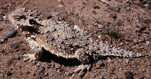

# [[Phrynosomatidae]] 

 

## #has_/text_of_/abstract 

> The **Phrynosomatidae** are a diverse family of lizards, sometimes classified as a subfamily (Phrynosomatinae), found from Panama to the extreme south of Canada. Many members of the group are adapted to life in hot, sandy deserts, although the spiny lizards prefer rocky deserts or even relatively moist forest edges, and the short-horned lizard lives in prairie or sagebrush environments. The group includes both oviparous (egg-laying) and viviparous species, with the latter being more common in species living at high elevations. Oviparous and viviparous species of Phrynosomatidae lizards co-localize in certain areas of the United States, including New Mexico.
>
> The earliest fossil remains of this group are known from the Late Cretaceous of Mongolia and belong to the genus Desertiguana. As phrynosomatids are only known from North America, these remains indicate that phrynosomatids likely had a wider distribution in prehistoric times.
>
> [Wikipedia](https://en.wikipedia.org/wiki/Phrynosomatidae) 

## Phylogeny 

-   « Ancestral Groups  
    -   [Iguania](../Iguania.md)
    -   [Squamata](../../Squamata.md)
    -   [Lepidosauromorpha](../../../Lepidosauromorpha.md)
    -   [Diapsida](../../../../Diapsida.md)
    -  [Amniota](../../../../../../../Amniota.md))
    -   [Terrestrial Vertebrates](../../../../../../Terrestrial.md)
    -  [Sarcopterygii](../../../../../../../../../Sarc.md))
    -  [Gnathostomata](../../../../../../../../../../Gnath.md))
    -  [Vertebrata](../../../../../../../../../../../Vertebrata.md))
    -  [Craniata](../../../../../../../../../../../../Craniata.md))
    -  [Chordata](../../../../../../../../../../../../../Chordata.md))
    -  [Deuterostomia](../../../../../../../../../../../../../../Deutero.md))
    -  [Bilateria](../../../../../../../../../../../../../../../Bilateria.md))
    -  [Animals](../../../../../../../../../../../../../../../../Animals.md))
    -  [Eukarya](../../../../../../../../../../../../../../../../../Eukarya.md))
    -  [Tree of Life](../../../../../../../../../../../../../../../../../Tree_of_Life.md))

-   ◊ Sibling Groups of  Iguania
    -   Phrynosomatidae

-   » Sub-Groups 

## Confidential Links & Embeds: 

### #is_/same_as ::[Phrynosomatidae](Phrynosomatidae.md)) 

### #is_/same_as :: [Phrynosomatidae.public](/_public/bio/bio~Domain/Eukarya/Animals/Bilateria/Deutero/Chordata/Craniata/Vertebrata/Gnath/Sarc/Tetrapods/Amniota/Diapsida/Lepidosauromorpha/Squamata/Iguania/Phrynosomatidae.public.md) 

### #is_/same_as :: [Phrynosomatidae.internal](/_internal/bio/bio~Domain/Eukarya/Animals/Bilateria/Deutero/Chordata/Craniata/Vertebrata/Gnath/Sarc/Tetrapods/Amniota/Diapsida/Lepidosauromorpha/Squamata/Iguania/Phrynosomatidae.internal.md) 

### #is_/same_as :: [Phrynosomatidae.protect](/_protect/bio/bio~Domain/Eukarya/Animals/Bilateria/Deutero/Chordata/Craniata/Vertebrata/Gnath/Sarc/Tetrapods/Amniota/Diapsida/Lepidosauromorpha/Squamata/Iguania/Phrynosomatidae.protect.md) 

### #is_/same_as :: [Phrynosomatidae.private](/_private/bio/bio~Domain/Eukarya/Animals/Bilateria/Deutero/Chordata/Craniata/Vertebrata/Gnath/Sarc/Tetrapods/Amniota/Diapsida/Lepidosauromorpha/Squamata/Iguania/Phrynosomatidae.private.md) 

### #is_/same_as :: [Phrynosomatidae.personal](/_personal/bio/bio~Domain/Eukarya/Animals/Bilateria/Deutero/Chordata/Craniata/Vertebrata/Gnath/Sarc/Tetrapods/Amniota/Diapsida/Lepidosauromorpha/Squamata/Iguania/Phrynosomatidae.personal.md) 

### #is_/same_as :: [Phrynosomatidae.secret](/_secret/bio/bio~Domain/Eukarya/Animals/Bilateria/Deutero/Chordata/Craniata/Vertebrata/Gnath/Sarc/Tetrapods/Amniota/Diapsida/Lepidosauromorpha/Squamata/Iguania/Phrynosomatidae.secret.md)

